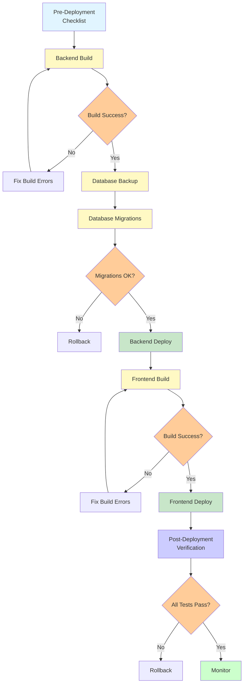

# 🚀 Deployment Checklist

## Pubblico di Destinazione

Questa documentazione è destinata a:
- **DevOps** che eseguono deployment
- **Sviluppatori** che deployano features
- **Team Leads** che verificano processi

## Pre-Deployment Checklist

### Backend

- [ ] **Codice Review** completato
- [ ] **Test** passati (se presenti)
- [ ] **Linting** passato
- [ ] **Variabili d'Ambiente** configurate su Render
  - [ ] `DATABASE_URL`
  - [ ] `JWT_SECRET`
  - [ ] `FRONTEND_URL`
  - [ ] `NODE_ENV=production`
- [ ] **Migrazioni Database** verificate
  - [ ] Migrazioni testate in staging
  - [ ] Script di rollback preparato
  - [ ] Backup database eseguito
- [ ] **Dependencies** aggiornate
  - [ ] `package.json` verificato
  - [ ] Nessuna vulnerabilità critica
- [ ] **Logging** configurato
  - [ ] Nessun `console.log` di debug
  - [ ] Error logging appropriato
- [ ] **CORS** configurato correttamente
  - [ ] Solo origin frontend consentiti
  - [ ] Credentials configurati
- [ ] **Health Check** endpoint funzionante
  - [ ] `/health` ritorna 200

### Frontend

- [ ] **Build** locale testata
  - [ ] `npm run build` eseguito senza errori
  - [ ] Build preview verificata (`npm run preview`)
- [ ] **Variabili d'Ambiente** configurate su Render
  - [ ] `VITE_API_URL` (URL backend)
- [ ] **TypeScript** compila senza errori
  - [ ] Nessun errore TypeScript
  - [ ] Nessun warning critico
- [ ] **Assets** caricati correttamente
  - [ ] Immagini, font, icone
- [ ] **API Integration** verificata
  - [ ] Endpoint backend raggiungibili
  - [ ] CORS configurato correttamente
- [ ] **Performance** verificata
  - [ ] Bundle size ragionevole
  - [ ] Code splitting funzionante (se implementato)

### Database

- [ ] **Backup** eseguito
  - [ ] Backup completo prima di migrazioni
  - [ ] Backup verificato (restore test)
- [ ] **Migrazioni** pronte
  - [ ] Migrazioni testate in staging
  - [ ] Ordine di esecuzione verificato
  - [ ] Script di rollback preparato
- [ ] **Schema** verificato
  - [ ] Indici creati
  - [ ] Foreign keys valide
  - [ ] Constraints verificati
- [ ] **Dati** verificati
  - [ ] Dati di test rimossi (se necessario)
  - [ ] Dati sensibili non esposti

## Deployment Steps

### Deployment Flow



### 1. Backend Deployment

```bash
# 1. Verifica codice
git pull origin main
cd backend
npm install

# 2. Test locale (se test presenti)
npm test

# 3. Push a Render (o merge PR)
git push origin main

# 4. Monitora log Render
# Render dashboard → Logs
```

**Verifica**:
- [ ] Build completato senza errori
- [ ] Server avviato correttamente
- [ ] Health check `/health` ritorna 200
- [ ] Log non mostrano errori critici

### 2. Database Migrations

```bash
# 1. Backup database
pg_dump "$DATABASE_URL" > backup_pre_migration_$(date +%Y%m%d).sql

# 2. Esegui migrazioni (in ordine)
psql "$DATABASE_URL" < backend/database/migration_xxx.sql

# 3. Verifica migrazioni
psql "$DATABASE_URL" -c "\d table_name"
```

**Verifica**:
- [ ] Migrazioni eseguite senza errori
- [ ] Tabelle/colonne create/modificate
- [ ] Dati esistenti non corrotti

### 3. Frontend Deployment

```bash
# 1. Verifica codice
git pull origin main
cd gestionale-app
npm install

# 2. Build locale
npm run build

# 3. Verifica build
npm run preview

# 4. Push a Render (o merge PR)
git push origin main
```

**Verifica**:
- [ ] Build completato senza errori
- [ ] Sito accessibile
- [ ] API calls funzionanti
- [ ] Nessun errore console

## Post-Deployment Verification

### Smoke Tests

1. **Health Check**
   ```bash
   curl https://gestionale-backand-api.onrender.com/health
   # Dovrebbe ritornare: {"status":"ok","database":"connected"}
   ```

2. **Login**
   - Accedi con credenziali valide
   - Verifica token JWT ricevuto
   - Verifica redirect a dashboard

3. **API Endpoints**
   - Testa endpoint critici (GET /api/projects, /api/clients)
   - Verifica risposte corrette
   - Verifica autenticazione funzionante

4. **Frontend Pages**
   - Verifica pagine principali caricano
   - Verifica routing funzionante
   - Verifica componenti renderizzati

5. **Database**
   - Verifica connessione database
   - Verifica query base funzionanti
   - Verifica migrazioni applicate

### Monitoring

- [ ] **Logs** verificati (no errori critici)
- [ ] **Performance** monitorata (response time)
- [ ] **Error Rate** verificata (0% errori critici)
- [ ] **Uptime** verificata (servizio online)

### Rollback Plan

Se qualcosa va storto:

1. **Identifica problema**
   - Log errori
   - Endpoint non funzionanti
   - Database corrotto

2. **Decidi rollback**
   - Rollback codice (Git revert)
   - Rollback database (restore backup)
   - Rollback entrambi

3. **Esegui rollback**
   ```bash
   # Rollback codice
   git revert <commit-hash>
   git push origin main
   
   # Rollback database
   psql "$DATABASE_URL" < backup_pre_migration_YYYYMMDD.sql
   ```

4. **Verifica rollback**
   - Smoke tests
   - Verifica funzionalità critiche

## Environment-Specific Checklist

### Staging

- [ ] Staging environment configurato
- [ ] Test completi eseguiti
- [ ] Feedback stakeholder ricevuto
- [ ] Nessun bug critico

### Production

- [ ] Staging deployment verificato
- [ ] Backup produzione eseguito
- [ ] Maintenance window comunicato (se necessario)
- [ ] Rollback plan preparato
- [ ] Team notificato

## Common Deployment Issues

### Issue: Build Fails

**Cause possibili**:
- Errori TypeScript
- Dependencies mancanti
- Variabili d'ambiente non configurate

**Soluzione**:
1. Verifica log build
2. Testa build locale
3. Verifica variabili d'ambiente

### Issue: Backend Not Starting

**Cause possibili**:
- Database connection failed
- Port già in uso
- Variabili d'ambiente mancanti

**Soluzione**:
1. Verifica log backend
2. Verifica `DATABASE_URL`
3. Verifica health check

### Issue: Frontend Cannot Reach Backend

**Cause possibili**:
- `VITE_API_URL` non configurato
- CORS non configurato
- Backend non raggiungibile

**Soluzione**:
1. Verifica `VITE_API_URL` in Render
2. Verifica CORS config
3. Verifica backend online

### Issue: Database Migration Fails

**Cause possibili**:
- Migrazione già eseguita
- Dati esistenti violano constraint
- Ordine migrazioni errato

**Soluzione**:
1. Verifica stato migrazioni
2. Pulisci dati problematici
3. Verifica ordine esecuzione

## Deployment Schedule

### Best Practices

- **Deploy in orari a basso traffico** (se possibile)
- **Comunica** deployment al team
- **Monitora** per 24-48 ore post-deploy
- **Documenta** eventuali problemi

### Maintenance Windows

**Schedula** deployment durante:
- Orari a basso utilizzo
- Fine settimana (se necessario)
- Comunicato in anticipo

## Riferimenti

- **[Database Migrations](./backend/Database-Migrations.md)** - Procedure migrazioni
- **[Backup & Recovery](./data/Backup-Recovery.md)** - Procedure backup
- **[Troubleshooting](./TROUBLESHOOTING.md)** - Problemi comuni

---

**Versione**: 1.0  
**Ultimo Aggiornamento**: 2024

