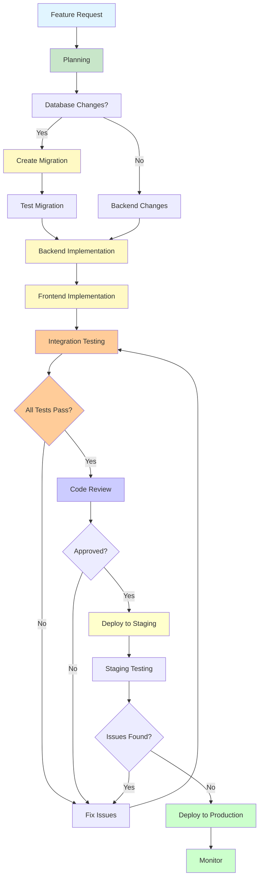

# 🛠️ Development Workflow Guide

## Pubblico di Destinazione

Questa documentazione è destinata a:
- **Sviluppatori** che contribuiscono al progetto
- **Code Reviewers** che verificano il codice
- **Team Leads** che definiscono processi

## Panoramica

Questa guida descrive il workflow di sviluppo, dalle convenzioni di codice alle procedure di collaborazione.

## Setup Ambiente di Sviluppo

### Prerequisiti

- **Node.js** 18+ installato
- **PostgreSQL** accessibile (locale o remoto)
- **Git** per version control
- **Editor** (VS Code consigliato)

### Setup Locale

```bash
# 1. Clona repository
git clone <repository-url>
cd GESTIONALE-JEINS

# 2. Setup backend
cd backend
npm install
cp .env.example .env
# Modifica .env con credenziali database

# 3. Setup frontend
cd ../gestionale-app
npm install
echo "VITE_API_URL=http://localhost:3000" > .env

# 4. Esegui migrazioni database
cd ../backend
npm run migrate

# 5. Avvia backend
npm run dev

# 6. Avvia frontend (in nuovo terminale)
cd ../gestionale-app
npm run dev
```

## Convenzioni di Codice

### Backend (JavaScript/Node.js)

#### Naming Conventions

- **Variabili/Funzioni**: `camelCase`
- **Costanti**: `UPPER_SNAKE_CASE`
- **File**: `kebab-case.js` o `camelCase.js`
- **Classi**: `PascalCase`

```javascript
// ✅ BENE
const userName = 'Mario';
const MAX_RETRIES = 3;
function getUserById() { }
class UserService { }

// ❌ MALE
const user_name = 'Mario';
const maxRetries = 3;
function GetUserById() { }
```

#### Code Style

- **Indentazione**: 4 spazi (o 2, ma consistente)
- **Semicoloni**: Opzionali, ma consistenti
- **Quotes**: Single quotes per stringhe
- **Trailing commas**: Sì per array/oggetti multiline

```javascript
// ✅ BENE
const projects = [
    { id: 1, name: 'Progetto A' },
    { id: 2, name: 'Progetto B' },
];

// ❌ MALE
const projects = [
    { id: 1, name: "Progetto A" },
    { id: 2, name: "Progetto B" }
]
```

### Frontend (TypeScript/React)

#### Naming Conventions

- **Componenti**: `PascalCase.tsx`
- **Hooks**: `useCamelCase.ts`
- **Utils**: `camelCase.ts`
- **Props Interface**: `ComponentNameProps`

```typescript
// ✅ BENE
function ProjectCard({ project }: ProjectCardProps) { }
const useProjects = () => { }
interface ProjectCardProps { }

// ❌ MALE
function projectCard({ project }: props) { }
const UseProjects = () => { }
```

#### Code Style

- **Indentazione**: 2 spazi
- **Semicoloni**: Sì
- **Quotes**: Double quotes per JSX, single per stringhe
- **Trailing commas**: Sì

```typescript
// ✅ BENE
function MyComponent({ name }: Props) {
    return (
        <div className="container">
            <h1>{name}</h1>
        </div>
    );
}
```

## Git Workflow

### Branching Strategy

**Branch principale**: `main`

**Branch di sviluppo**: `develop` (se presente) o feature branches da `main`

**Pattern branch naming**:
- `feature/nome-feature` - Nuove funzionalità
- `fix/nome-bug` - Bug fixes
- `refactor/nome-refactor` - Refactoring
- `docs/nome-doc` - Documentazione

### Commit Messages

**Formato**: `type(scope): description`

**Tipi**:
- `feat`: Nuova funzionalità
- `fix`: Bug fix
- `docs`: Documentazione
- `refactor`: Refactoring
- `test`: Test
- `chore`: Task di manutenzione

**Esempi**:

```bash
feat(projects): aggiungi tab Team nei progetti
fix(calendar): risolvi conflitto optimistic locking eventi
docs(api): aggiorna documentazione endpoint projects
refactor(calendar): estrai modali in componenti separati
```

### Pull Request Process

1. **Crea branch** da `main`
2. **Sviluppa feature/fix**
3. **Commit** con messaggi chiari
4. **Push** branch
5. **Crea Pull Request**
6. **Code Review** (se applicabile)
7. **Merge** dopo approvazione

## Sviluppare una Nuova Feature

### Feature Development Workflow



### Checklist

1. **Pianificazione**
   - [ ] Definisci requisiti
   - [ ] Identifica modifiche database (se necessarie)
   - [ ] Identifica modifiche backend (se necessarie)
   - [ ] Identifica modifiche frontend

2. **Database**
   - [ ] Crea migrazione SQL (se necessaria)
   - [ ] Testa migrazione in sviluppo
   - [ ] Documenta schema modifiche

3. **Backend**
   - [ ] Crea/modifica route API
   - [ ] Implementa validazione input
   - [ ] Implementa autorizzazione
   - [ ] Testa endpoint (Postman/curl)

4. **Frontend**
   - [ ] Crea/modifica componenti
   - [ ] Integra API service
   - [ ] Testa UI
   - [ ] Gestisci errori

5. **Documentazione**
   - [ ] Aggiorna API docs (se endpoint nuovi)
   - [ ] Aggiorna README (se necessario)
   - [ ] Documenta feature

6. **Testing**
   - [ ] Testa flusso completo
   - [ ] Testa edge cases
   - [ ] Testa errori

7. **Deploy**
   - [ ] Commit e push
   - [ ] Verifica build
   - [ ] Deploy staging (se presente)
   - [ ] Deploy produzione

## Code Review Checklist

### Backend

- [ ] Codice segue convenzioni naming
- [ ] Input validation implementata
- [ ] Error handling appropriato
- [ ] SQL injection prevention (parametri preparati)
- [ ] Autorizzazione verificata
- [ ] Logging appropriato (senza dati sensibili)
- [ ] Performance considerations (N+1 queries, indici)

### Frontend

- [ ] Codice segue convenzioni naming
- [ ] TypeScript types definiti
- [ ] Componenti non troppo grandi (< 500 righe)
- [ ] Error handling implementato
- [ ] Loading states gestiti
- [ ] Accessibilità (aria labels, keyboard navigation)
- [ ] Performance (memoization, code splitting se necessario)

### Generale

- [ ] Nessun console.log in produzione
- [ ] Nessun commento TODO senza issue
- [ ] Codice commentato dove necessario
- [ ] Testato manualmente
- [ ] Documentazione aggiornata

## Testing

### Testing Manuale

**Checklist base**:

1. **Happy Path**: Flusso principale funziona
2. **Error Cases**: Gestione errori appropriata
3. **Edge Cases**: Valori limite, input vuoti
4. **Cross-browser**: Chrome, Firefox, Safari (se applicabile)
5. **Responsive**: Mobile, tablet, desktop

### Testing Automatico (Futuro)

**Framework consigliati**:
- **Backend**: Jest, Supertest
- **Frontend**: Jest, React Testing Library
- **E2E**: Playwright, Cypress

Vedi [Testing Guide](./TESTING.md) per dettagli.

## Debugging

### Backend

**Logging**:

```javascript
// Info log
console.log('✅ Progetto creato:', { id: project.id });

// Warning log
console.warn('⚠️ Utente non trovato, usando dati cache');

// Error log
console.error('❌ Errore database:', {
    error: error.message,
    stack: process.env.NODE_ENV === 'development' ? error.stack : undefined
});
```

**Debugger**:
- VS Code: Attach debugger a processo Node.js
- Chrome DevTools: `node --inspect server.js`

### Frontend

**React DevTools**: Install extension per ispezionare componenti

**Console Logging**:

```typescript
console.log('State:', state);
console.table(projects); // Tabella formattata
console.group('API Call');
console.log('Request:', request);
console.log('Response:', response);
console.groupEnd();
```

**Debugger**:
- VS Code: Breakpoint in TypeScript
- Chrome DevTools: Breakpoint in source maps

## Performance Profiling

### Backend

**Node.js Profiler**:

```bash
# Profiling CPU
node --prof server.js
# Usa tool per analizzare

# Profiling memory
node --inspect server.js
# Chrome DevTools → Memory tab
```

### Frontend

**React DevTools Profiler**:
- Record performance
- Identifica componenti lenti
- Analizza re-render

**Chrome DevTools Performance**:
- Record timeline
- Analizza FPS, memory, network

## Best Practices

### 1. Small, Focused Commits

```bash
# ✅ BENE: Commit piccoli e focalizzati
git commit -m "feat(projects): aggiungi tab Team"
git commit -m "fix(projects): correggi bug visualizzazione team"

# ❌ MALE: Commit giganti
git commit -m "feat: aggiungi feature completa progetti con team, task, ecc."
```

### 2. Code Comments

**Commenta**:
- **Perché** (non cosa) - se logica complessa
- **TODO** con issue reference
- **FIXME** per code smell temporanei

```javascript
// ✅ BENE: Spiega perché
// Usa optimistic locking per prevenire conflitti simultanei
// senza bloccare il database (lock pessimistico)
if (currentVersion !== expectedVersion) {
    return res.status(409).json({ error: 'CONCURRENT_MODIFICATION' });
}

// ❌ MALE: Commenta cosa (evidente dal codice)
// Incrementa la versione
version++;
```

### 3. DRY (Don't Repeat Yourself)

**Estrai** codice duplicato in funzioni/componenti riutilizzabili.

### 4. YAGNI (You Aren't Gonna Need It)

**Non over-engineer**. Implementa solo quello che serve ora.

### 5. KISS (Keep It Simple, Stupid)

**Semplifica**. Codice semplice è più facile da mantenere.

## Troubleshooting Development Issues

### Problema: Database Connection Failed

```bash
# Verifica DATABASE_URL
echo $DATABASE_URL

# Testa connessione
psql "$DATABASE_URL" -c "SELECT 1;"
```

### Problema: Port Already in Use

```bash
# Trova processo che usa porta
lsof -i :3000  # Mac/Linux
netstat -ano | findstr :3000  # Windows

# Kill processo
kill -9 <PID>  # Mac/Linux
taskkill /PID <PID> /F  # Windows
```

### Problema: Module Not Found

```bash
# Reinstalla node_modules
rm -rf node_modules package-lock.json
npm install
```

## Riferimenti

- **[Testing Guide](./TESTING.md)** - Testing strategy
- **[Component Architecture](./frontend/Component-Architecture.md)** - Frontend patterns
- **[Error Handling](./backend/Error-Handling-Patterns.md)** - Backend patterns

---

**Versione**: 1.0  
**Ultimo Aggiornamento**: 2024

