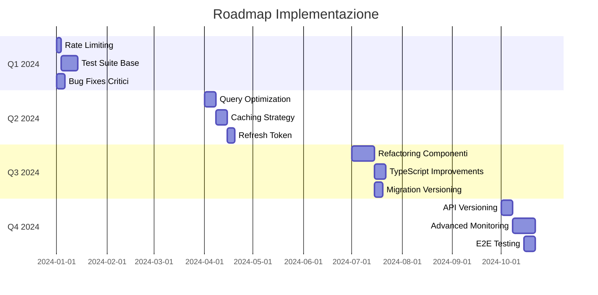

# 📋 Limitations & Roadmap

## Pubblico di Destinazione

Questa documentazione è destinata a:
- **Product Managers** che pianificano features
- **Software Architects** che definiscono roadmap
- **Stakeholders** che valutano priorità

## Limitazioni Attuali

### Sicurezza

1. **Rate Limiting Non Implementato**
   - **Rischio**: Brute force attacks su login
   - **Priorità**: Alta
   - **Soluzione**: Implementare rate limiting su endpoint critici

2. **Refresh Token Non Implementato**
   - **Limitazione**: Token JWT scade dopo 7 giorni, utente deve rieffettuare login
   - **Priorità**: Media
   - **Soluzione**: Implementare refresh token con rotazione

3. **Password Policy Non Implementata**
   - **Rischio**: Password deboli
   - **Priorità**: Media
   - **Soluzione**: Validazione complessità password

4. **CORS Troppo Permissivo in Development**
   - **Rischio**: Sicurezza ridotta in development
   - **Priorità**: Bassa
   - **Soluzione**: Configurare origin specifici anche in development

### Performance

1. **N+1 Queries**
   - **Problema**: Query multiple invece di JOIN in `projects.js`
   - **Priorità**: Media
   - **Soluzione**: Refactoring query con JOIN

2. **Mancanza di Caching**
   - **Problema**: Ogni richiesta esegue query database
   - **Priorità**: Media
   - **Soluzione**: Implementare caching (Redis o in-memory)

3. **Componenti Frontend Troppo Grandi**
   - **Problema**: `App.tsx` (~1900 righe), `Calendar.tsx` (~2000 righe)
   - **Priorità**: Bassa (refactoring)
   - **Soluzione**: Estrarre componenti più piccoli

### Funzionalità

1. **Sistema Migrazioni Non Versionato**
   - **Problema**: Nessun tracking quali migrazioni eseguite
   - **Priorità**: Media
   - **Soluzione**: Tabella `migrations` per versioning

2. **Test Automatici Non Implementati**
   - **Priorità**: Alta (per qualità codice)
   - **Soluzione**: Implementare unit/integration/E2E tests

3. **API Versioning Non Implementato**
   - **Limitazione**: Breaking changes richiedono comunicazione manuale
   - **Priorità**: Bassa
   - **Soluzione**: Implementare versioning API (`/api/v1/`, `/api/v2/`)

### Technical Debt

1. **Mock Data Inline**
   - **Problema**: Mock data grande in `api.ts`
   - **Priorità**: Bassa
   - **Soluzione**: Estrarre in file separati

2. **TypeScript `any` Usage**
   - **Problema**: Troppo uso di `any` invece di tipi specifici
   - **Priorità**: Media
   - **Soluzione**: Definire tipi per tutte le API responses

3. **Duplicazione Logica**
   - **Problema**: Logica `expandInvites` duplicata
   - **Priorità**: Bassa
   - **Soluzione**: Estrarre in utility condivisa

## Bug Noti

### Critici

1. **candidatesAPI.getAll() Signature Errata**
   - **File**: `gestionale-app/src/services/api.ts`
   - **Problema**: Signature non corrisponde a utilizzo
   - **Stato**: Identificato, da correggere

2. **candidate_id Non Sempre Incluso in Query Eventi**
   - **File**: `backend/routes/events.js`
   - **Problema**: `candidate_id` non sempre incluso in SELECT
   - **Stato**: Identificato, da correggere

### Non Critici

1. **Tab "Team" e "Tasks" Non Appaiono** (risolto, ma da monitorare)
2. **"I Miei Task" Schermata Bianca** (risolto, ma da monitorare)

## Roadmap Futura

### Q1 2024 - Sicurezza e Stabilità

**Priorità Alta**:

1. **Rate Limiting**
   - Implementare rate limiting su `/api/auth/login`
   - Implementare rate limiting su endpoint critici
   - **Stima**: 2-3 giorni

2. **Refresh Token**
   - Implementare refresh token con rotazione
   - Tabella `refresh_tokens` in database
   - Endpoint `/api/auth/refresh`
   - **Stima**: 3-5 giorni

3. **Password Policy**
   - Validazione complessità password
   - UI feedback per password deboli
   - **Stima**: 1-2 giorni

4. **Test Suite**
   - Setup Jest + React Testing Library
   - Test unit backend (utility functions)
   - Test integration API endpoints
   - Test componenti React critici
   - **Stima**: 1-2 settimane

### Q2 2024 - Performance e Scalabilità

**Priorità Media**:

1. **Query Optimization**
   - Refactoring N+1 queries
   - Aggiunta indici database
   - Query pagination
   - **Stima**: 1 settimana

2. **Caching Strategy**
   - Implementare caching (Redis o in-memory)
   - Cache per dati statici (clienti, utenti)
   - Cache invalidation strategy
   - **Stima**: 1 settimana

3. **Frontend Optimization**
   - Code splitting
   - Lazy loading componenti
   - Bundle optimization
   - **Stima**: 3-5 giorni

### Q3 2024 - Qualità e Manutenibilità

**Priorità Media/Bassa**:

1. **Refactoring Componenti**
   - Estrarre componenti da `App.tsx`
   - Estrarre componenti da `Calendar.tsx`
   - Implementare Context API per stato globale
   - **Stima**: 1-2 settimane

2. **TypeScript Improvements**
   - Definire tipi per tutte le API responses
   - Ridurre uso di `any`
   - Type safety completo
   - **Stima**: 1 settimana

3. **Migration Versioning**
   - Tabella `migrations` per tracking
   - Script automatico esecuzione migrazioni
   - Rollback automatico
   - **Stima**: 3-5 giorni

### Q4 2024 - Funzionalità Avanzate

**Priorità Bassa**:

1. **API Versioning**
   - Implementare `/api/v1/`, `/api/v2/`
   - Deprecation policy
   - Backward compatibility
   - **Stima**: 1 settimana

2. **Advanced Monitoring**
   - ELK stack o Datadog
   - Error tracking (Sentry)
   - Performance metrics dashboard
   - **Stima**: 1-2 settimane

3. **E2E Testing**
   - Setup Playwright
   - Test flussi critici
   - CI/CD integration
   - **Stima**: 1 settimana

## Priorità di Implementazione

### Roadmap Timeline

### Immediate (Q1 2024)

1. ✅ **Rate Limiting** - Sicurezza critica
2. ✅ **Test Suite Base** - Qualità codice
3. ✅ **Bug Fixes Critici** - Stabilità

### Short Term (Q2 2024)

1. ✅ **Query Optimization** - Performance
2. ✅ **Caching** - Scalabilità
3. ✅ **Refresh Token** - UX miglioramento

### Medium Term (Q3 2024)

1. ✅ **Refactoring Componenti** - Manutenibilità
2. ✅ **TypeScript Improvements** - Type safety
3. ✅ **Migration Versioning** - Operazioni

### Long Term (Q4 2024+)

1. ✅ **API Versioning** - Evoluzione API
2. ✅ **Advanced Monitoring** - Observability
3. ✅ **E2E Testing** - Qualità E2E

## Metriche di Successo

### Sicurezza

- **Rate Limiting**: 0 brute force attacks riusciti
- **Password Policy**: 100% password conformi
- **Vulnerabilità**: 0 vulnerabilità critiche

### Performance

- **Response Time**: < 500ms per 95% richieste
- **Database Query Time**: < 100ms per query
- **Frontend Load Time**: < 3s First Contentful Paint

### Qualità

- **Test Coverage**: > 80% backend, > 70% frontend
- **TypeScript Errors**: 0 errori in build
- **Bug Rate**: < 1 bug critico/mese

### Manutenibilità

- **Component Size**: < 500 righe per componente
- **Code Duplication**: < 5% duplicazione
- **Documentation**: 100% API documentate

## Riferimenti

- **[Security](./SECURITY.md)** - Security best practices
- **[Performance](./PERFORMANCE.md)** - Performance optimization
- **[Testing](./TESTING.md)** - Testing strategy
- **[Development](./DEVELOPMENT.md)** - Development workflow

---

**Versione**: 1.0  
**Ultimo Aggiornamento**: 2024  
**Prossima Revisione**: Q2 2024

