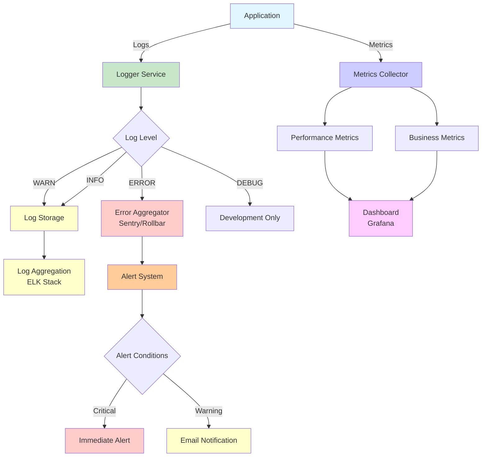

# 📊 Monitoring & Logging Strategy

## Pubblico di Destinazione

Questa documentazione è destinata a:
- **DevOps** che configurano monitoring
- **Sviluppatori** che implementano logging
- **System Administrators** che monitorano sistema

## Panoramica

Questa guida descrive la strategia di monitoring e logging per il gestionale, dalle best practices di base alle soluzioni avanzate.

## Monitoring Architecture



## Logging Strategy

### Log Levels

**Standard livelli**:

1. **ERROR**: Errori critici che richiedono attenzione
2. **WARN**: Situazioni anomale ma gestibili
3. **INFO**: Informazioni importanti (operazioni business)
4. **DEBUG**: Dettagli per debugging (solo development)

### Implementazione Backend

```javascript
// backend/utils/logger.js
const logLevels = {
    ERROR: 0,
    WARN: 1,
    INFO: 2,
    DEBUG: 3
};

const currentLevel = process.env.LOG_LEVEL || (process.env.NODE_ENV === 'production' ? 'INFO' : 'DEBUG');

function log(level, message, data = {}) {
    if (logLevels[level] <= logLevels[currentLevel]) {
        const timestamp = new Date().toISOString();
        console[level.toLowerCase()](`[${timestamp}] [${level}] ${message}`, data);
    }
}

export const logger = {
    error: (message, data) => log('ERROR', message, data),
    warn: (message, data) => log('WARN', message, data),
    info: (message, data) => log('INFO', message, data),
    debug: (message, data) => log('DEBUG', message, data),
};
```

### Uso nei Route

```javascript
import { logger } from '../utils/logger.js';

router.post('/api/projects', authenticateToken, async (req, res) => {
    try {
        logger.info('Creazione progetto', {
            userId: req.user.userId,
            projectName: req.body.name
        });
        
        const result = await pool.query(...);
        
        logger.info('Progetto creato', {
            projectId: result.rows[0].id,
            userId: req.user.userId
        });
        
        res.status(201).json(result.rows[0]);
    } catch (error) {
        logger.error('Errore creazione progetto', {
            userId: req.user?.userId,
            error: error.message,
            stack: process.env.NODE_ENV === 'development' ? error.stack : undefined
        });
        
        res.status(500).json({ error: 'Errore interno del server' });
    }
});
```

## Cosa Loggare

### ✅ DO Log

- **Operazioni business critiche**: Creazione progetti, clienti, contratti
- **Errori**: Con contesto sufficiente (user ID, operazione, errore)
- **Autenticazione**: Login successo/fallito (senza password)
- **Performance**: Request lenti (> 1s)
- **Security**: Tentativi di accesso non autorizzati

```javascript
// ✅ BENE
logger.info('Progetto creato', {
    projectId: project.id,
    userId: req.user.userId,
    projectName: project.name
});

logger.error('Errore database', {
    query: 'SELECT * FROM projects',
    error: error.message,
    code: error.code
});
```

### ❌ DON'T Log

- **Password**: Mai loggare password (anche hash, se possibile)
- **Token JWT completi**: Solo user ID o token parziale
- **Dati sensibili**: Carte di credito, SSN, informazioni personali
- **Stack trace in produzione**: Solo in development
- **Informazioni ridondanti**: Log ogni operazione minore

```javascript
// ❌ MALE
logger.info('Login', {
    email: req.body.email,
    password: req.body.password // ❌ MAI!
});

logger.error('Errore', {
    token: req.headers.authorization, // ❌ Token completo
    stack: error.stack // ❌ In produzione
});
```

## Log Format

### Formato Standardizzato

```javascript
// Formato: [Timestamp] [Level] [Context] [Message] [Data]
[2024-01-15T10:30:45.123Z] [INFO] [Projects] [Create] { projectId: '123', userId: '456' }
```

### Structured Logging

**Per sistemi di log aggregati** (es. ELK, Datadog):

```javascript
logger.info('Progetto creato', {
    timestamp: new Date().toISOString(),
    level: 'INFO',
    service: 'backend',
    operation: 'create_project',
    userId: req.user.userId,
    projectId: project.id,
    duration: Date.now() - startTime,
    metadata: {
        ip: req.ip,
        userAgent: req.get('user-agent')
    }
});
```

## Performance Monitoring

### Request Timing

**Middleware per logging performance**:

```javascript
// backend/middleware/performanceLogger.js
export function performanceLogger(req, res, next) {
    const start = Date.now();
    
    res.on('finish', () => {
        const duration = Date.now() - start;
        const logLevel = duration > 1000 ? 'warn' : 'info';
        
        logger[logLevel]('Request completed', {
            method: req.method,
            path: req.path,
            statusCode: res.statusCode,
            duration: `${duration}ms`,
            userId: req.user?.userId
        });
        
        // Alert su richieste molto lente
        if (duration > 5000) {
            logger.error('Very slow request', {
                method: req.method,
                path: req.path,
                duration: `${duration}ms`
            });
        }
    });
    
    next();
}
```

### Database Query Timing

```javascript
// Wrapper per query timing
async function timedQuery(query, params) {
    const start = Date.now();
    try {
        const result = await pool.query(query, params);
        const duration = Date.now() - start;
        
        if (duration > 1000) {
            logger.warn('Slow query', {
                query: query.substring(0, 100), // Primi 100 caratteri
                duration: `${duration}ms`
            });
        }
        
        return result;
    } catch (error) {
        const duration = Date.now() - start;
        logger.error('Query error', {
            query: query.substring(0, 100),
            duration: `${duration}ms`,
            error: error.message
        });
        throw error;
    }
}
```

## Error Monitoring

### Error Tracking

**Implementazione base**:

```javascript
// backend/middleware/errorHandler.js
export function errorHandler(err, req, res, next) {
    // Log errore
    logger.error('Unhandled error', {
        error: err.message,
        stack: process.env.NODE_ENV === 'development' ? err.stack : undefined,
        path: req.path,
        method: req.method,
        userId: req.user?.userId
    });
    
    // Response user-friendly
    res.status(err.status || 500).json({
        error: err.message || 'Errore interno del server'
    });
}
```

### Error Aggregation

**Per sistemi avanzati** (Sentry, Rollbar):

```javascript
// backend/utils/errorTracker.js
import * as Sentry from '@sentry/node';

Sentry.init({
    dsn: process.env.SENTRY_DSN,
    environment: process.env.NODE_ENV,
});

export function trackError(error, context = {}) {
    Sentry.captureException(error, {
        extra: context
    });
    
    // Log anche localmente
    logger.error('Error tracked', {
        error: error.message,
        context
    });
}
```

## Health Checks

### Backend Health Check

**Endpoint**: `GET /health`

```javascript
router.get('/health', async (req, res) => {
    try {
        // Test database connection
        await pool.query('SELECT 1');
        
        res.json({
            status: 'ok',
            database: 'connected',
            timestamp: new Date().toISOString()
        });
    } catch (error) {
        logger.error('Health check failed', { error: error.message });
        res.status(503).json({
            status: 'error',
            database: 'disconnected',
            error: error.message
        });
    }
});
```

### Frontend Health Check

```typescript
// Frontend: Verifica backend raggiungibile
async function checkBackendHealth(): Promise<boolean> {
    try {
        const response = await fetch(`${API_URL}/health`);
        return response.ok;
    } catch {
        return false;
    }
}
```

## Monitoring Metrics

### Metriche da Monitorare

1. **Uptime**: % tempo sistema online
2. **Response Time**: Tempo medio risposta API
3. **Error Rate**: % richieste con errore
4. **Throughput**: Richieste/secondo
5. **Database**: Query time, connection pool usage
6. **Memory**: Uso memoria backend
7. **CPU**: Uso CPU backend

### Implementazione Base

```javascript
// backend/utils/metrics.js
const metrics = {
    requests: 0,
    errors: 0,
    totalResponseTime: 0,
    startTime: Date.now()
};

export function recordRequest(duration, isError) {
    metrics.requests++;
    metrics.totalResponseTime += duration;
    if (isError) metrics.errors++;
}

export function getMetrics() {
    const uptime = Date.now() - metrics.startTime;
    const avgResponseTime = metrics.totalResponseTime / metrics.requests;
    const errorRate = (metrics.errors / metrics.requests) * 100;
    
    return {
        uptime: `${Math.floor(uptime / 1000 / 60)}m`,
        requests: metrics.requests,
        errors: metrics.errors,
        errorRate: `${errorRate.toFixed(2)}%`,
        avgResponseTime: `${avgResponseTime.toFixed(0)}ms`
    };
}

// Endpoint metrics
router.get('/metrics', authenticateToken, (req, res) => {
    if (req.user.role !== 'Admin') {
        return res.status(403).json({ error: 'Accesso negato' });
    }
    res.json(getMetrics());
});
```

## Alerting

### Alert Conditions

**Configura alert per**:

1. **Error Rate > 5%**: Troppi errori
2. **Response Time > 5s**: Performance degradata
3. **Database Disconnected**: Database non raggiungibile
4. **Memory Usage > 90%**: Memoria critica
5. **Uptime < 99%**: Disponibilità critica

### Implementazione Base

```javascript
// backend/utils/alerting.js
export function checkAlerts(metrics) {
    const alerts = [];
    
    if (metrics.errorRate > 5) {
        alerts.push({
            level: 'critical',
            message: `Error rate alta: ${metrics.errorRate}%`
        });
    }
    
    if (metrics.avgResponseTime > 5000) {
        alerts.push({
            level: 'warning',
            message: `Response time elevato: ${metrics.avgResponseTime}ms`
        });
    }
    
    return alerts;
}
```

## Log Aggregation (Futuro)

### Soluzioni Consigliate

1. **ELK Stack** (Elasticsearch, Logstash, Kibana)
2. **Datadog**
3. **Sentry** (per error tracking)
4. **Grafana + Prometheus** (per metrics)

### Setup Base (Esempio ELK)

```javascript
// backend/utils/logAggregator.js
import { createLogger, transports, format } from 'winston';
import { ElasticsearchTransport } from 'winston-elasticsearch';

const logger = createLogger({
    transports: [
        new transports.Console(),
        new ElasticsearchTransport({
            level: 'info',
            clientOpts: {
                node: process.env.ELASTICSEARCH_URL
            }
        })
    ]
});
```

## Best Practices

### 1. Log Contextual

**Includi sempre contesto**:

```javascript
// ✅ BENE: Con contesto
logger.info('Progetto creato', {
    projectId: project.id,
    userId: req.user.userId,
    projectName: project.name,
    timestamp: new Date().toISOString()
});

// ❌ MALE: Senza contesto
logger.info('Progetto creato');
```

### 2. Log Levels Appropriati

**Usa livello corretto**:

```javascript
logger.error('Database connection failed'); // ✅ Critico
logger.warn('Slow query detected'); // ⚠️ Anomalo ma gestibile
logger.info('User logged in'); // ℹ️ Informazione
logger.debug('Cache hit'); // 🔍 Debug
```

### 3. Structured Logging

**Usa oggetti strutturati** invece di stringhe concatenate:

```javascript
// ✅ BENE: Strutturato
logger.info('Operation completed', { operation: 'create', entity: 'project', id: '123' });

// ❌ MALE: Stringa concatenata
logger.info(`Operation create completed for project 123`);
```

### 4. Rotazione Logs

**Per file logs** (se implementato):

```javascript
import winston from 'winston';
import 'winston-daily-rotate-file';

const logger = winston.createLogger({
    transports: [
        new winston.transports.DailyRotateFile({
            filename: 'logs/application-%DATE%.log',
            datePattern: 'YYYY-MM-DD',
            maxSize: '20m',
            maxFiles: '14d' // Mantieni 14 giorni
        })
    ]
});
```

## Riferimenti

- **[Error Handling Patterns](./backend/Error-Handling-Patterns.md)** - Gestione errori
- **[Security](./SECURITY.md)** - Logging sicuro
- **[Performance](./PERFORMANCE.md)** - Performance monitoring

---

**Versione**: 1.0  
**Ultimo Aggiornamento**: 2024

