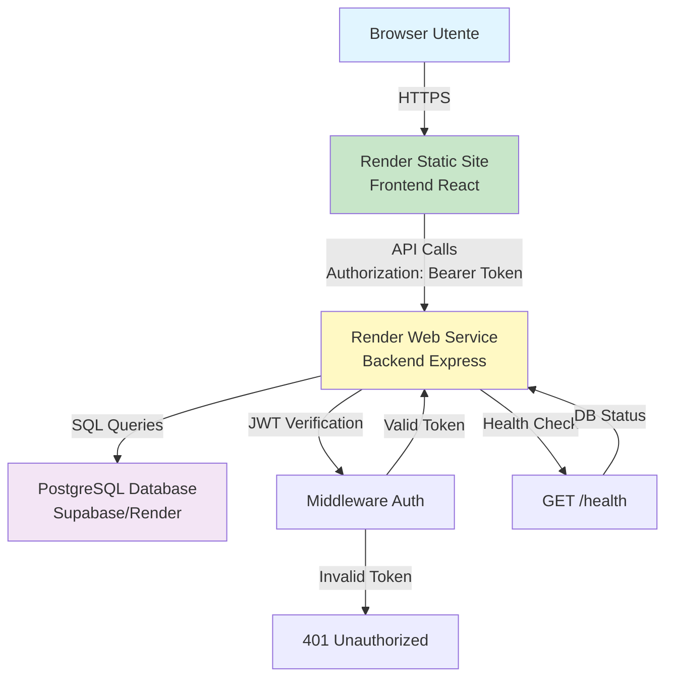

# 📚 Documentazione Gestionale Associazione

## Introduzione

Il **Gestionale Full-Stack per Associazione** è una piattaforma web completa progettata per gestire tutte le attività operative di un'associazione, dalla gestione clienti e progetti alla pianificazione eventi, dal recruiting HR alla reportistica avanzata.

Questo sistema è stato sviluppato seguendo un'architettura moderna a 3 livelli (3-Tier Architecture) che separa chiaramente le responsabilità tra presentazione, logica di business e persistenza dei dati.

## Architettura Applicativa (3-Tier)

### Componenti del Sistema

Il gestionale è composto da tre componenti principali:

1. **Frontend (React/Vite)**
   - Interfaccia utente reattiva e moderna
   - Single Page Application (SPA)
   - Framework: React 18+ con TypeScript
   - Build tool: Vite
   - Styling: Tailwind CSS
   - Icone: Lucide React

2. **Backend (Node.js/Express)**
   - API RESTful per tutte le operazioni
   - Framework: Express.js
   - Autenticazione: JWT (JSON Web Tokens)
   - Database client: `pg` (PostgreSQL)
   - Security: bcrypt per hash password

3. **Database (PostgreSQL)**
   - Database relazionale su Supabase/Render
   - Supporto per JSONB per dati strutturati flessibili
   - Triggers e funzioni per integrità referenziale

### Diagramma Architetturale



### Flusso di Richiesta

1. **Browser** → Richiesta HTTP al frontend statico (React build)
2. **Frontend** → Chiamata API al backend con token JWT nell'header
3. **Backend** → Verifica token e autenticazione utente
4. **Backend** → Query SQL al database PostgreSQL
5. **Database** → Ritorna dati al backend
6. **Backend** → Trasforma dati in JSON e ritorna al frontend
7. **Frontend** → Aggiorna UI con i nuovi dati

## Struttura del Repository

```
GESTIONALE-JEINS/
├── gestionale-app/          # Frontend React
│   ├── src/
│   │   ├── components/      # Componenti React
│   │   ├── services/        # API services
│   │   └── utils/           # Utility functions
│   ├── package.json
│   └── vite.config.ts
│
├── backend/                 # Backend Node.js
│   ├── routes/              # API routes
│   ├── database/            # Migration SQL
│   ├── middleware/          # Auth middleware
│   ├── server.js            # Entry point
│   └── package.json
│
└── docs/                    # Documentazione
    ├── backend/             # Doc Backend
    ├── frontend/            # Doc Frontend
    └── data/                # Doc Database
```

## Tecnologie Principali

### Frontend
- **React 18+**: Libreria UI con componenti funzionali e hooks
- **TypeScript**: Type safety per prevenire errori a runtime
- **Vite**: Build tool veloce per sviluppo e produzione
- **Tailwind CSS**: Framework CSS utility-first
- **React Router**: Navigazione client-side (se implementato)

### Backend
- **Node.js**: Runtime JavaScript server-side
- **Express.js**: Framework web minimalista
- **PostgreSQL**: Database relazionale robusto
- **JWT**: Autenticazione stateless
- **bcrypt**: Hashing sicuro delle password

### Database
- **PostgreSQL 14+**: Database relazionale avanzato
- **Supabase/Render**: Hosting del database
- **JSONB**: Supporto per dati JSON strutturati

## Link Utili

### 📑 Indice Completo

- **[Indice Documentazione](./INDEX.md)** - Panoramica completa di tutta la documentazione con navigazione per ruolo

### Documentazione Tecnica

- **[Backend Documentation](./backend/README.md)** - Architettura, API e convenzioni backend
- **[API Endpoints](./backend/API-Endpoints.md)** - Documentazione completa di tutti gli endpoint
- **[Database Migrations](./backend/Database-Migrations.md)** - Guida completa alle migrazioni database
- **[Optimistic Locking](./backend/Optimistic-Locking.md)** - Dettagli tecnici controllo concorrenza
- **[Error Handling](./backend/Error-Handling-Patterns.md)** - Pattern gestione errori
- **[API Versioning](./backend/API-Versioning.md)** - Strategia versioning API (futuro)

- **[Frontend Documentation](./frontend/README.md)** - Architettura componenti e flussi UI
- **[Flussi Dinamici](./frontend/Flussi-Dinamici.md)** - Logica condizionale e form dinamici
- **[Mock Data System](./frontend/Mock-Data-System.md)** - Sistema dati simulati per sviluppo
- **[Component Architecture](./frontend/Component-Architecture.md)** - Linee guida architettura componenti
- **[Design System](./frontend/Design-System.md)** - ⭐ **NUOVO** - Design System completo con colori, typography, componenti UI, dark mode

### Documentazione Dati

- **[Database Schema](./data/Database-Schema.md)** - Schema completo ERD e dizionario dati
- **[KPI Analytics](./data/KPI-Analytics.md)** - Metriche e query per dashboard
- **[Backup & Recovery](./data/Backup-Recovery.md)** - Procedure backup e recovery

### Documentazione Operativa

- **[Security Best Practices](./SECURITY.md)** - Sicurezza, autenticazione, validazione
- **[Performance Optimization](./PERFORMANCE.md)** - Ottimizzazioni database, caching, frontend
- **[Development Workflow](./DEVELOPMENT.md)** - Workflow sviluppo, convenzioni, Git
- **[Testing Strategy](./TESTING.md)** - Strategia testing (futuro)
- **[Deployment Checklist](./DEPLOYMENT-CHECKLIST.md)** - Checklist pre/post deployment
- **[Monitoring & Logging](./MONITORING.md)** - Strategia logging e monitoring
- **[Troubleshooting Guide](./TROUBLESHOOTING.md)** - Problemi comuni e soluzioni
- **[Limitations & Roadmap](./LIMITATIONS-ROADMAP.md)** - Limitazioni attuali e roadmap futura
- **[Glossario](./GLOSSARY.md)** - Terminologia tecnica e business

## Funzionalità Principali

### 1. Dashboard Dinamiche per Ruolo
Ogni ruolo utente (Presidente, Tesoreria, Marketing, Commerciale, IT, CDA, Audit) visualizza KPI e metriche specifiche per le proprie responsabilità.

### 2. Gestione Clienti e Progetti
CRUD completo per clienti, progetti e contratti con supporto per assegnazioni team e task management.

### 3. Calendario Avanzato
Sistema di eventi con:
- Form dinamici per tipo evento (Call, Formazione, Networking)
- Regole di invito complesse (gruppi, individui, aree)
- Ricorrenza (settimanale, mensile)
- Reportistica post-evento (verbali)

### 4. Sistema di Pianificazione (Sondaggi)
Flusso "Da pianificare" per raccogliere disponibilità prima di creare eventi:
- Modalità **Sondaggio Classico**: creazione 2-5 slot, votazione sì/no, tabella riepilogo manager.
- Modalità **Sondaggio Heatmap**: raccolta disponibilità libera con drag-and-drop, heatmap aggregata, creazione evento diretta sullo slot migliore.
- Finalizzazione con ponte automatico verso `events` e `participants`.

### 5. Modulo HR (Recruiting e Onboarding)
Gestione completa del processo di assunzione:
- Gestione candidati
- Sondaggi colloquio con integrazione calendario
- Periodi di prova come progetti interni

### 6. Task Management
Sistema avanzato per assegnazione e tracking task:
- Backlog progetti
- Assegnazione task a membri team
- Dashboard "I Miei Task" per associati

## Accesso e Sicurezza

### Autenticazione
- Login con email/password
- Token JWT valido 7 giorni
- Refresh automatico del token
- Logout forzato su token scaduto

### Autorizzazione (RBAC)
- Ruoli: Admin, Presidente, CDA, Tesoreria, Manager (IT/Marketing/Commerciale), Audit, Responsabile, Socio
- Permessi granulari per ogni funzionalità
- Filtri area-based per Manager

## Deployment

### Ambiente di Produzione
- **Frontend**: Render Static Site
- **Backend**: Render Web Service
- **Database**: Render PostgreSQL / Supabase

### Variabili d'Ambiente

**Frontend:**
- `VITE_API_URL`: URL del backend API

**Backend:**
- `DATABASE_URL`: Connection string PostgreSQL
- `JWT_SECRET`: Secret per firma token JWT
- `FRONTEND_URL`: URL frontend per CORS

## Supporto e Contributi

Per questioni tecniche o segnalazioni bug, consultare la documentazione specifica di ciascun modulo o contattare il team di sviluppo.

---

**Versione Documentazione**: 1.0  
**Ultimo Aggiornamento**: 2024

