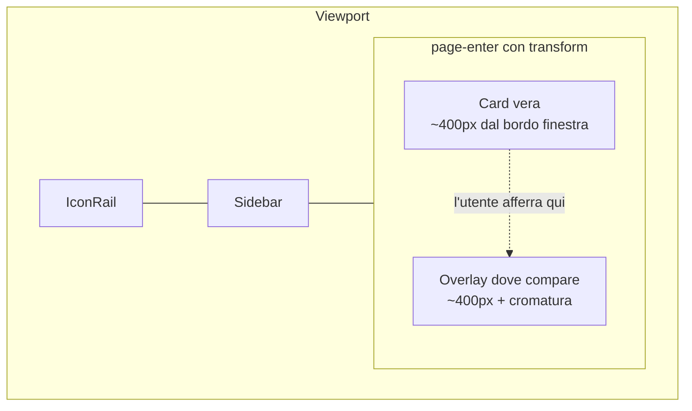
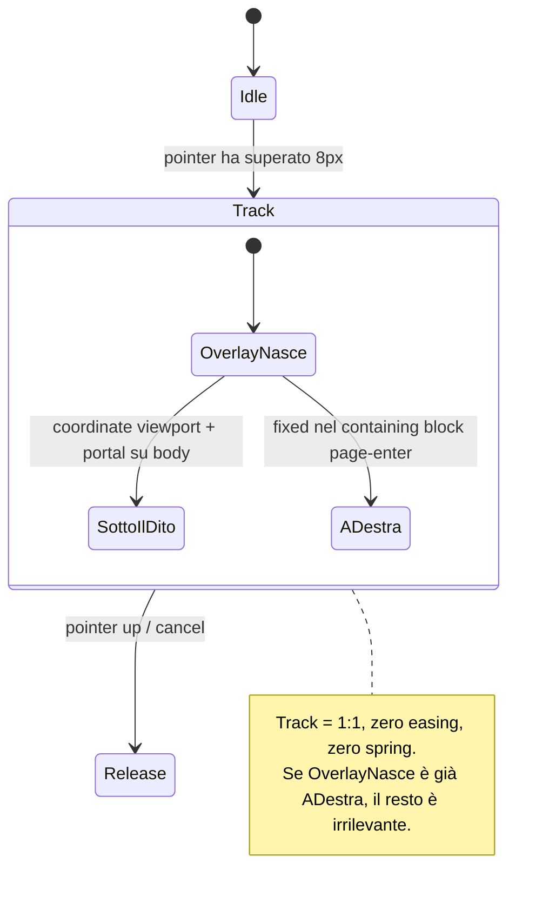
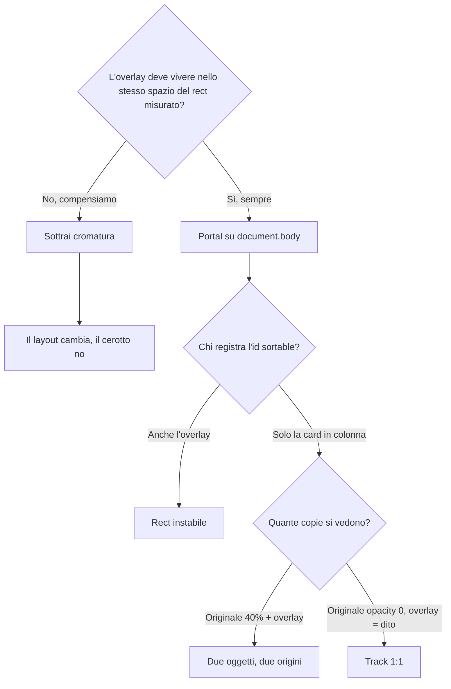
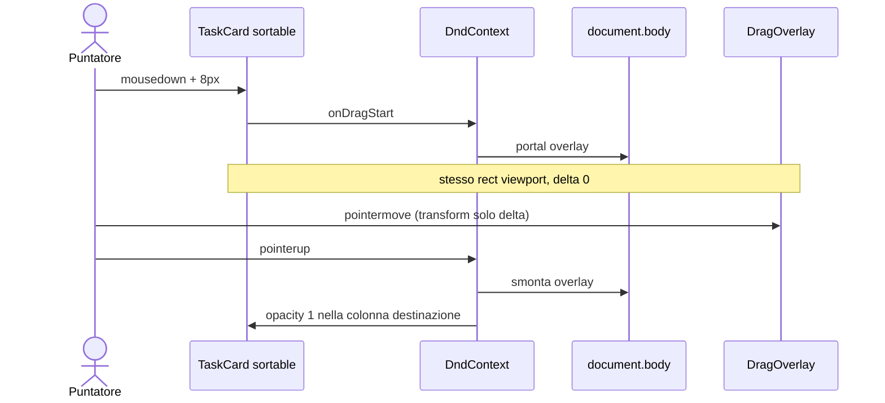

# 001 — Kanban drag overlay: origine 1:1 sotto il dito

| Campo | Valore |
|-------|--------|
| Numero | `001` |
| Stato | `implementato` |
| Progettato il | `2026-09-15 11:12` Europe/Rome |
| Approvato per implementazione il | `2026-09-15 11:21` Europe/Rome |
| Implementato il | `2026-09-15 11:21` Europe/Rome |
| Superficie | Dashboard Kanban (`KanbanBoard`, `TaskCard`), transizione pagina, well CSS |
| Autore del progetto | Diagnosi su gesture + containing block; implementazione allineata al registro |

---

## 1. Cosa si rompe in uso reale

Chi apre la dashboard e afferra un task nella **colonna più a sinistra** vede la card staccarsi dal cursore: l’overlay compare decine o centinaia di pixel più a destra. Non è un ritardo, è una **bugia spaziale**. Il cervello ha già deciso “sto tenendo questo oggetto”; l’UI mostra un secondo oggetto altrove. In un gestionale B2B quella dissonanza costa fiducia più di un colore sbagliato.

Il salto è massimo a sinistra perché l’errore è un **offset costante** pari alla cromatura a sinistra del board (rail + sidebar + padding del `main`). Sulle colonne a destra lo stesso errore spinge l’overlay fuori dal pannello, quindi si nota di meno — non perché lì sia corretto.

Il primo frame del drag è già sbagliato. Tutto ciò che succede dopo (collisioni, drop, animazioni) parte da un’origine falsa.

## 2. Causa radice (una sola, nominata)

**Containing block di `position: fixed` vs coordinate viewport.**

dnd-kit posiziona `DragOverlay` così:

- `position: fixed`
- `left` / `top` = `getBoundingClientRect()` del nodo attivo (**viewport**)
- `transform` = solo il delta del pointer

`fixed` è relativo al viewport **solo se** nessun antenato crea un containing block (`transform`, `filter`, `perspective`, `will-change: transform`, `contain`, a volte `backdrop-filter`).

Nel DOM attuale l’overlay **non è in un portal**: è un sibling dentro `DndContext`, quindi sotto:

1. `.page-enter` — `animation-fill-mode: both` lascia `transform: translateY(0)` per sempre. `translateY(0)` è comunque un transform.
2. `BentoCell` — `motion.div` con `y: 0` (stesso meccanismo, Framer).
3. Eventualmente il well `motion.div` che anima colori e può promuovere un transform.

Il browser interpreta `left: 400px` rispetto al bordo di `.page-enter`, non della finestra. `.page-enter` sta già a ~350–370px dal bordo (rail 3.5rem + sidebar 17.5rem + `lg:px-8`). Somma: la card “salta” a destra di tutta la cromatura.

### Amplificatori (non la causa)

| Amplificatore | Effetto |
|---------------|---------|
| `useSortable` anche sull’overlay, stesso `id` | Due registrazioni; il rect misurato può attaccarsi al nodo sbagliato |
| Originale a `opacity: 0.4` che segue ancora il transform sortable | Due copie visibili, origini diverse |
| Wrapper overlay `w-[17rem]` vs card = colonna meno `p-1.5` | Preview ~12px più larga del buco |
| `motion.div` sul well per bordo/sfondo | Lavoro extra in track; rischio transform sul parent delle card |

La causa resta il containing block. Togliere gli amplificatori senza il portal lascia il salto.

## 3. Vincoli che non si negoziano

- **1:1 in track.** Mentre il pointer è giù l’overlay *è* il dito. Nessuna spring, nessuna `dropAnimation` sul pickup.
- **Una libreria di drag.** `@dnd-kit` è già in bundle. Non si aggiunge Motion `drag` né HTML5 DnD “perché è nativo”.
- **Niente pixel magici.** Vietato `left: -368px`, `snapCenterToCursor` come cerotto, modifier che sottraggono la sidebar.
- **Motion solo dove comunica stato**, non sul gesto. Highlight di colonna = CSS. Dropdown colonna può restare Motion (non è il dito).
- **`prefers-reduced-motion`:** il tracking resta (è manipolazione diretta). Cade bounce/momentum; `.page-enter` non deve lasciare transform nemmeno nel ramo reduced.
- **Fuori scope 001:** reorder live cross-column durante il drag, droppable solo sul well, persistenza API del move (già esiste `onMoveTask`).

## 4. Alternative e perché cadono

| Opzione | Cosa risolve | Cosa rompe tra 6 mesi | Verdetto |
|---------|--------------|----------------------|----------|
| A. Portal `DragOverlay` su `document.body` | `fixed` torna viewport; overlay e card condividono lo stesso spazio | z-index vs modali: si fissa con `zIndex={1000}` e si alza se un dialog copre | **Scelta** |
| B. Compensare `left` con larghezza sidebar | Oggi sembra a posto | Layout responsive, sidebar hidden su `md`, zoom, seconda sidebar: il numero mente | Scartata |
| C. `snapCenterToCursor` | Nasconde l’offset allineando il centro al cursore | Perde il grab point; card “salta” sotto il dito in un altro modo | Scartata |
| D. Togliere `.page-enter` e basta | Riduce il containing block | Overlay resta sotto `BentoCell` (Framer `y`); stesso bug al prossimo fade | Insufficiente da sola |
| E. Riscrivere il Kanban in Motion `drag` | API gesture del corso | Seconda libreria sullo stesso gesto; sortable multi-colonna da rifare | Scartata |
| F. Lasciare overlay in-tree e `transform: none` su tutti gli antenati | Teoricamente vale | Framer rimette transform al prossimo stagger; fragile | Mitigazione collaterale, non il design |

A è necessaria. C+D pulite sono obbligatorie perché A da sola lascia due id e due fantasmi. D (transform none su `.page-enter`) protegge **altri** `fixed` in pagina (dropdown, toast futuri), non sostituisce il portal.

## 5. Design scelto

### Track

1. `PointerSensor` resta con `distance: 8` (non ruba i click).
2. All’activation: overlay montato via `createPortal(..., document.body)`.
3. `left/top` dnd-kit = viewport = dove sta la card.
4. Sorgente in colonna: `opacity: 0` (il buco resta, l’oggetto visibile è uno).
5. Overlay: clone **presentazionale**, niente `useSortable`, `w-full` nel wrapper misurato da dnd-kit (niente secondo `17rem`).

### Release

`dropAnimation={null}` resta in 001. Prima si dimostra l’origine. Uno snap breve è un numero successivo, non un extra sul bug di pickup.

### Antenati

`.page-enter` non usa `animation-fill-mode: both`: `both` lascia `transform: translateY(0)` o `matrix(1,0,0,1,0,0)` dopo l’animazione, e **qualsiasi transform calcolato diverso da `none` crea containing block**. Si usa `backwards` (applica solo il `from` all’attesa) così a animazione finita il computed è `none`.

### Split di `TaskCard`

- `TaskCardFace`: markup e stili, ignora dnd-kit.
- `SortableTaskCard`: `useSortable` + face.
- `TaskCard`: se `isOverlay` → solo face; altrimenti sortable.

Hooks sempre incondizionati nel componente che li usa. L’overlay non entra nel registro id.

## 6. Rischi residui e non-goals

- **z-index:** overlay a 1000; una modale sopra il board durante un drag è un caso degenere. Se succede, si alza l’overlay o si disabilita il drag a dialog aperta — non in 001.
- **Scroll orizzontale del board durante il drag:** dnd-kit auto-scroll; da riosservare dopo il portal, non da “sistemare” a tentativi.
- **Droppable sull’intera colonna** (header incluso): collisioni un po’ larghe. Numero futuro se il drop “mangia” la colonna sbagliata.
- **Reorder live** mentre si attraversano le colonne: oggi il move è su `onDragEnd`. UX migliore, scope diverso.
- **Framer su `BentoCell`:** non è più sul path dell’overlay. Lasciarlo evita un refactor motion della dashboard per un bug che il portal chiude.

## 7. Piano di verifica

Ambiente: Vite su `localhost:5173`, dashboard autenticata, board con almeno due colonne e una card nella prima.

1. Pickup colonna **sinistra**: al primo frame con overlay visibile, i bounding rect di overlay e card (ancora in `opacity: 0`) coincidono a ±1px in `left` e `top`.
2. Stesso test sulla **terza** colonna: se c’è ancora errore, l’offset in px è **identico** a (1) → containing block non risolto; se entrambi sono 1:1 → portal ok.
3. Durante il drag esiste **una** card visibile, non un fantasma al 40%.
4. Larghezza overlay = larghezza card in colonna (non 12px in più).
5. Click sul titolo / delete / “più opzioni” senza drag (soglia 8px).
6. Drop su colonna vuota e su un’altra card: `onMoveTask` come prima.
7. Tema chiaro e scuro: solo ombra overlay, non geometria.
8. `prefers-reduced-motion`: pickup ancora 1:1; `.page-enter` computed `transform` è `none`.

Fallimento: overlay a destra di ≥ 8px sulla colonna sinistra al pickup, prima di muovere il mouse.

### Esito in sede di implementazione (2026-09-15)

- `tsc --noEmit` in `gestionale-app/`: ok.
- Sessione dashboard già autenticata: prima card colonna sinistra `left: 396px`, `.page-enter` `left: 368px` (è l’offset che produceva il salto). Well e Bento `transform: none`.
- Con `animation-fill-mode: both`, `.page-enter` restava `matrix(1,0,0,1,0,0)` — containing block ancora vivo. Passati a `backwards`.
- Il drag automatizzato HTML5 è stato rifiutato dalla pagina (dnd-kit usa pointer, non HTML5). Il pickup 1:1 va confermato a mano sulla colonna sinistra.

## 8. File toccati

| Path | Ruolo della modifica |
|------|----------------------|
| `.cursor/rules/blueprint-aggiornamenti.mdc` | Regola permanente processo 001+ |
| `docs/aggiornamenti/TEMPLATE-BLUEPRINT.md` | Schema blueprint |
| `docs/aggiornamenti/REGISTRO.md` | Indice numerato + orari |
| `docs/aggiornamenti/001-kanban-drag-overlay-origine.md` | Questo progetto |
| `docs/INDEX.md` | Puntatore al registro |
| `gestionale-app/src/components/dashboard/KanbanBoard.tsx` | Portal overlay, well CSS |
| `gestionale-app/src/components/dashboard/TaskCard.tsx` | Face vs sortable, opacity 0 |
| `gestionale-app/src/index.css` | `transform: none` su page-enter; `.kanban-well--over` |

**Fuori scope:** `BentoCell.tsx`, API task, collision detection, drop animation.

---

*Blueprint 001 — progettato 2026-09-15 11:12 Europe/Rome — il gesto è diretto solo se l’origine è vera.*
