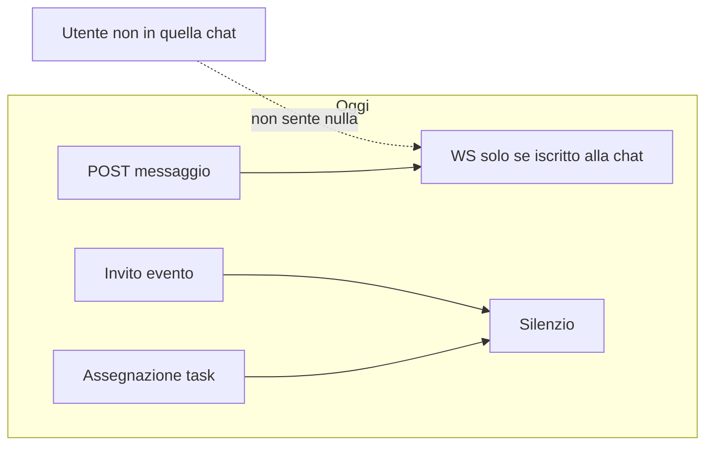
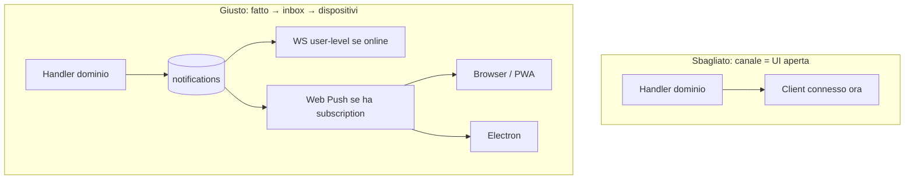
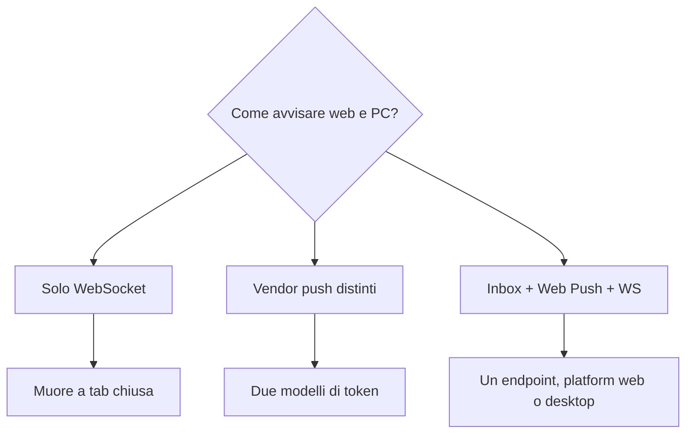
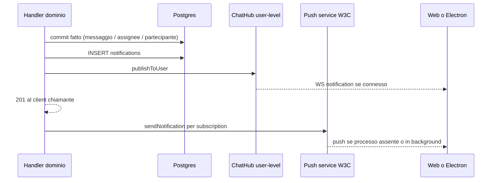

# 002 — Notifiche push: un dispatch, due client (web e desktop)

| Campo | Valore |
|-------|--------|
| Numero | `002` |
| Stato | `implementato` |
| Progettato il | `2026-09-15 11:30` Europe/Rome |
| Implementato il | `2026-09-15 11:35` Europe/Rome |
| Superficie | Inbox persistente, sottoscrizioni Web Push, fan-out WS, hook su chat/task/eventi |
| Autore del progetto | Progetto strutturale push unificato web + Electron |

---

## 1. Cosa si rompe in uso reale

Oggi un messaggio in chat esiste solo se hai **quella** conversazione aperta: il WebSocket pubblica sul `chatId` iscritto, non sulla persona. Un task assegnato o un invito a un evento non fanno rumore da nessuna parte. Chi lavora in un’altra scheda, o ha chiuso il browser, o installerà l’app desktop, non viene avvisato. Le toast in-app non sono notifiche di sistema: spariscono con la tab.

Senza un **inbox nel database** e un **canale di consegna per dispositivo**, Electron e la PWA finirebbero per inventare due code diverse — doppi toast, permessi divergenti, nessun modo di dire “ho già letto questo”.

## 2. Causa radice (una sola, nominata)

**Assenza di un dominio “notifica” indipendente dalla sessione UI.** Il real-time attuale è un fan-out di presenza su una risorsa (`chatId`), non un contratto verso un utente e i suoi dispositivi. Web e desktop hanno bisogno dello stesso fatto persistito (`notifications`) e dello stesso protocollo di push (Web Push RFC 8030), non di due stack.

## 3. Vincoli che non si negociano

- Un solo catalogo tipi e un solo inbox: web e desktop non hanno tabelle gemelle.
- Il path HTTP del dominio (invio messaggio, assegnazione, creazione evento) **non fallisce** se il push esterno è down: commit del fatto, poi dispatch.
- Non si notifica l’attore. Preferenze utente possono spegnere un tipo.
- Stesso payload click (`url` + `data`) su web e desktop, così il deep link resta identico.
- Nessuna seconda coda (Inngest/QStash) in questo numero: Render è un processo Node; retry è in-process + cancellazione subscription morte (410/404).
- Fuori scope: installer Electron, Service Worker frontend, UI `/notifiche`, quiet hours, email.

## 4. Alternative e perché cadono

| Opzione | Cosa risolve | Cosa rompe tra 6 mesi | Verdetto |
|---------|--------------|----------------------|----------|
| Solo WS + `Notification` in pagina | Toast con app aperta | App chiusa = zero; Electron spento = zero | Scartata come unico canale |
| FCM / OneSignal solo desktop | Push nativo Windows | Due vendor, due token, inbox assente | Scartata |
| Email per ogni evento | Funziona a app chiusa | Rumore, non è OS toast, costo e delay | Fuori scope |
| Web Push VAPID + inbox + WS user-level | Un protocollo per Chromium (browser **e** Electron) | Serve HTTPS e chiavi VAPID in prod | **Scelta** |

Electron non ha bisogno di WNS in v1: il renderer Chromium registra una **stessa** subscription Web Push con `platform: "desktop"`. Il processo in tray (app chiusa ma viva) e il push a processo morto si affineranno con lo shell desktop, senza cambiare il backend.

## 5. Design scelto

Tre strati, in quest’ordine dopo ogni fatto di dominio:

1. **Persistenza** — riga in `notifications` per ogni destinatario (fonte di verità, badge, lista).
2. **Presenza** — frame WS `{ type: "notification", payload }` a tutti i socket autenticati di quell’`userId` (app in primo piano o minimizzata).
3. **Push** — `web-push` verso ogni riga di `push_subscriptions` (app in background o chiusa). Il client deduplica con `notificationId` / `tag` se arriva sia WS sia push.

### Schema

- `notifications` — inbox per utente: `type`, `title`, `body`, `payload` JSONB (`url`, id di dominio), `actor_id`, `collapse_key` (sostituisce il toast precedente sulla stessa chat), `dedupe_key` (es. un solo avviso per `task.assigned:<taskId>`), `read_at`.
- `push_subscriptions` — `platform IN ('web','desktop')`, `endpoint` unique, chiavi `p256dh`/`auth`. Re-login sullo stesso browser aggiorna l’owner dell’endpoint.
- `notification_preferences` — JSONB `settings` per tipo; chiave assente = acceso.

### Tipi v1

| `type` | Quando | `url` |
|--------|--------|-------|
| `chat.message` | Nuovo messaggio, altri membri | `/inbox?chat=<id>` |
| `task.assigned` | Create task con assignee o POST assignee | `/tasks?task=<id>` |
| `event.invited` | Dopo COMMIT creazione evento, **solo prima occorrenza** se ricorrente | `/calendario?event=<id>` |

### API (JWT)

- `GET /api/notifications` lista + `GET /api/notifications/unread-count`
- `PATCH /api/notifications/:id/read` · `POST /api/notifications/read-all`
- `GET`/`PATCH /api/notifications/preferences`
- `GET /api/push/vapid-public-key` · `POST /api/push/subscribe` · `DELETE /api/push/subscribe`

Senza `VAPID_*` l’inbox e il WS restano attivi; il subscribe pubblica risponde 503 così il client non chiede il permesso OS a vuoto.

### File e responsabilità

| Path | Ruolo |
|------|--------|
| `backend/database/migration_notifications_push.sql` | Tabelle + indici |
| `backend/services/notificationService.js` | Destinatari, preferenze, insert, orchestrazione |
| `backend/services/webPush.js` | VAPID, send, delete su 410 |
| `backend/routes/notifications.js` | REST inbox + subscribe |
| `backend/lib/chatHub.js` | `publishToUser` |
| `routes/messages.js`, `tasks.js`, `events.js` | Hook `scheduleNotify` dopo il commit |

## 6. Rischi residui e non-goals

- Senza Service Worker (web) o registrazione Push in Electron, le subscription restano vuote: l’inbox API è comunque usabile.
- Doppia toast possibile finché il client non deduplica; è un problema di UI, non di schema.
- Nessun prune a 90 giorni; la tabella può crescere.
- Nessun worker persistente: un crash a metà `sendNotification` perde quel push (l’inbox resta). QStash resta il passo del cap. 3 walkthrough, non questo numero.
- Chiavi VAPID da generare in deploy (`npm run vapid:generate`); non committarle.

## 7. Piano di verifica

1. Unit test: esclusione attore, preferenze off, payload `url`/`tag`, `publishToUser` non sporca altre chat, status 410 → gone.
2. `GET /api/push/vapid-public-key` senza env → 503; con env → chiave pubblica.
3. Subscribe valida vs endpoint non URL → 400.
4. Dopo `POST /api/chats/:id/messages`, i membri diversi dal mittente hanno una riga inbox (verifica su DB o test di servizio con pool mock).
5. Creazione evento ricorrente: **una** ondata di inviti (prima occorrenza), non N toast.
6. Criterio di fallimento: un destinatario riceve una notifica con `userId === actorId`, oppure il 201 del messaggio diventa 500 perché web-push è down.

## 8. File toccati

| Path | Ruolo della modifica |
|------|----------------------|
| `docs/aggiornamenti/002-notifiche-push-web-desktop.md` | Questo progetto |
| `docs/aggiornamenti/REGISTRO.md` | Numero 002 |
| `backend/database/migration_notifications_push.sql` | Schema |
| `backend/scripts/run-sql-migrations.js` | Ordine migrazioni |
| `backend/services/notificationService.js` | Dominio |
| `backend/services/webPush.js` | Adapter push |
| `backend/routes/notifications.js` | HTTP |
| `backend/validators/notificationSchemas.js` | Zod |
| `backend/lib/chatHub.js` | Fan-out per utente |
| `backend/app.js` | Mount route |
| `backend/routes/messages.js` | Hook chat |
| `backend/routes/tasks.js` | Hook assegnazione |
| `backend/routes/events.js` | Hook invito |
| `backend/test/notifications.test.js` | Contratti |
| `backend/scripts/generate-vapid-keys.js` | Chiavi locali/prod |
| `ARCHITETTURA.md` | Diagramma a tre client |

**Fuori scope:** `gestionale-app` Service Worker, shell Electron, UI pagina `/notifiche`.

---

*Template blueprint JEINS — ogni aggiornamento ha un numero, un’ora di progetto, e i Mermaid dove spiegano, non dove decorano.*
