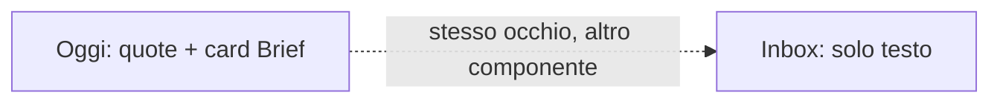
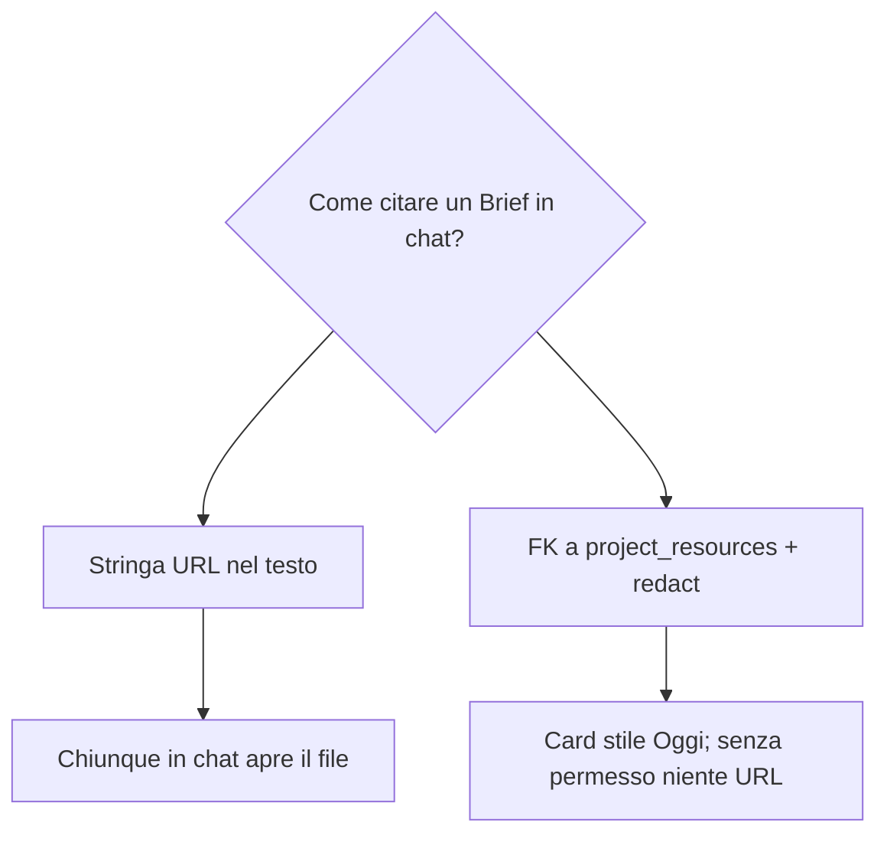
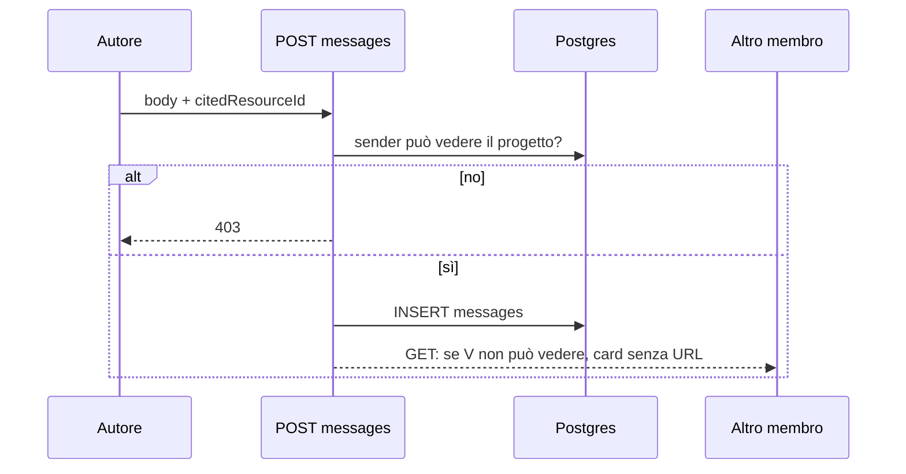

# 003 — Citazioni in chat (stesso stile Oggi) e documenti dell’area

| Campo | Valore |
|-------|--------|
| Numero | `003` |
| Stato | `implementato` |
| Progettato il | `2026-09-15 11:48` Europe/Rome |
| Implementato il | `2026-09-15 11:55` Europe/Rome |
| Superficie | Inbox chat, `messages`, `project_resources`, blocchi citazione condivisi con Oggi |
| Autore del progetto | Citazioni reali in chat + link documenti per chi ha accesso all’area |

---

## 1. Cosa si rompe in uso reale

Chi apre **Inbox** vede bolle piatte: niente virgolette, niente card documento. Il pannello **Oggi** ha già quel linguaggio (bordo sinistro + `@autore`, card file verde). Lo si è perso in chat perché la chat vera non ha un modello di citazione: un messaggio è solo `body`.

Quando qualcuno condivide un Brief in un progetto, l’associato in chat non può **puntarlo**: deve copiare l’URL a mano, e chi non dovrebbe vederlo lo vedrebbe comunque se il link sta nel testo.

## 2. Causa radice (una sola, nominata)

**Citazione come payload di mock, non come fatto persistito sul messaggio.** Oggi disegna `payload.reply` / `payload.fileName` se ci sono; i messaggi non hanno `reply_to_id` né `cited_resource_id`, quindi lo stile non ha dati. I documenti stanno in `project_resources` (per progetto/area) ma la chat non li interroga né redige l’URL per chi è fuori area.

## 3. Vincoli che non si negociano

- Stessi primitivi visivi di Oggi (quote a bordo brand, card `FileText` + `bg-grad-brand`), un solo componente condiviso.
- L’URL del documento **non** esce nella risposta se il lettore non può vedere quel progetto (privilegiato, stessa area, o assegnato).
- Inbox resta chiusa al Socio (`requireNotSocio`); “associati con permessi” = membri chat che superano il gate sul progetto.
- Un messaggio può citare un altro messaggio della **stessa** chat e/o un documento esistente; il body può essere vuoto se c’è almeno una citazione.
- Fuori scope: allegati binari, citazioni a contratti/fatture, aprire Inbox ai Soci.

## 4. Alternative e perché cadono

| Opzione | Cosa risolve | Cosa rompe | Verdetto |
|---------|--------------|------------|----------|
| URL incollato nel body | Veloce | Niente stile, niente ACL, link visibile a tutti i membri | Scartata |
| Solo frontend, senza colonne | Demo | Refresh e altri client perdono la cite | Scartata |
| `reply_to` + `cited_resource_id` + redact in GET | Stile + permessi | Due FK, join in lettura | **Scelta** |

## 5. Design scelto

### Persistenza

`message_citations` (tabella nuova: l’utente DB dell’app non può `ALTER` su `messages`) — `reply_to_id` e `cited_resource_id`.

GET idrata quote (`author`, `text`) e documento. Se `userCanSeeProject` è falso: `{ allowed: false }` senza `title`/`url`.

### Scrittura

POST accetta `{ body, replyToId, citedResourceId }`.  
Validare membership, reply nella stessa chat, documento visibile **al mittente**. Poi WS + notifica come oggi.

Se il messaggio ha un `project_id` (chat o documento citato), si scrive anche `activities` `comment.added` con `body` / `reply` / `fileName` così **Oggi** mostra le stesse citazioni, non solo i mock.

### Picker

`GET /api/chats/:id/documents?q=` — risorse dei progetti che l’utente può vedere; quelle del `chats.project_id` in testa.

### UI

`CitationBlocks` usato da `ActivityFeed` e dalla bolla chat: avatar + quote + card documento cliccabile. Composer: chip “Rispondi a…”, pulsante documenti, anteprima card prima dell’invio.

## 6. Rischi residui e non-goals

- GET `/api/projects/:id/resources` oggi non filtra l’area: in questo numero si allinea al medesimo gate.
- Documento cancellato: card “Documento rimosso”.
- Due Brief identici nel feed Oggi restano due attività `resource.added` (altro numero).

## 7. Piano di verifica

1. Unit: redact toglie `url` se area diversa e utente non privilegiato.
2. POST senza body né cite → 400; cite di risorsa non visibile → 403; reply di altra chat → 400.
3. Inbox: rispondi a un messaggio → quote stile Oggi; cita Brief → card cliccabile per chi può, “Documento riservato” altrimenti.
4. Dashboard Oggi: dopo un messaggio su chat di progetto, compare commento con quote/card (non solo mock).
5. Socio non entra in `/inbox`.

## 8. File toccati

| Path | Ruolo |
|------|--------|
| `backend/database/migration_message_citations.sql` | FK reply + documento |
| `backend/lib/documentAccess.js` | Gate progetto/area |
| `backend/routes/messages.js` | GET/POST idratati, picker |
| `backend/routes/projects.js` | GET resources con gate |
| `gestionale-app/src/components/chat/CitationBlocks.tsx` | Stile condiviso |
| `gestionale-app/src/pages/InboxPage.tsx` | Composer + bolle |
| `gestionale-app/src/components/dashboard/ActivityFeed.tsx` | Usa i primitivi |

**Fuori scope:** Electron, push, Soci in inbox.

---

*Template blueprint JEINS — ogni aggiornamento ha un numero, un’ora di progetto, e i Mermaid dove spiegano, non dove decorano.*
