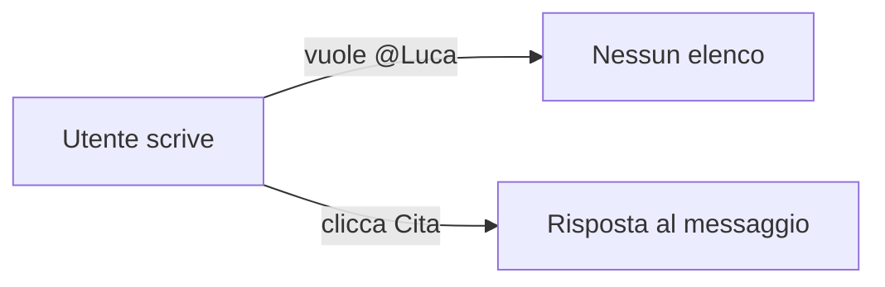
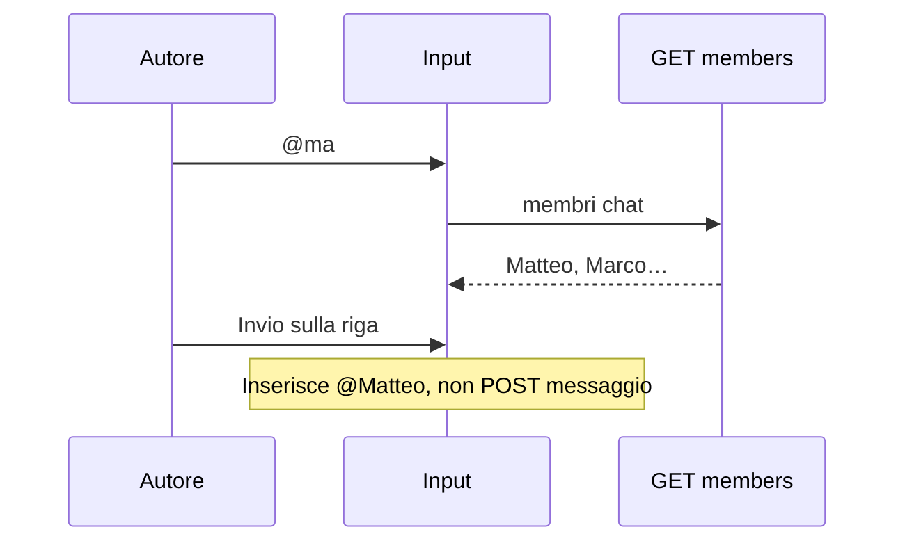

# 004 — Rispondi vs @cita persone in chat

| Campo | Valore |
|-------|--------|
| Numero | `004` |
| Stato | `implementato` |
| Progettato il | `2026-09-15 12:00` Europe/Rome |
| Implementato il | `2026-09-15 12:09` Europe/Rome |
| Superficie | Inbox composer, etichetta Rispondi, autocomplete `@` sui membri chat |
| Autore del progetto | Distinguere reply da menzione persona |

---

## 1. Cosa si rompe in uso reale

Chi vuole **taggare un socio** cerca la chiocciola. Trova invece il bottone **Cita** sotto il messaggio, che risponde a quel testo. Due gesti diversi con lo stesso nome: si cita un documento, si “cita” un messaggio, e non si cita una persona. L’associato non scopre `@` perché non esiste.

## 2. Causa radice (una sola, nominata)

**Un’unica etichetta “Cita” copre il reply.** La menzione persona non è un secondo verbo nell’UI: è un token nel testo (`@` + query), come Slack/WhatsApp. Finché il bottone si chiama Cita, l’autocomplete `@` non ha un posto mentale.

## 3. Vincoli che non si negoziano

- Reply al messaggio = **Rispondi** (stessa quote verde di Oggi).
- Cita persona = **`@` mentre si digita**, elenco filtrato, Invio sceglie la riga non manda il messaggio.
- Candidati: membri di **quella** chat (inclusi Soci se sono in `chat_members`).
- Body resta testo leggibile (`@Nome `); gli id restano in `message_mentions` per non perdere chi è stato taggato se si omonimi.
- Fuori scope: menzionare chi non è in chat, `@` nei documenti, push dedicata (il fan-out chat resta quello già esistente).

## 4. Alternative e perché cadono

| Opzione | Cosa risolve | Cosa rompe | Verdetto |
|---------|--------------|------------|----------|
| Bottone “Menziona” a parte | Scoperta | Non è “mentre typi” | Scartata |
| Solo `@Nome` nel body senza tabella | Veloce | Omonimi, rename, niente lista solida | Scartata |
| `@` + members + `message_mentions` | Gesto chiesto + id stabili | Una tabella in più | **Scelta** |

## 5. Design scelto

1. Label `Cita` → `Rispondi`. Aria “Annulla risposta”.
2. `GET /api/chats/:id/members` — nome, handle, avatar, colore.
3. Composer: su `@query` (dopo spazio o inizio riga) dropdown sopra l’input, filtra nome/handle, frecce + Enter.
4. Inserisce `@Nome ` e registra `mentionIds`. In invio si tengono solo gli id il cui `@Nome` è ancora nel testo.
5. GET messaggi aggrega `mentions`; il body evidenzia `@Nome` in brand.
6. `message_mentions (message_id, user_id)` come `message_citations` (CREATE, non ALTER su `messages`).

## 6. Rischi residui e non-goals

- Due “Brief” nel picker documenti restano duplicati di condivisione.
- Chi cancella `@Nome` a mano ma lascia l’id: al send si prune sul testo.
- Soci senza Inbox non aprono la chat; se sono membri, altri possono comunque `@` citarli.

## 7. Piano di verifica

1. Unit: `@ma` a metà frase apre query `ma`; `ciao ma` senza `@` no.
2. Inbox: Cita sparito, **Rispondi** apre la quote.
3. Digitare `@` mostra persone; scegliere Matteo inserisce `@Matteo Di Liberto`.
4. Messaggio inviato: `@Nome` colorato; persistenza dopo refresh.
5. Enter con lista aperta non invia.

## 8. File toccati

| Path | Ruolo |
|------|--------|
| `backend/database/migration_message_mentions.sql` | Tabella |
| `backend/routes/messages.js` | members + mentionIds |
| `gestionale-app/src/lib/mentionQuery.ts` | Parse `@` al cursore |
| `gestionale-app/src/components/chat/MentionPicker.tsx` | Lista |
| `gestionale-app/src/pages/InboxPage.tsx` | Composer |
| `gestionale-app/src/components/chat/ChatMessage.tsx` | Rispondi + highlight |

---

*Template blueprint JEINS — ogni aggiornamento ha un numero, un’ora di progetto, e i Mermaid dove spiegano, non dove decorano.*
