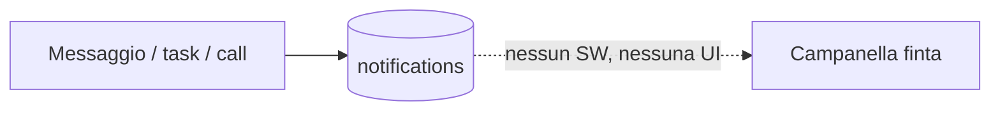
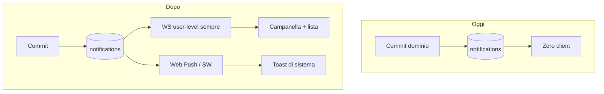
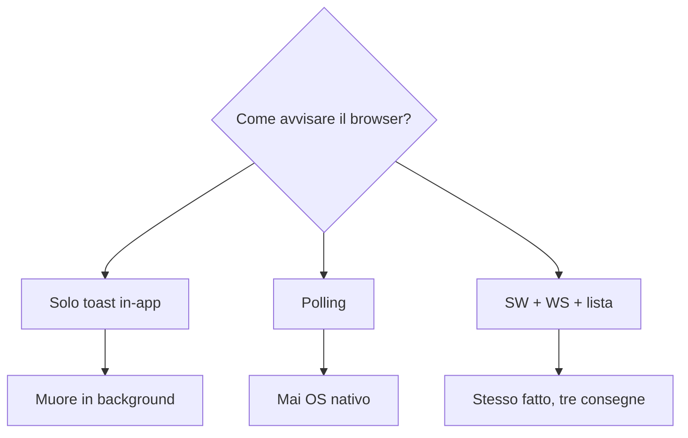
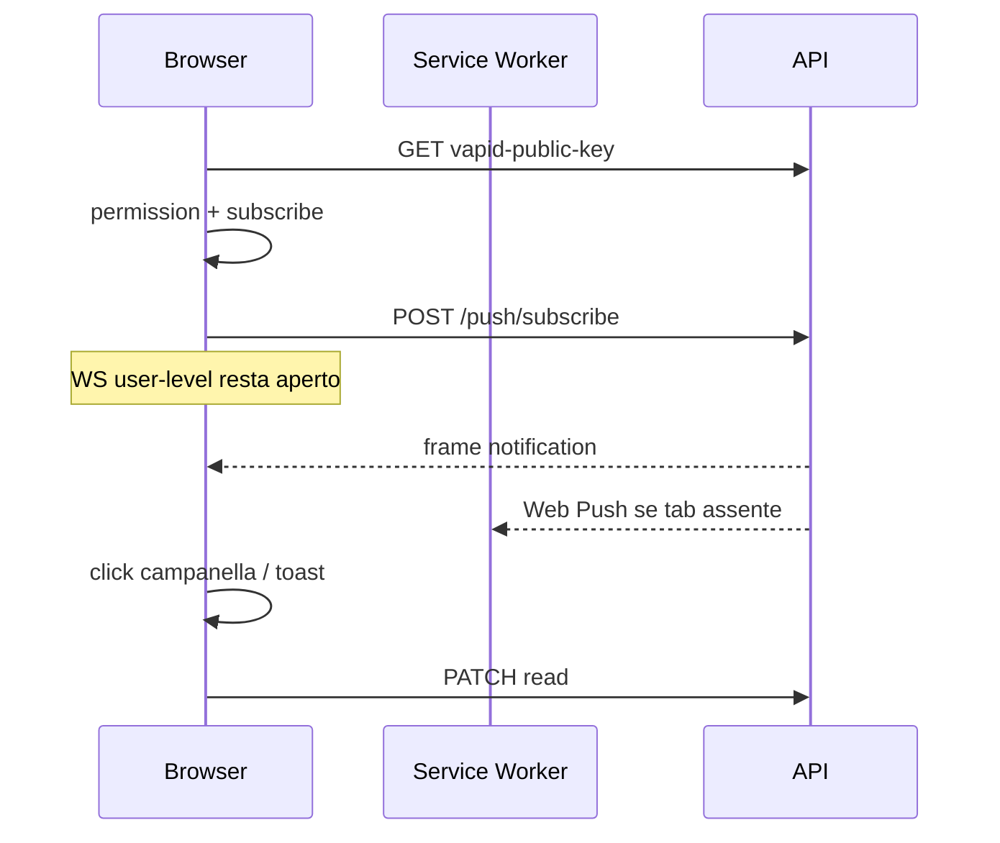

# 005 — Client notifiche: campanella, push, chat / lavori / call

| Campo | Valore |
|-------|--------|
| Numero | `005` |
| Stato | `implementato` |
| Progettato il | `2026-09-15 12:34` Europe/Rome |
| Implementato il | `2026-09-15 12:40` Europe/Rome |
| Superficie | Service Worker, campanella, `/notifiche`, hook menzione / stato task / copy call |
| Autore del progetto | Collegare l’inbox 002 al browser e ai tre fatti d’uso |

---

## 1. Cosa si rompe in uso reale

Un socio riceve un messaggio, viene messo su un lavoro, o viene citato in una call da fare: il fatto è già in Postgres, ma la campanella è un pallino fisso e `/notifiche` è un placeholder. Il browser non chiede il permesso, non c’è Service Worker, il WebSocket delle notifiche vive solo se hai l’Inbox aperta. Chi è su Dashboard o ha la tab in secondo piano non sente nulla.

## 2. Causa radice (una sola, nominata)

**Il contratto 002 termina al JSON: nessun subscriber sul dispositivo e nessuna superficie che legge l’inbox.** In più due buchi di dominio: la menzione `@` non ha tipo proprio (sommerge nel `chat.message` a tutti i membri), lo spostamento di un lavoro non avvisa gli assignee, la copy dell’invito non distingue una call da un evento generico.

## 3. Vincoli che non si negoziano

- Stesso catalogo tipi e stesso payload `url`/`tag` del 002. Nessuna seconda libreria push.
- Il POST dominio non fallisce se VAPID manca o il permesso è denied: restano inbox + WS.
- Non si notifica l’attore. Menzionato ≠ tutti i membri della chat.
- Dedup `notificationId` / `tag` se arrivano sia WS sia push.
- Fuori scope: Electron, quiet hours, email, prune 90 giorni.

## 4. Alternative e perché cadono

| Opzione | Cosa risolve | Cosa rompe | Verdetto |
|---------|--------------|------------|----------|
| Solo `Notification` in pagina | Toast con tab aperta | Tab chiusa = zero | Scartata come unico canale |
| Polling ogni 15s | Lista aggiornata | Ritardo, batteria, niente OS | Scartata |
| SW + WS user-level + pagina inbox | Aperto, background, chiuso | Serve HTTPS in prod e permesso | **Scelta** |

## 5. Design scelto

1. **Service Worker** in `public/sw.js`: `push` mostra il toast OS se nessuna finestra è focused; `notificationclick` apre `payload.url`.
2. **Dopo il login**, se VAPID è configurato, `Notification.requestPermission` + `pushManager.subscribe` + `POST /api/push/subscribe` (`platform: web`). Denied o 503: solo WS e lista.
3. **Socket user-level** sempre autenticato (non dipende dall’Inbox). Frame `{ type: "notification" }` aggiorna badge, toast in-app se tab visibile.
4. **Campanella**: badge = unread count; click → `/notifiche`.
5. **Pagina** lista inbox, segno letto, “segna tutte”, click = `navigate(url)` e PATCH read.
6. **Dominio, tre casi**
   - Messaggio: `chat.message` agli altri membri; se c’è `@`, quei user ricevono `chat.mentioned` al posto del generico.
   - Lavori: `task.assigned` (già); `task.updated` agli assignee su cambio colonna/stato.
   - Call: `event.invited` con titolo/body “citato per una call” se `isCall`.

Deep link già nel payload: `/inbox?chat=`, `/tasks?task=`, `/calendario?event=`. L’Inbox legge `chat` dalla query.

## 6. Rischi residui e non-goals

- Senza chiavi VAPID in `.env` il permesso OS non si chiede: WS e lista restano.
- Un kanban drag avvisa gli assignee (collapse per tag OS, nuove righe in inbox).
- Soci senza Inbox ricevono comunque menzione/call/task; il click su chat può essere 403 — il fatto resta in `/notifiche`.

## 7. Piano di verifica

1. Login: se VAPID c’è, compare il prompt permesso (o è già granted).
2. Altro utente manda un messaggio: campanella +1, riga in `/notifiche`; tab in background → toast OS.
3. `@` su una persona: quella persona vede “ti ha citato”, gli altri il messaggio chat.
4. Spostare un lavoro con assignee: gli altri assignee ricevono aggiornamento, non chi ha spostato.
5. Creare una call con partecipanti: “citato per una call”; click apre calendario.
6. Criterio di fallimento: l’attore riceve la propria notifica, oppure il 201 chat diventa 500 se il push è down.

## 8. File toccati

| Path | Ruolo |
|------|--------|
| `gestionale-app/public/sw.js` | Push e click |
| `gestionale-app/src/features/notifications/*` | Subscribe, WS, pagina, campanella |
| `backend/services/notificationService.js` | `chat.mentioned`, `task.updated`, copy call |
| `backend/routes/messages.js` `tasks.js` `events.js` | Hook |
| `backend/validators/notificationSchemas.js` | Preferenze nuovi tipi |

---

*Template blueprint JEINS — ogni aggiornamento ha un numero, un’ora di progetto, e i Mermaid dove spiegano, non dove decorano.*
