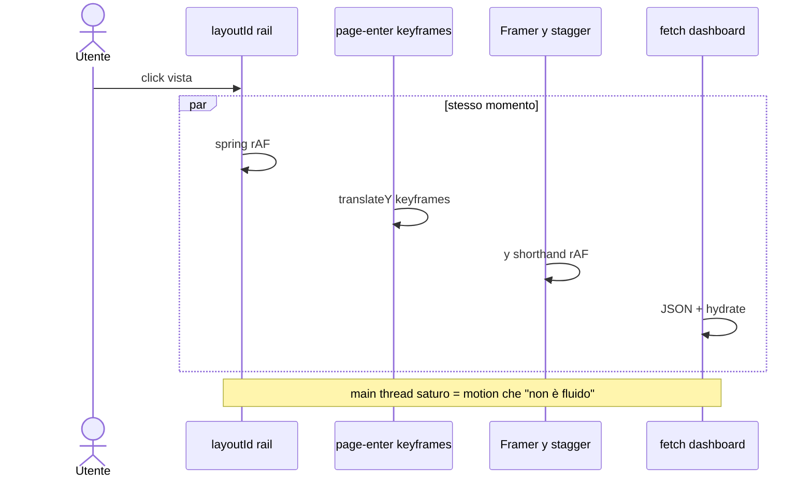
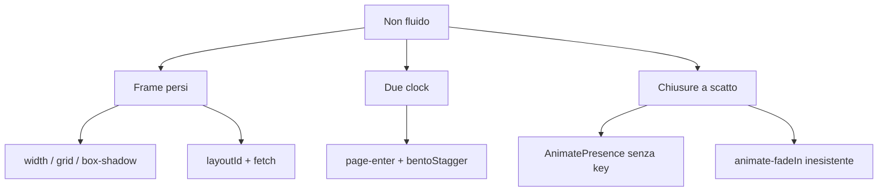
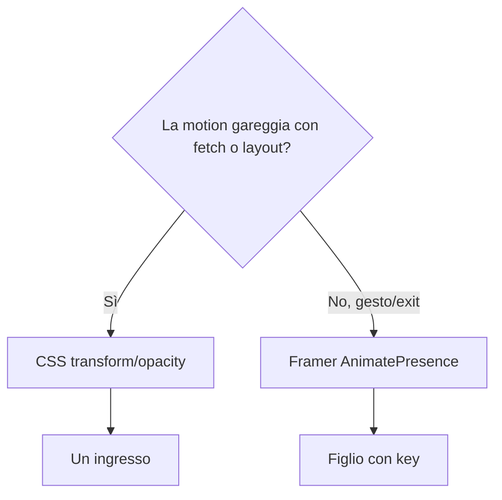

# 006 — Motion fluido: un clock, solo composite

| Campo | Valore |
|-------|--------|
| Numero | `006` |
| Stato | `implementato` |
| Progettato il | `2026-09-15 12:39` Europe/Rome |
| Implementato il | `2026-09-15 12:45` Europe/Rome |
| Superficie | Token motion, route enter, rail/calendar, sidebar, barre, toast/dialog, hover/press |
| Autore del progetto | Audit Emil (jank + doppio clock + layout props) |

---

## 1. Cosa si rompe in uso reale

Chi cambia vista, apre un menu o guarda una barra di avanzamento sente l’interfaccia **inseguire**, non rispondere. Non è “un po’ lenta”: durante il fetch della dashboard corrono insieme `page-enter`, lo stagger Framer delle celle e lo `layoutId` della rail. I frame cadono. La sidebar che anima `width` rilancia il layout di tutta la shell. Le barre animano `width`. I toast usano `transition-all`. Le modali con `animate-fadeIn` (classe inesistente) comparono a scatto e spariscono senza exit.

## 2. Causa radice (una sola, nominata)

**Motion di layout/JS sullo stesso tick del lavoro di pagina**, più proprietà che non sono composite.

Amplificatori (non la causa): curve deboli in `theme.ts`, `DURATION.slow` 420ms, hover `scale(1.10)`, spring sul hover di `Pressable`, `EASE_IN` definito, blur 28px in login, spinner 0.7s, origin centrale sui dropdown.

## 3. Vincoli che non si negoziano

- Solo `transform` e `opacity` in motion (stroke SVG delle gauge ammesso, durata corta).
- Un ingresso per contenitore.
- Hover/press in CSS; Framer solo dove serve exit o spring di tap.
- Reduced motion: `MotionConfig reducedMotion="user"` + CSS `reduce`.
- Niente seconda libreria. Kanban 001 intatto.
- Fuori scope: riscrivere AdminPanel in design system; solo togliere `transition-all` / classe morta.

## 4. Alternative e perché cadono

| Opzione | Cosa risolve | Cosa rompe | Verdetto |
|---------|--------------|------------|----------|
| A. CSS composite + un clock | Jank e doppio ingresso | Si perde lo slide Framer della rail | **Scelta** |
| B. Accorciare solo le durate | Sensazione “un po’ più rapida” | Il main thread resta pieno | Scartata |
| C. `will-change` su tutto | Niente | GPU piena, 1px shift | Scartata |
| D. Tenere `layoutId` rail ma `layout={false}` in navigazione | Metà del danno | Condizione fragile, stesso rAF | Scartata |

## 5. Design scelto

1. Token: ease-out expo `(0.19, 1, 0.22, 1)`; UI ≤ 220ms; niente `EASE_IN`; `slow` allineato a 220ms.
2. `MotionConfig reducedMotion="user"` in `providers`.
3. `page-enter` e `animate-fade-in`: solo opacity. Bento: div statico, zero stagger.
4. Rail: pill CSS `translateY`, non `layoutId`. Calendari: classe selected, non shared layout.
5. Sidebar: cambio larghezza **istantaneo** (occasionale ≠ scusa per animare `width`).
6. Barre: `scaleX` + `transform-origin: left`.
7. Toast: `transform`+`opacity` 180ms. Dialog/modal: presenza con `key` + exit. `animate-fadeIn` → `animate-fade-in`.
8. Pressable/ThemeToggle: hover 1.02 / active 0.97 in CSS, gated. Dropdown `origin-top-right`.
9. Spinner 0.5s. Login blur ≤ 12px.

## 6. Rischi residui

- La rail non “scivola” più tra icone con spring: è un translate CSS. Più nitida, meno magica — corretto per un gestionale.
- Collapse sidebar senza tween: uno scatto. Meglio di un reflow di 200ms su tutta la pagina.
- `strokeDashoffset` sulla gauge resta paint-tier; durata breve.

## 7. Piano di verifica

1. Dashboard: un solo fade di pagina, celle già al posto. Rail click + load: highlight senza stutter.
2. Collapse sidebar: il Kanban non “respira” a scatti di layout animato.
3. Barre: crescono da sinistra, nessun reflow delle etichette.
4. Apri/chiudi ricerca TopBar e menu colonna: origin dall’angolo, exit visibile.
5. Toast: compare/esce senza animare l’ombra.
6. `prefers-reduced-motion`: niente translate/scale.

## 8. File toccati

| Path | Ruolo |
|------|--------|
| `docs/aggiornamenti/006-…` + `REGISTRO.md` | Questo progetto |
| `src/motion/presets.ts`, `variants.ts` | Token e varianti |
| `src/app/providers.tsx` | MotionConfig |
| `src/index.css`, `tailwind.config.js`, `design-system/theme.ts` | CSS enter, pill, press, spinner |
| Rail, calendari, sidebar, Bento, Dashboard | Via layoutId / doppio enter / width |
| Progress, TimeSheet, CitationBlocks, SprintVelocity | scaleX / durate |
| Toast, MotionDialog, AppModal, Modal, Pressable, ThemeToggle, Button | Superfici |
| AdminPanel, DiagnosticsModal, MetricCard, Login | all / fadeIn / blur |

**Fuori scope:** API, Kanban DnD 001.
