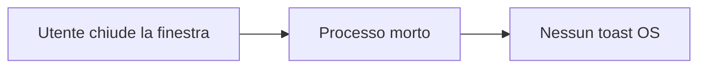
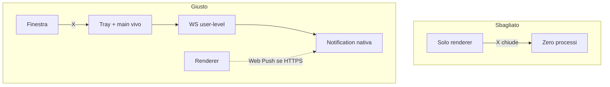
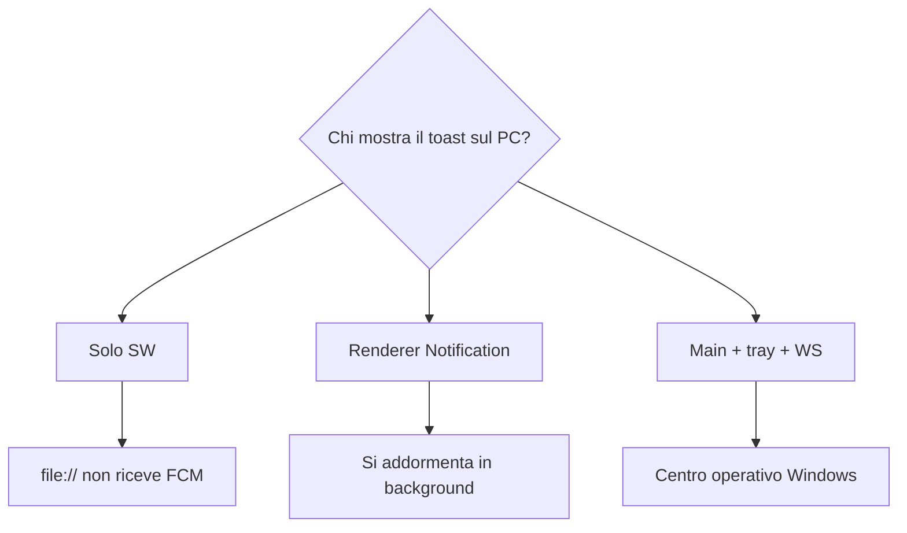
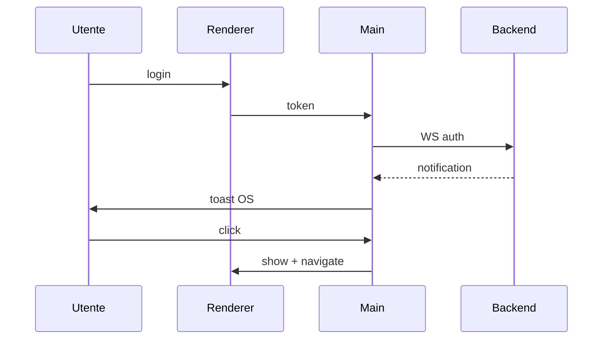

# 007 — Client Electron: toast di sistema e installer

| Campo | Valore |
|-------|--------|
| Numero | `007` |
| Stato | `implementato` |
| Progettato il | `2026-09-15 13:05` Europe/Rome |
| Implementato il | `2026-09-15 13:10` Europe/Rome |
| Superficie | Shell Electron, tray, WS nativo, NSIS/DMG/AppImage, origin desktop |
| Autore del progetto | Stesso inbox 002, consegna sul PC anche a finestra chiusa |

---

## 1. Cosa si rompe in uso reale

Il browser avvisa solo se il Service Worker è vivo. Chi installa un .exe si aspetta il toast di Windows (Centro operativo) quando un socio scrive, sposta un lavoro o cita in una call — anche se la finestra è in tray. Un wrapper che muore con la X è un browser travestito: la push “vera” sparisce.

## 2. Causa radice (una sola, nominata)

**Il renderer da solo non è un processo di notifica.** Su Windows il toast affidabile arriva dal main process con `AppUserModelId`; il Web Push nel SW su `file://` è inaffidabile. Serve un processo che resta in tray e un WebSocket autenticato nel main, stesso payload del 002.

## 3. Vincoli che non si negoziano

- Stesso backend, stessi tipi, `platform: desktop` sulla subscription se il SW riesce.
- Chiudere la finestra **non** termina l’app; Esci dal tray sì.
- `app.setAppUserModelId` allineato a `appId` installer, altrimenti Windows ingoia i toast.
- Origin `file://` / `jeins:` ammessi sul WS (il token resta obbligatorio).
- Fuori scope: store Microsoft/Apple, WNS nativo, auto-update.

## 4. Alternative e perché cadono

| Opzione | Cosa risolve | Cosa rompe | Verdetto |
|---------|--------------|------------|----------|
| Solo loadURL del sito HTTPS | SW/push come Chrome | Niente tray, X = morte | Scartata da sola |
| Solo Notification nel renderer | Toast se finestra aperta | Throttle in background | Insufficiente |
| Tray + WS nel main + Notification nativa | Toast a finestra nascosta | App del tutto chiusa = zero (v1 002) | **Scelta** |

## 5. Design scelto

1. Pacchetto `desktop/`: Electron, preload, electron-builder (NSIS Windows, DMG Mac, AppImage Linux).
2. Renderer = `gestionale-app` build con `base: ./`. API da `JEINS_API_URL` (packaged: backend Render). Su desktop **HashRouter**: `file://` non ha history SPA, `BrowserRouter` spezzerebbe login e Inbox.
3. Login nel renderer → token al main (`safeStorage`) → WS `/ws` + `auth`.
4. Frame `notification` → `new Notification` se la finestra non è focused; click riapre e naviga.
5. `ensurePushSubscription` manda `platform: desktop` se `window.jeins`.

## 6. Rischi residui e non-goals

- Build Mac/Linux da questo PC Windows: configurati, non prodotti qui.
- Senza VAPID il SW desktop può fallire: il toast OS resta via WS.
- Icona tray minimale; branding store in un numero successivo.

## 7. Piano di verifica

1. `npm run dist:win` in `desktop/` produce `release/*.exe`.
2. Install, login, chiudi la finestra: il tray resta.
3. Messaggio da un altro utente: toast Centro operativo; click riapre l’Inbox.
4. Criterio di fallimento: X dal titolo termina il processo, oppure nessun toast a finestra nascosta.

## 8. File toccati

| Path | Ruolo |
|------|--------|
| `desktop/` | Shell, preload, builder |
| `gestionale-app/src/app/providers.tsx` | HashRouter sul client desktop |
| `gestionale-app/src/lib/api/client.ts` | `window.jeins.apiUrl` |
| `backend/lib/chatHub.js` | Origin file/jeins |
| `backend/app.js` | CORS desktop |

---

*Template blueprint JEINS — ogni aggiornamento ha un numero, un’ora di progetto, e i Mermaid dove spiegano, non dove decorano.*
