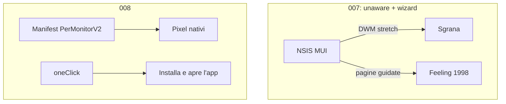
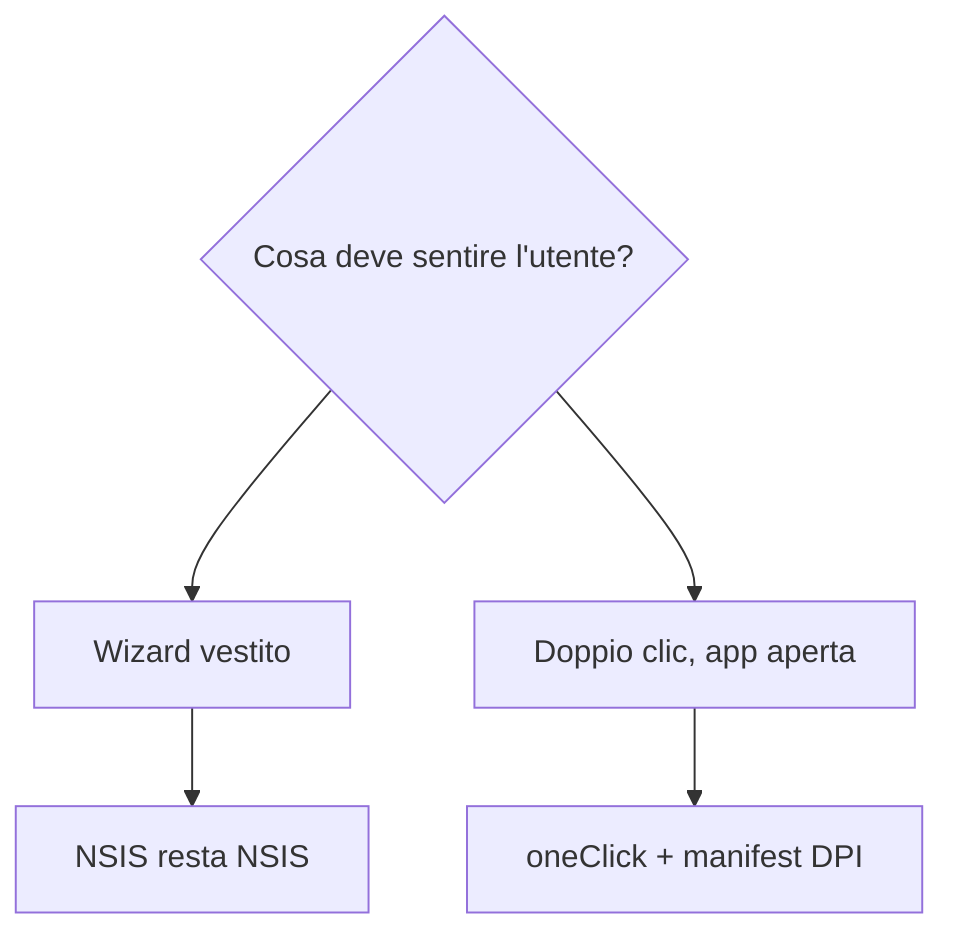
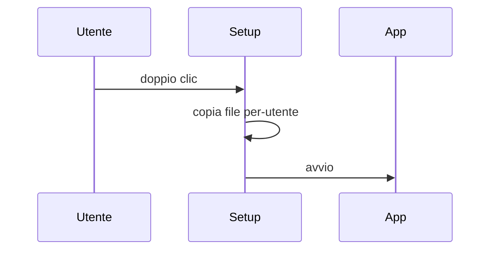

# 008 — Installer Windows nitido, senza wizard 1998

| Campo | Valore |
|-------|--------|
| Numero | `008` |
| Stato | `implementato` |
| Progettato il | `2026-09-15 15:05` Europe/Rome |
| Implementato il | `2026-09-15 15:10` Europe/Rome |
| Superficie | `desktop/package.json`, `desktop/build/installer.nsh` |
| Autore del progetto | Stesso packaging 007, prima impressione sul PC |

---

## 1. Cosa si rompe in uso reale

Chi lancia il Setup su un laptop Windows recente (125–200% di scala) non vede un installer: vede una finestra **stesa**. Testi, bordi e barra di avanzamento sono blocchi grossi, come un programma del 2003 ingrandito. Non è il pallino verde. È **tutta** la window. Il feeling premium muore prima del login.

## 2. Causa radice (una sola, nominata)

**Il wizard NSIS non è DPI-aware.** Windows 8.1+ applica la *DPI virtualization*: prende la bitmap del dialog Win32 e la scala nearest-neighbor. Da qui i “pixel enormi”.

Amplificatore, non causa: in 007 abbiamo messo `oneClick: false`. Quello è il wizard Avanti/Indietro/Annulla. Anche nitido, resta un installer da CD. Slack, Figma, VS Code non lo mostrano.

## 3. Vincoli che non si negoziano

- Stesso `appId`, stessa installazione per-utente, niente seconda libreria di installer.
- Non “abbellire” il MUI con BMP 164×314: è un cerotto sulla causa.
- Fuori scope: Authenticode a pagamento, MSIX Store, icona prodotto (numero successivo se serve).

## 4. Alternative e perché cadono

| Opzione | Cosa risolve | Cosa rompe | Verdetto |
|---------|--------------|------------|----------|
| Solo BMP sidebar più grandi | Niente: DWM stira comunque | Si lavora sul sintomo | Scartata |
| Solo `ManifestDPIAware` | Testo nitido | Resta il wizard Avanti/Indietro | Insufficiente da sola |
| MSIX / WiX / Inno | UI moderna nativa | Nuovo toolchain, identità publisher | Fuori da questo numero |
| **DPI-aware + oneClick** | Nitido e niente wizard | Niente scelta cartella (come le app premium) | **Scelta** |

## 5. Design scelto

1. `desktop/build/installer.nsh`: `ManifestDPIAware true` e `ManifestDPIAwareness "PerMonitorV2,System"`. Windows non stira più la window.
2. `nsis.oneClick: true`. Niente pagine Avanti/cartella/Indietro: progress, shortcut, avvio app.
3. Resta `perMachine: false` (niente UAC da amministratore).

## 6. Rischi residui e non-goals

- La finestra di progress oneClick è ancora NSIS, piccola: nitida, non “marketing site”.
- Chi vuole scegliere `C:\Program Files` perde quella pagina (voluto).
- SmartScreen resta finché non c’è Authenticode.

## 7. Piano di verifica

1. `npm run dist:win` in `desktop/`.
2. Scala Windows 150% o 200%. Lanciare il nuovo Setup.
3. Criterio di fallimento: testi/bordi a blocchi, oppure di nuovo tre pulsanti Avanti/Indietro/Annulla.
4. Fine: app aperta, shortcut Desktop, tray dopo login.

## 8. File toccati

| Path | Ruolo |
|------|--------|
| `desktop/build/installer.nsh` | Manifest DPI |
| `desktop/package.json` | `oneClick: true` |
| `.gitignore` | Non ignorare `installer.nsh` |

---

*Template blueprint JEINS — ogni aggiornamento ha un numero, un’ora di progetto, e i Mermaid dove spiegano, non dove decorano.*
