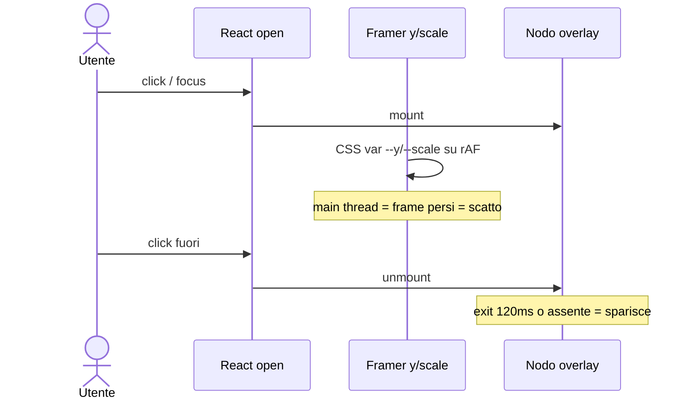
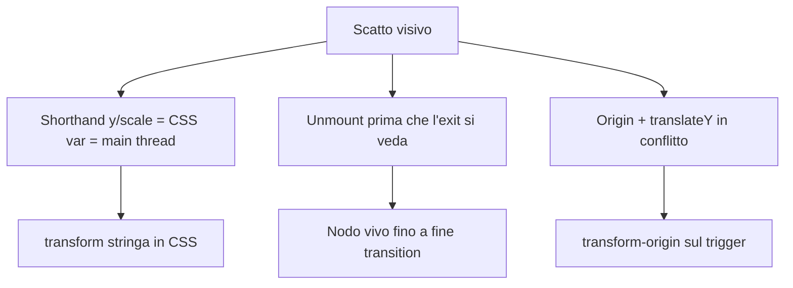
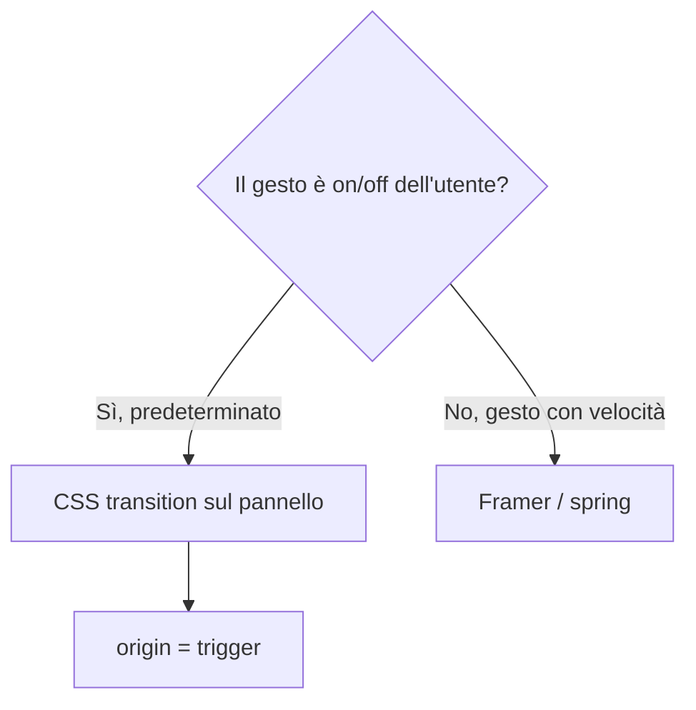

# 009 — Dropdown: transizione CSS dal trigger, non uno scatto

| Campo | Valore |
|-------|--------|
| Numero | `009` |
| Stato | `implementato` |
| Progettato il | `2026-09-15 15:06` Europe/Rome |
| Implementato il | `2026-09-15 15:12` Europe/Rome |
| Superficie | Menu overlay (TopBar, Kanban, autocomplete, picker chat) |
| Autore del progetto | Diagnosi Emil: user-driven → CSS transition; `y`/`scale` Framer sul main thread |

---

## 1. Cosa si rompe in uso reale

Si apre la ricerca, il menu utente o le opzioni colonna: il pannello **compare già al posto**, poi sparisce di colpo. Non c’è un unico oggetto che nasce dal pulsante e ci rientra. Chi usa il gestionale dieci volte al giorno legge l’UI come a scatti, non come un menu.

## 2. Causa radice (una sola, nominata)

**Il dropdown è trattato come enter/exit Framer (shorthand `y`/`scale` + unmount) invece che come transizione CSS interruptibile dal trigger.**

Amplificatori, non la causa: viaggio di 4px (il movimento non si legge), exit a 120ms, `transition={duration: 0}` se reduced è vero, picker chat e autocomplete senza alcuna motion.

## 3. Vincoli che non si negoziano

- Solo `transform` e `opacity`. Niente `height`/`width` sul pannello.
- Stesso clock di 006: expo `cubic-bezier(0.19, 1, 0.22, 1)`, UI ≤ 220ms.
- Interruptibile: riaprire a metà chiusura continua dal frame corrente (transition, non `@keyframes`).
- Reduced motion: opacity, niente scale/translate.
- Niente seconda libreria. Kanban DnD 001 intatto.
- Fuori scope: `<select>` nativo (OS), tooltip, drawer.

## 4. Alternative e perché cadono

| Opzione | Cosa risolve | Cosa rompe | Verdetto |
|---------|--------------|------------|----------|
| A. Un `DropdownPanel` CSS, `data-open`, resta montato in chiusura | Scatto, GPU, un clock | Si perde lo spring Framer (non serviva) | **Scelta** |
| B. Framer con `transform: "translateY() scale()"` stringa | Accelerazione | Unmount/exit restano fragili; due API per lo stesso gesto | Scartata |
| C. Allungare solo le durate del variant | Sensazione “più lenta” | Il main thread e l’unmount restano | Scartata |

## 5. Design scelto

1. Classe `.dropdown-panel`: chiuso = `opacity: 0` + `translateY(±8px) scale(0.96)`; aperto = identità. Origin da `data-origin`. Enter 200ms, exit 160ms, stessa curva expo.
2. Componente `DropdownPanel`: al close resta nel DOM ~220ms; al reopen cancella il timer (interruptibile). Doppio `rAF` sul primo open così il browser vede lo stato chiuso prima di aprire (`@starting-style` come rete di sicurezza).
3. TopBar ricerca/utente e menu colonna Kanban usano il componente; via Framer `dropdown`.
4. Autocomplete clienti e picker Inbox (@ e documenti) sullo stesso primitive, origine `bottom` se nascono sopra il campo.

## 6. Rischi residui e non-goals

- `@starting-style` manca sui browser vecchi: il doppio rAF copre.
- Quattro menu colonna montati solo da aperti: nessun costo a riposo.
- Native `<select>` resta dello OS.

## 7. Piano di verifica

1. TopBar: focus ricerca → il pannello cresce dal bordo alto del campo, non compare già pieno. Escape: rientra nello stesso punto, non sparisce.
2. Toggle rapido menu utente: non riparte da `scale(0.96)` se era a metà.
3. Opzioni colonna Kanban: origin top-right.
4. Inbox `@` e allegato: stesso moto, dal basso.
5. `prefers-reduced-motion`: solo fade.

## 8. File toccati

| Path | Ruolo della modifica |
|------|----------------------|
| `docs/aggiornamenti/009-…` + `REGISTRO.md` | Questo progetto |
| `src/index.css` | `.dropdown-panel` |
| `src/components/motion/DropdownPanel.tsx` | Montaggio + `data-open` |
| `src/layout/TopBar.tsx` | Ricerca e menu utente |
| `src/components/dashboard/KanbanBoard.tsx` | Menu colonna |
| `src/features/forms/modals.tsx` | Autocomplete cliente |
| `src/pages/InboxPage.tsx` + picker | Menu sopra il composer |
| `src/motion/variants.ts` | Via variant `dropdown` morto |

**Fuori scope:** select nativo, Kanban drag 001, dialog/modali (già MotionDialog), installer 008.
