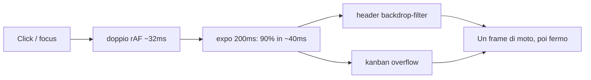
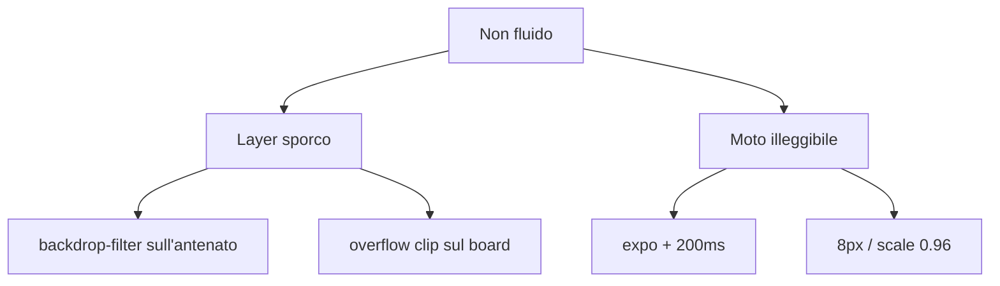

# 010 — Dropdown: fuori dal glass, curva e viaggio visibili

| Campo | Valore |
|-------|--------|
| Numero | `010` |
| Stato | `implementato` |
| Progettato il | `2026-09-15 15:13` Europe/Rome |
| Implementato il | `2026-09-15 15:16` Europe/Rome |
| Superficie | `DropdownPanel` + CSS; TopBar / Kanban / Inbox / autocomplete |
| Autore del progetto | Diagnosi Emil: expo corto + ancestor filter/overflow |

---

## 1. Cosa si rompe in uso reale

009 ha fermato lo smontaggio istantaneo, ma il menu **non si vede muovere**: compare, poi sparisce. Sulla ricerca (pannello largo sotto l’header) e sulle opzioni colonna (dentro lo scroll del board) la motion resta uno scatto con fade.

## 2. Causa radice (una sola, nominata)

**La transizione corre in un contesto che non può essere fluido, con una curva troppo ripida per la durata e il viaggio.**

Causa: il pannello è figlio dell’header `.glass` (`backdrop-filter`) o di uno scroller Kanban. Il compositor raggruppa/ritaglia il layer: i frame di `transform` non arrivano puliti.

Amplificatori: `cubic-bezier(0.19, 1, 0.22, 1)` a 200ms su un menu largo (Emil: la curva ripida **compra** durata, non la sostituisce); `translateY(8px)` illeggibile; `visibility` nella stessa transition; due `rAF` di attesa prima di partire.

## 3. Vincoli che non si negoziano

- Solo `transform` e `opacity`. Niente `height`.
- Overlay in `position: fixed` su `document.body` (stesso principio del drag 001: niente containing block / filter group).
- Transition interruptibile, non keyframes.
- Reduced motion: solo opacity.
- Fuori scope: select nativo, installer, Kanban DnD.

## 4. Alternative e perché cadono

| Opzione | Cosa risolve | Cosa rompe | Verdetto |
|---------|--------------|------------|----------|
| A. Portal `fixed` + durata 260ms + `translateY(±8%)` | Layer pulito e moto visibile | Coordinate da misurare sullo trigger | **Scelta** |
| B. `will-change` restando nel glass | Niente di sostanziale | Il filter group resta | Scartata |
| C. Solo allungare la durata in-tree | Un po’ più lenta | I frame restano nel blur/clip | Scartata |

## 5. Design scelto

1. `DropdownPanel` misura il trigger e fa portal su `body` (`fixed`, gap 8px, align stretch/end).
2. Curva `cubic-bezier(0.22, 1, 0.36, 1)` — ease-out forte ma non il dump di expo. Enter **260ms**, exit **200ms**. Viaggio `translateY(±8%) scale(0.98)` (percentuale = altezza propria, come Sonner).
3. Niente `visibility` in transition. Un solo `rAF` dopo il mount chiuso. `mousedown` sul pannello `stopPropagation` così il click-outside dei parent resta valido col portal.
4. Origin dal trigger via `--dropdown-origin`.

## 6. Rischi residui

- Scroll della pagina mentre il menu è aperto: ricalcolo su scroll/resize. Se manca un frame, il menu può restare 1px indietro — accettabile.
- Due menu aperti su colonne diverse: ogni colonna ha il suo stato.

## 7. Piano di verifica

1. Ricerca TopBar: il pannello cresce dal bordo basso del campo per ~260ms, sopra il Kanban, non dentro il blur dell’header.
2. Escape: rientra nello stesso punto.
3. Opzioni colonna: il menu non è tagliato dallo scroller; origin in alto a destra.
4. Toggle rapido: continua dal frame corrente.
5. Reduced motion: solo fade.

## 8. File toccati

| Path | Ruolo |
|------|--------|
| `docs/aggiornamenti/010-…` + `REGISTRO.md` | Questo progetto |
| `src/components/motion/DropdownPanel.tsx` | Portal + posizione |
| `src/index.css` | Curva, durata, % translate, no visibility |
| Call site TopBar / Kanban / Inbox / modals | `triggerRef` |

**Fuori scope:** 008 installer, 001 overlay Kanban.
