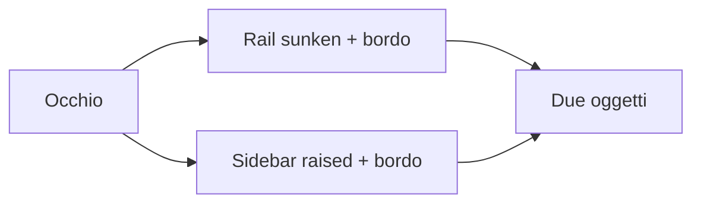
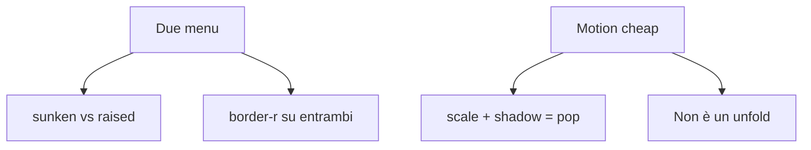

# 011 — Chrome laterale unico; dropdown a clip dal trigger

| Campo | Valore |
|-------|--------|
| Numero | `011` |
| Stato | `implementato` |
| Progettato il | `2026-09-15 15:32` Europe/Rome |
| Implementato il | `2026-09-15 15:34` Europe/Rome |
| Superficie | AppShell / IconRail / ProjectSidebar; DropdownPanel |
| Autore del progetto | Screenshot: due lastre + motion che non si legge come unfold |

---

## 1. Cosa si rompe in uso reale

A sinistra si vedono **due barre**: la rail icone (`surface-sunken`) e i progetti (`surface-raised`), ciascuna con il proprio `border-r`. Sembrano due prodotti incollati. I menu a tendina, anche portati sul `body`, **scalano e traslano** un pannello con ombra: è un *pop in* povero, non un unfold dal pulsante.

## 2. Causa radice (una sola, nominata)

**Due superfici (colore + bordo) dove il chrome deve essere uno; il dropdown anima lo *scale* del rettangolo invece di rivelarlo dal trigger.**

Diagnosi Emil: *origin-aware* vuole che il menu **cresca dal bordo del controllo**. `scale(0.98)` + `translateY` su un layer con `box-shadow` è un pop dal centro ottico, anche con `transform-origin` corretto — l’ombra e il bordo si deformano. Il corso usa `clip-path: inset()` per le reveal senza layout (comparison slider, tab highlight, hold-to-delete).

## 3. Vincoli che non si negoziano

- Un solo background sul chrome sinistro; un solo bordo verso il contenuto.
- Overlay: `clip-path` + `opacity`, composite. Niente `width`/`height`.
- Reduced motion: solo opacity (niente clip che si muove).
- Niente Radix/seconda libreria (già Framer + CSS; il primitive custom resta).
- Kanban DnD 001 intatto.

## 4. Alternative e perché cadono

| Opzione | Cosa risolve | Cosa rompe | Verdetto |
|---------|--------------|------------|----------|
| A. Shell unica `sunken` + clip-path unfold | Un oggetto; origin-aware vero | Si perde il contrasto raised sulla lista | **Scelta** |
| B. Solo togliere il bordo, colori diversi | Meno netto | Restano due materiali | Scartata |
| C. Radix DropdownMenu | A11y e `--radix-*-origin` | Seconda libreria, riscrittura | Scartata |

## 5. Design scelto

1. `AppShell` avvolge rail + progetti in un flex `bg-surface-sunken border-r`. I figli **non** hanno bg né bordo verticale.
2. Pulsanti collassati (`+`, `>>`) usano `nav-rail-btn` — stessa famiglia della rail.
3. Dropdown: `clip-path: inset(0 0 100% 0 round 1rem)` → `inset(0 round 1rem)` (dal trigger in basso; invertito se `data-side="top"`). Opacity in parallelo. Niente scale. Overflow sullo **inner**, così il clip non combatte `overflow-y`.
4. Curva `cubic-bezier(0.22, 1, 0.36, 1)`, 260ms clip / 200ms opacity. Exit 200ms.

## 6. Rischi residui

- Lista progetti sullo stesso sunken: un filo meno “card”. Si recupera con inset sulle righe attive, già presenti.
- `clip-path` su Safari è composito; se un frame scatta, `will-change: clip-path` solo sul pannello montato.

## 7. Piano di verifica

1. Viewport desktop: una lastra scura a sinistra, nessun doppio bordo tra J e `+`.
2. Collapse/expand progetti: il colore non cambia.
3. Ricerca TopBar: il menu si *srotola* dal bordo del campo, l’ombra non si schiaccia.
4. Reduced motion: fade, il clip è già aperto.

## 8. File toccati

| Path | Ruolo |
|------|--------|
| `docs/aggiornamenti/011-…` + `REGISTRO.md` | Questo progetto |
| `AppShell.tsx` | Wrapper chrome |
| `IconRail.tsx`, `ProjectSidebar.tsx` | Stesso materiale |
| `DropdownPanel.tsx`, `index.css` | Clip unfold |

**Fuori scope:** installer, contenuto Kanban.
