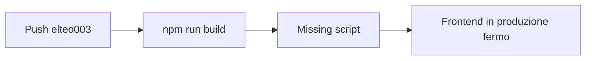
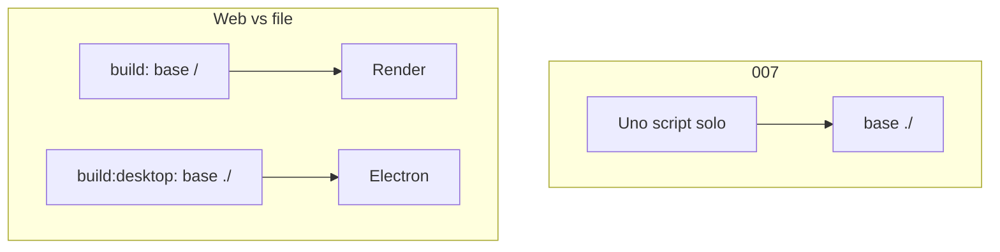

# 012 — Render: `npm run build` deve esistere

| Campo | Valore |
|-------|--------|
| Numero | `012` |
| Stato | `implementato` |
| Progettato il | `2026-09-15 15:55` Europe/Rome |
| Implementato il | `2026-09-15 15:56` Europe/Rome |
| Superficie | `gestionale-app/package.json` |
| Autore del progetto | Log Render: Missing script `"build"` |

---

## 1. Cosa si rompe in uso reale

Il Static Site su Render fallisce il deploy. L’utente vede il sito vecchio; il log dice `npm error Missing script: "build"`. CI GitHub sullo stesso comando è nello stesso buco.



## 2. Causa radice (una sola, nominata)

**007 ha sostituito lo script `build` con `build:desktop` invece di aggiungerlo.**

Prove: `726eb5d` cambia `"build": "tsc && vite build"` in `"build:desktop": "vite build --base ./"`. Render (`gestionale-app/render.yaml`) e CI (`.github/workflows/ci.yml`) chiamano ancora `npm run build`. Il log mostra decine di package installati: Root Directory è `gestionale-app`, non la root del monorepo.



## 3. Vincoli che non si negoziano

- Desktop resta `--base ./` (asset relativi su `file://`).
- Web resta `base` default `/` + `tsc` prima del bundle.
- Niente secondo bundler.

## 4. Alternative e perché cadono

| Opzione | Cosa risolve | Cosa rompe | Verdetto |
|---------|--------------|------------|----------|
| A. Ripristinare `build` e tenere `build:desktop` | Render, CI, installer | Zero | **Scelta** |
| B. Puntare Render a `build:desktop` | Un comando | Asset `/` vs `./` sul dominio HTTPS | Scartata |
| C. Mettere `build` sulla root del repo | Se Root Directory fosse `.` | Non lo è: il log ha ~90 package | Scartata |

## 5. Design scelto

```json
"build": "tsc && vite build",
"build:desktop": "vite build --base ./"
```

## 6. Rischi residui

Nessuno sul runtime se i due script restano distinti. Un futuro “unifica gli script” tornerebbe a rompere uno dei due host.

## 7. Piano di verifica

1. `cd gestionale-app && npm run build` esce 0.
2. Push su `elteo003` → Render Build succeeded.
3. `npm run build:desktop` ancora usato da `desktop/package.json`.

## 8. File toccati

| Path | Ruolo |
|------|--------|
| `docs/aggiornamenti/012-…` + `REGISTRO.md` | Questo progetto |
| `gestionale-app/package.json` | Script `build` |

**Fuori scope:** Auto-Deploy Render, vulnerabilità `npm audit` nel log.
