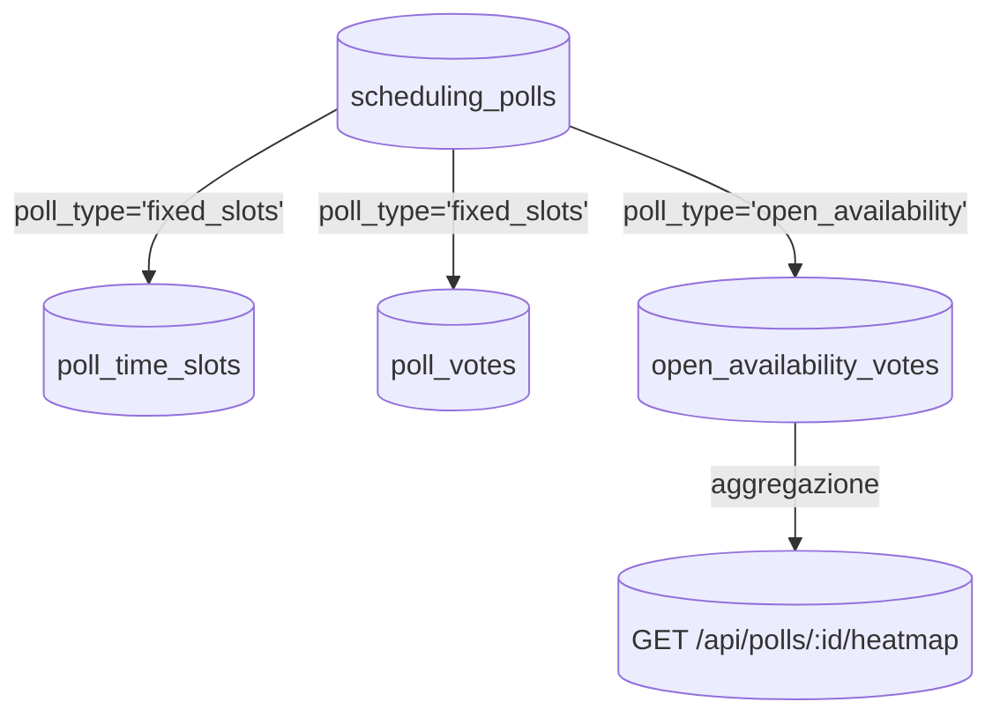
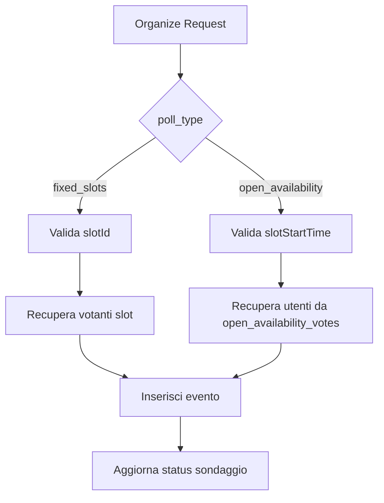

# 📡 API Endpoints - Documentazione Completa

## Pubblico di Destinazione

Questa documentazione è destinata a:
- **Sviluppatori Backend** che implementano nuovi endpoint
- **Sviluppatori Frontend** che integrano le API
- **QA Engineers** che testano le funzionalità

## Convenzioni

### Formato Documentazione

Ogni endpoint è documentato con:
- **Metodo HTTP** e **Path**
- **Autenticazione**: Richiesta/Solo Admin/Optional
- **Descrizione** della funzionalità
- **Request Body** (se applicabile)
- **Response Success** (200/201)
- **Response Error** (400/401/403/404/500)
- **Esempi** di chiamata

### Base URL

```
Development: http://localhost:3000
Production: https://gestionale-backand-api.onrender.com
```

### Headers Richiesti

Per tutte le route protette:
```
Authorization: Bearer <jwt_token>
Content-Type: application/json
```

---

## Modulo: Autenticazione

### POST /api/auth/login

**Autenticazione**: Non richiesta

**Descrizione**: Autentica un utente con email e password, ritorna token JWT e dati utente.

**Request Body**:
```json
{
  "email": "user@example.com",
  "password": "password123"
}
```

**Response Success (200)**:
```json
{
  "token": "eyJhbGciOiJIUzI1NiIsInR5cCI6IkpXVCJ9...",
  "user": {
    "id": "uuid",
    "name": "Mario Rossi",
    "email": "user@example.com",
    "role": "Manager",
    "area": "IT"
  }
}
```

**Response Error (401)**:
```json
{
  "error": "Credenziali non valide"
}
```

---

### POST /api/auth/register

**Autenticazione**: Non richiesta (in produzione, solo Admin può creare utenti)

**Descrizione**: Registra un nuovo utente nel sistema.

**Request Body**:
```json
{
  "name": "Mario Rossi",
  "email": "mario@example.com",
  "password": "password123",
  "area": "IT",
  "role": "Socio"
}
```

**Response Success (201)**:
```json
{
  "message": "Registrazione completata",
  "token": "jwt_token...",
  "user": {
    "id": "uuid",
    "name": "Mario Rossi",
    "email": "mario@example.com"
  }
}
```

---

### GET /api/auth/verify

**Autenticazione**: Richiesta

**Descrizione**: Verifica la validità del token JWT e ritorna i dati utente aggiornati.

**Response Success (200)**:
```json
{
  "user": {
    "id": "uuid",
    "name": "Mario Rossi",
    "email": "user@example.com",
    "role": "Manager",
    "area": "IT"
  }
}
```

---

## Modulo: Gestione Task (Sezione 9)

### GET /api/tasks/mytasks

**Autenticazione**: Richiesta

**Descrizione**: Ritorna tutti i task assegnati all'utente loggato. Usato dalla dashboard "I Miei Task" degli associati.

**Response Success (200)**:
```json
[
  {
    "id": "uuid",
    "description": "Completare analisi requisiti",
    "status": "In Corso",
    "priority": "Alta",
    "projectId": "uuid",
    "projectName": "Progetto Alpha",
    "area": "IT",
    "createdAt": "2024-01-01T00:00:00Z"
  }
]
```

**Query Parameters**: Nessuno

---

### PUT /api/tasks/:id/assign

**Autenticazione**: Richiesta (Solo Manager/Admin)

**Descrizione**: Assegna un task a un utente. Usato dal pannello "Tasks" del manager quando trascina un task dal backlog a un membro del team.

**Request Body**:
```json
{
  "userId": "uuid"
}
```

**Response Success (200)**:
```json
{
  "id": "uuid",
  "assignedToUserId": "uuid",
  "message": "Task assegnato con successo"
}
```

**Response Error (403)**:
```json
{
  "error": "Non hai i permessi per assegnare task"
}
```

---

### PUT /api/tasks/:id/status

**Autenticazione**: Richiesta (Solo utente assegnato o Manager)

**Descrizione**: Aggiorna lo stato di un task. Usato dagli associati per aggiornare il proprio task (es. "Da Fare" → "In Corso").

**Request Body**:
```json
{
  "status": "In Corso"
}
```

**Valori Status**: `"Da Fare"`, `"In Corso"`, `"Completato"`, `"In Revisione"`

**Response Success (200)**:
```json
{
  "id": "uuid",
  "status": "In Corso",
  "updatedAt": "2024-01-01T00:00:00Z"
}
```

**Response Error (403)**:
```json
{
  "error": "Non puoi modificare questo task"
}
```

---

## Modulo: Progetti e Team (Sezione 9)

### POST /api/projects/:id/team

**Autenticazione**: Richiesta (Solo Manager/Admin)

**Descrizione**: Aggiunge un utente al team del progetto. Usato dal pannello "Team" del manager.

**Request Body**:
```json
{
  "userId": "uuid"
}
```

**Response Success (201)**:
```json
{
  "assignmentId": "uuid",
  "projectId": "uuid",
  "userId": "uuid",
  "userName": "Mario Rossi",
  "message": "Utente aggiunto al team"
}
```

**Response Error (400)**:
```json
{
  "error": "Utente già nel team"
}
```

---

### DELETE /api/projects/:id/team/:userId

**Autenticazione**: Richiesta (Solo Manager/Admin)

**Descrizione**: Rimuove un utente dal team del progetto.

**Response Success (200)**:
```json
{
  "message": "Utente rimosso dal team"
}
```

---

### GET /api/projects/:id/team

**Autenticazione**: Richiesta

**Descrizione**: Ritorna la lista dei membri del team del progetto.

**Response Success (200)**:
```json
[
  {
    "assignmentId": "uuid",
    "userId": "uuid",
    "userName": "Mario Rossi",
    "userEmail": "mario@example.com",
    "addedAt": "2024-01-01T00:00:00Z"
  }
]
```

---

### POST /api/projects/:id/tasks

**Autenticazione**: Richiesta (Solo Manager/Admin)

**Descrizione**: Crea un nuovo task nel backlog del progetto. Il task inizialmente non è assegnato (`assigned_to_user_id = NULL`).

**Request Body**:
```json
{
  "description": "Analizzare requisiti cliente",
  "priority": "Alta"
}
```

**Valori Priority**: `"Bassa"`, `"Media"`, `"Alta"`

**Response Success (201)**:
```json
{
  "id": "uuid",
  "description": "Analizzare requisiti cliente",
  "status": "Da Fare",
  "priority": "Alta",
  "projectId": "uuid",
  "assignedToUserId": null,
  "createdAt": "2024-01-01T00:00:00Z"
}
```

---

### DELETE /api/projects/:id/tasks/:taskId

**Autenticazione**: Richiesta (Solo Manager/Admin)

**Descrizione**: Elimina un task dal progetto.

**Response Success (200)**:
```json
{
  "message": "Task eliminato con successo"
}
```

---

### GET /api/projects/:id/tasks

**Autenticazione**: Richiesta

**Descrizione**: Ritorna tutti i task del progetto (backlog + assegnati).

**Response Success (200)**:
```json
[
  {
    "id": "uuid",
    "description": "Task 1",
    "status": "Da Fare",
    "priority": "Media",
    "assignedToUserId": null,
    "assignedToUserName": null
  },
  {
    "id": "uuid",
    "description": "Task 2",
    "status": "In Corso",
    "priority": "Alta",
    "assignedToUserId": "uuid",
    "assignedToUserName": "Mario Rossi"
  }
]
```

---

## Modulo: Calendario Avanzato (Sezione 10)

### POST /api/events

**Autenticazione**: Richiesta

**Descrizione**: Crea un nuovo evento con supporto per form dinamici, regole di invito complesse e ricorrenza. **Logica complessa di espansione inviti**.

**Request Body**:
```json
{
  "title": "Call Cliente Alpha",
  "description": "Discussione progetto",
  "startTime": "2024-01-15T10:00:00Z",
  "endTime": "2024-01-15T11:00:00Z",
  "eventType": "call",
  "eventSubtype": "call_clienti",
  "clientId": "uuid",
  "callLink": "https://meet.google.com/xxx",
  "invitationRules": {
    "groups": ["manager", "it"],
    "individuals": ["user_id_1", "user_id_2"],
    "area": "IT"
  },
  "recurrenceType": "none",
  "recurrenceEndDate": null
}
```

**Tipi Evento**:
- `"call"`: Call (con sottotipi: `"call_interna"`, `"call_reparto"`, `"call_clienti"`)
- `"formazione"`: Formazione (campi aggiuntivi: `trainerName`, `level`, `prerequisites`)
- `"networking"`: Evento networking (campi aggiuntivi: `location`, `externalLink`)
- `"generic"`: Evento generico
- `"colloquio"`: Colloquio (vedi Sezione 13)

**Logica Espansione Inviti**:

Il backend espande `invitationRules` in un array di `user_id`:

1. **Gruppi**: `groups: ["manager"]` → `SELECT user_id FROM users WHERE role IN ('Manager', 'Responsabile', 'Presidente', 'CDA', 'Tesoreria', 'Audit')`
2. **Individui**: `individuals: ["uuid"]` → Aggiunge direttamente gli ID
3. **Area**: `area: "IT"` → `SELECT user_id FROM users WHERE area = 'IT'`

Poi crea righe in `participants` per ogni `user_id` trovato.

**Ricorrenza**:

Se `recurrenceType = "weekly"` o `"monthly"`:
- Genera array di date (start, end) fino a `recurrenceEndDate`
- Crea **un evento per ogni data** nella tabella `events`
- Crea `participants` per ogni evento

**Response Success (201)**:
```json
[
  {
    "id": "uuid",
    "title": "Call Cliente Alpha",
    "startTime": "2024-01-15T10:00:00Z",
    "endTime": "2024-01-15T11:00:00Z",
    "eventType": "call",
    "participants": [
      {
        "id": "uuid",
        "userId": "uuid",
        "userName": "Mario Rossi",
        "status": "pending"
      }
    ]
  }
]
```

**Note**: Se ricorrenza, ritorna array di eventi. Altrimenti array con un solo elemento.

---

### GET /api/events

**Autenticazione**: Richiesta

**Descrizione**: Ritorna tutti gli eventi con filtri opzionali.

**Query Parameters**:
- `startDate` (ISO string): Filtra eventi da questa data
- `endDate` (ISO string): Filtra eventi fino a questa data
- `isCall` (boolean): Filtra solo call (`true`) o solo non-call (`false`)
- `eventType` (string): Filtra per tipo evento

**Response Success (200)**:
```json
[
  {
    "id": "uuid",
    "title": "Call Cliente Alpha",
    "startTime": "2024-01-15T10:00:00Z",
    "endTime": "2024-01-15T11:00:00Z",
    "eventType": "call",
    "eventSubtype": "call_clienti",
    "clientId": "uuid",
    "clientName": "Cliente Alpha",
    "participants": [...]
  }
]
```

---

### PUT /api/events/:id

**Autenticazione**: Richiesta (Solo creatore o Admin)

**Descrizione**: Aggiorna un evento esistente. Supporta **Optimistic Locking** tramite `version`.

**Request Body**:
```json
{
  "title": "Call Cliente Alpha - Aggiornata",
  "description": "Nuova descrizione",
  "expectedVersion": 2
}
```

**Response Success (200)**:
```json
{
  "id": "uuid",
  "title": "Call Cliente Alpha - Aggiornata",
  "version": 3,
  "participants": [...]
}
```

**Response Error (409) - Conflitto Concorrenza**:
```json
{
  "error": "CONCURRENT_MODIFICATION",
  "conflictData": {
    "yourChanges": {...},
    "serverData": {...},
    "originalData": {...}
  }
}
```

---

## Modulo: Reportistica Eventi (Sezione 11)

### GET /api/events/:id/reports

**Autenticazione**: Richiesta

**Descrizione**: Ritorna tutti i report/verbali per un evento. Usato nella tab "Report e Verbali" del modale evento.

**Response Success (200)**:
```json
[
  {
    "id": "uuid",
    "eventId": "uuid",
    "creatorUserId": "uuid",
    "creatorName": "Mario Rossi",
    "reportContent": "# Verbale Riunione\n\n## Punti Discussi\n...",
    "createdAt": "2024-01-01T00:00:00Z"
  }
]
```

---

### POST /api/events/:id/reports

**Autenticazione**: Richiesta (Solo Manager/CDA/Admin/Responsabile/Presidente o creatore evento)

**Descrizione**: Crea un nuovo verbale per un evento. L'evento deve essere nel passato (`endTime < NOW()`).

**Request Body**:
```json
{
  "reportContent": "# Verbale\n\n## Contenuto..."
}
```

**Response Success (201)**:
```json
{
  "id": "uuid",
  "eventId": "uuid",
  "creatorUserId": "uuid",
  "reportContent": "# Verbale\n\n## Contenuto...",
  "createdAt": "2024-01-01T00:00:00Z"
}
```

---

### PUT /api/events/:eventId/reports/:reportId

**Autenticazione**: Richiesta (Solo creatore del report)

**Descrizione**: Aggiorna un verbale esistente.

**Request Body**:
```json
{
  "reportContent": "# Verbale Aggiornato\n\n..."
}
```

---

### DELETE /api/events/:eventId/reports/:reportId

**Autenticazione**: Richiesta (Solo creatore del report)

**Descrizione**: Elimina un verbale.

**Response Success (200)**:
```json
{
  "message": "Report eliminato con successo"
}
```

---

## Modulo: Sistema di Pianificazione - Sondaggi (Sezione 12)

### Evoluzione Modello Dati

- Tabella `scheduling_polls`
  - Nuova colonna `poll_type VARCHAR(32)` con valori ammessi `"fixed_slots"` (default) e `"open_availability"`.
- Tabella `poll_time_slots`
  - Utilizzata solo se `poll_type = 'fixed_slots'`.
- Tabella `poll_votes`
  - Mantiene le preferenze slot predefiniti.
- **Nuova tabella** `open_availability_votes`
  - `vote_id UUID PRIMARY KEY`
  - `poll_id UUID REFERENCES scheduling_polls(poll_id) ON DELETE CASCADE`
  - `user_id UUID REFERENCES users(user_id) ON DELETE CASCADE`
  - `slot_start_time TIMESTAMP NOT NULL`
  - Indici consigliati su `(poll_id, slot_start_time)` e `(poll_id, user_id)`.



### POST /api/polls

**Autenticazione**: Richiesta (Solo Manager/CDA/Admin/Responsabile/Presidente)

**Descrizione**: Crea un nuovo sondaggio di disponibilità. Supporta entrambe le modalità.

**Request Body**:
```json
{
  "title": "Sondaggio per Workshop X",
  "durationMinutes": 60,
  "pollType": "fixed_slots",
  "invitationRules": {
    "groups": ["manager", "it"],
    "individuals": ["user_id_1"]
  },
  "timeSlots": [
    {
      "startTime": "2025-01-15T09:00:00Z",
      "endTime": "2025-01-15T10:00:00Z"
    }
  ],
  "candidateId": "uuid"
}
```

- Se `pollType = "fixed_slots"` è obbligatorio fornire da 2 a 5 elementi nell'array `timeSlots`.
- Se `pollType = "open_availability"` il campo `timeSlots` viene ignorato e non deve essere inviato.

**Response Success (201)**:
```json
{
  "id": "uuid",
  "title": "Sondaggio per Workshop X",
  "durationMinutes": 60,
  "pollType": "fixed_slots",
  "status": "open",
  "slots": [
    {
      "id": "uuid",
      "startTime": "2025-01-15T09:00:00Z",
      "endTime": "2025-01-15T10:00:00Z"
    }
  ]
}
```

### POST /api/polls/:pollId/availability

**Autenticazione**: Richiesta (Invitati al sondaggio)

**Descrizione**: Registra le disponibilità granulari per un sondaggio heatmap.

**Request Body**:
```json
{
  "slots": [
    "2025-11-19T10:00:00Z",
    "2025-11-19T10:30:00Z"
  ]
}
```

- Ogni elemento dell'array rappresenta l'inizio di un intervallo della durata definita dal sondaggio.
- Il backend sostituisce eventuali selezioni precedenti dell'utente per quel sondaggio.

**Response Success (200)**:
```json
{
  "message": "Disponibilità registrata",
  "saved": 2
}
```

### GET /api/polls/:pollId/heatmap

**Autenticazione**: Richiesta (Solo creatore del sondaggio)

**Descrizione**: Restituisce l'aggregazione delle disponibilità per la modalità heatmap.

**Response Success (200)**:
```json
{
  "pollId": "uuid",
  "durationMinutes": 60,
  "slots": [
    {
      "slotStartTime": "2025-11-19T10:00:00Z",
      "availableUsers": 8,
      "userIds": ["uuid1", "uuid2"]
    }
  ]
}
```

### GET /api/polls/:pollId

**Autenticazione**: Richiesta

**Descrizione**: Ritorna i dettagli del sondaggio con payload diverso in base alla modalità.

- `pollType = "fixed_slots"`: include `slots` con relative votazioni (`poll_votes`).
- `pollType = "open_availability"`: include `myAvailabilitySlots` (array degli slot scelti dall'utente corrente) e metadati per la heatmap (es. finestre temporali, timezone).

### POST /api/polls/:pollId/vote

**Nota**: Usato solo per `pollType = "fixed_slots"`. I client devono instradare i voti heatmap verso `/availability`.

### POST /api/polls/:pollId/organize

**Descrizione**: Identica alla versione precedente, ma accetta anche input da heatmap.

```json
{
  "slotId": "uuid",                     // Obbligatorio per fixed_slots
  "slotStartTime": "2025-11-19T10:00:00Z", // Obbligatorio per open_availability
  "title": "Workshop Definitivo",
  "eventType": "call",
  "eventSubtype": "call_interna"
}
```

Il backend:
1. Valida la modalità.
2. Per heatmap calcola `endTime = slotStartTime + durationMinutes`.
3. Recupera la lista utenti disponibili da `poll_votes` (classico) o `open_availability_votes` (heatmap).
4. Crea l'evento in `events` e i partecipanti in `participants`.
5. Aggiorna `scheduling_polls.status = 'closed'`.



---

## Modulo: HR - Recruiting (Sezione 13)

### GET /api/candidates

**Autenticazione**: Richiesta (Solo Manager/CDA/Admin/Responsabile/Presidente)

**Descrizione**: Ritorna tutti i candidati. Manager vede solo candidati della propria area.

**Query Parameters**: Nessuno (filtro automatico per area se Manager)

**Response Success (200)**:
```json
[
  {
    "id": "uuid",
    "name": "Mario Rossi",
    "email": "mario@example.com",
    "cvUrl": "https://drive.google.com/...",
    "status": "In attesa",
    "areaCompetenza": "IT",
    "createdAt": "2024-01-01T00:00:00Z",
    "createdByName": "Admin User"
  }
]
```

---

### POST /api/candidates

**Autenticazione**: Richiesta (Solo Manager/CDA/Admin/Responsabile/Presidente)

**Descrizione**: Crea un nuovo candidato.

**Request Body**:
```json
{
  "name": "Mario Rossi",
  "email": "mario@example.com",
  "cvUrl": "https://drive.google.com/...",
  "areaCompetenza": "IT"
}
```

**Response Success (201)**:
```json
{
  "id": "uuid",
  "name": "Mario Rossi",
  "email": "mario@example.com",
  "status": "In attesa",
  "createdAt": "2024-01-01T00:00:00Z"
}
```

---

### PUT /api/candidates/:id

**Autenticazione**: Richiesta (Solo Manager/CDA/Admin/Responsabile/Presidente)

**Descrizione**: Aggiorna un candidato (es. cambio stato).

**Request Body**:
```json
{
  "status": "In colloquio"
}
```

**Valori Status**: `"In attesa"`, `"In colloquio"`, `"Accettato"`, `"Rifiutato"`

---

### DELETE /api/candidates/:id

**Autenticazione**: Richiesta (Solo Admin/CDA/Presidente)

**Descrizione**: Elimina un candidato.

---

## Modulo: HR - Onboarding (Sezione 13)

### POST /api/onboarding/start

**Autenticazione**: Richiesta (Solo Manager/CDA/Admin/Responsabile/Presidente)

**Descrizione**: Avvia il periodo di prova per un candidato accettato. **Doppia creazione**: User + Project.

**Request Body**:
```json
{
  "candidateId": "uuid"
}
```

**Logica Backend (Transazione)**:

1. Verifica che il candidato esista e sia `status = "Accettato"`
2. Verifica che non esista già un utente con la stessa email
3. **Azione 1: Crea User**:
   - `name` = candidato.name
   - `email` = candidato.email
   - `role` = `"Associato (Prova)"`
   - `area` = candidato.area_competenza
   - Genera password temporanea (random)
   - Hash password con bcrypt
4. **Azione 2: Crea Project**:
   - `name` = `"Periodo di Prova: [Nome Candidato]"`
   - `client_id` = NULL (progetto interno)
   - `area` = candidato.area_competenza
   - `status` = `"In Corso"`
5. Crea `project_assignments` per il nuovo utente
6. Aggiorna candidato: `status = "In colloquio"` (per indicare che è in onboarding)

**Response Success (201)**:
```json
{
  "message": "Periodo di prova avviato con successo",
  "user": {
    "id": "uuid",
    "name": "Mario Rossi",
    "email": "mario@example.com",
    "role": "Associato (Prova)",
    "area": "IT",
    "tempPassword": "random_password_123" // ⚠️ In produzione, inviare via email
  },
  "project": {
    "id": "uuid",
    "name": "Periodo di Prova: Mario Rossi",
    "area": "IT",
    "status": "In Corso",
    "assignedUserId": "uuid"
  },
  "warning": "La password temporanea è stata generata. In produzione, inviala via email al candidato."
}
```

---

## Modulo: Utenti e Dashboard

### GET /api/users

**Autenticazione**: Richiesta (Solo Admin/IT)

**Descrizione**: Ritorna tutti gli utenti del sistema.

**Response Success (200)**:
```json
[
  {
    "id": "uuid",
    "name": "Mario Rossi",
    "email": "mario@example.com",
    "role": "Manager",
    "area": "IT",
    "isActive": true,
    "createdAt": "2024-01-01T00:00:00Z",
    "lastSeen": "2024-01-15T10:30:00Z"
  }
]
```

---

### GET /api/users/online

**Autenticazione**: Richiesta (Solo Admin/IT)

**Descrizione**: Ritorna gli utenti attivi negli ultimi 5 minuti (`last_seen > NOW() - INTERVAL '5 minutes'`).

**Response Success (200)**:
```json
[
  {
    "id": "uuid",
    "name": "Mario Rossi",
    "email": "mario@example.com",
    "lastSeen": "2024-01-15T10:30:00Z"
  }
]
```

---

## Modulo: Clienti, Progetti, Contratti

### GET /api/clients

**Autenticazione**: Richiesta

**Descrizione**: Ritorna tutti i clienti.

**Query Parameters**: Opzionali per filtri

**Response Success (200)**:
```json
[
  {
    "id": "uuid",
    "name": "Cliente Alpha",
    "contactPerson": "Mario Rossi",
    "email": "contact@alpha.com",
    "phone": "+39 123 456 7890",
    "status": "Attivo",
    "area": "IT",
    "createdAt": "2024-01-01T00:00:00Z",
    "version": 1
  }
]
```

---

### GET /api/projects

**Autenticazione**: Richiesta

**Descrizione**: Ritorna tutti i progetti.

**Response Success (200)**:
```json
[
  {
    "id": "uuid",
    "name": "Progetto Alpha",
    "clientId": "uuid",
    "clientName": "Cliente Alpha",
    "area": "IT",
    "status": "In Corso",
    "version": 1
  }
]
```

---

### GET /api/projects/my

**Autenticazione**: Richiesta

**Descrizione**: Ritorna i progetti assegnati all'utente loggato (tramite `project_assignments`).

**Response Success (200)**:
```json
[
  {
    "id": "uuid",
    "name": "Progetto Alpha",
    "area": "IT",
    "status": "In Corso",
    "assignedAt": "2024-01-01T00:00:00Z"
  }
]
```

---

## Error Handling Standard

### 400 Bad Request
```json
{
  "error": "Messaggio descrittivo dell'errore"
}
```

### 401 Unauthorized
```json
{
  "error": "Token non valido o scaduto"
}
```

### 403 Forbidden
```json
{
  "error": "Non hai i permessi per questa operazione"
}
```

### 404 Not Found
```json
{
  "error": "Risorsa non trovata"
}
```

### 409 Conflict (Optimistic Locking)
```json
{
  "error": "CONCURRENT_MODIFICATION",
  "conflictData": {
    "yourChanges": {...},
    "serverData": {...},
    "originalData": {...}
  }
}
```

### 500 Internal Server Error
```json
{
  "error": "Errore interno del server",
  "details": "Stack trace (solo in development)"
}
```

---

**Versione**: 1.0  
**Ultimo Aggiornamento**: 2024

