# 🔒 Optimistic Locking - Dettagli Tecnici

## Pubblico di Destinazione

Questa documentazione è destinata a:
- **Sviluppatori Backend** che implementano o modificano logica di concorrenza
- **Sviluppatori Frontend** che gestiscono conflitti di modifica
- **Ingegneri del Software** che devono comprendere il meccanismo di controllo concorrenza

## Panoramica

L'**Optimistic Locking** è un meccanismo di controllo della concorrenza che previene modifiche simultanee allo stesso record da parte di utenti diversi, senza bloccare i dati durante la lettura.

## Come Funziona

### Concetto Base

1. **Lettura**: Il client legge il record con la sua `version` (es. `version: 5`)
2. **Modifica**: Il client modifica i dati e invia la modifica con `expectedVersion: 5`
3. **Verifica**: Il backend verifica che la `version` nel database sia ancora `5`
4. **Successo**: Se corrisponde, aggiorna il record e incrementa `version` a `6`
5. **Conflitto**: Se non corrisponde, ritorna errore 409 con i dati del server

### Diagramma di Flusso

```mermaid
sequenceDiagram
    participant C1 as Client 1
    participant B as Backend
    participant D as Database
    participant C2 as Client 2

    Note over C1,D: Scenario: Due utenti modificano lo stesso record
    
    C1->>B: GET /api/projects/123
    B->>D: SELECT * FROM projects WHERE id=123
    D-->>B: {id: 123, name: "Progetto", version: 5}
    B-->>C1: {id: 123, name: "Progetto", version: 5}
    
    C2->>B: GET /api/projects/123
    B->>D: SELECT * FROM projects WHERE id=123
    D-->>B: {id: 123, name: "Progetto", version: 5}
    B-->>C2: {id: 123, name: "Progetto", version: 5}
    
    Note over C1,C2: Entrambi hanno version=5
    
    C1->>B: PUT /api/projects/123<br/>{name: "Progetto A", expectedVersion: 5}
    B->>D: SELECT version FROM projects WHERE id=123
    D-->>B: version=5 ✅
    B->>D: UPDATE projects SET name=..., version=6 WHERE id=123
    D-->>B: ✅ Updated
    B-->>C1: 200 OK {version: 6}
    
    C2->>B: PUT /api/projects/123<br/>{name: "Progetto B", expectedVersion: 5}
    B->>D: SELECT version FROM projects WHERE id=123
    D-->>B: version=6 ❌ (diverso da expectedVersion=5)
    B-->>C2: 409 Conflict<br/>{error: "CONCURRENT_MODIFICATION", serverData: {...}}
```



## Implementazione Backend

### Database Schema

Ogni tabella che supporta optimistic locking ha una colonna `version`:

```sql
ALTER TABLE projects ADD COLUMN IF NOT EXISTS version INTEGER DEFAULT 1;
ALTER TABLE clients ADD COLUMN IF NOT EXISTS version INTEGER DEFAULT 1;
ALTER TABLE contracts ADD COLUMN IF NOT EXISTS version INTEGER DEFAULT 1;
ALTER TABLE tasks ADD COLUMN IF NOT EXISTS version INTEGER DEFAULT 1;
ALTER TABLE events ADD COLUMN IF NOT EXISTS version INTEGER DEFAULT 1;
```

### Trigger Auto-Incremento

Un trigger PostgreSQL incrementa automaticamente `version` ad ogni UPDATE:

```sql
CREATE OR REPLACE FUNCTION increment_version() RETURNS TRIGGER AS $$
BEGIN
    NEW.version = OLD.version + 1;
    RETURN NEW;
END;
$$ LANGUAGE plpgsql;

CREATE TRIGGER trigger_projects_version 
BEFORE UPDATE ON projects 
FOR EACH ROW EXECUTE FUNCTION increment_version();
```

**Vantaggio**: L'incremento è atomico e garantito dal database.

### Verifica nel Backend

**File**: `backend/routes/projects.js` (esempio)

```javascript
// PUT /api/projects/:id
router.put('/:id', async (req, res) => {
    const { id } = req.params;
    const { name, status, expectedVersion } = req.body;

    // 1. Verifica versione corrente
    const currentCheck = await pool.query(
        'SELECT version FROM projects WHERE project_id = $1',
        [id]
    );

    if (currentCheck.rows.length === 0) {
        return res.status(404).json({ error: 'Progetto non trovato' });
    }

    const currentVersion = currentCheck.rows[0].version;

    // 2. Verifica conflitto
    if (expectedVersion !== undefined && currentVersion !== expectedVersion) {
        // Conflitto! Recupera dati server per il merge
        const serverData = await pool.query(
            'SELECT * FROM projects WHERE project_id = $1',
            [id]
        );

        return res.status(409).json({
            error: 'CONCURRENT_MODIFICATION',
            message: 'Il record è stato modificato da un altro utente',
            currentVersion: currentVersion,
            expectedVersion: expectedVersion,
            serverData: serverData.rows[0]
        });
    }

    // 3. Aggiorna (il trigger incrementerà version automaticamente)
    const result = await pool.query(
        'UPDATE projects SET name = $1, ... WHERE project_id = $2 RETURNING *',
        [name, id]
    );

    res.json(result.rows[0]); // Include version incrementata
});
```

## Implementazione Frontend

### Servizio API

**File**: `gestionale-app/src/services/api.ts`

Il servizio API intercetta errori 409 e li converte in eccezioni tipizzate:

```typescript
async function apiCall(endpoint: string, options: RequestInit = {}): Promise<any> {
    const response = await fetch(fullUrl, config);
    
    if (!response.ok) {
        const error = await response.json();
        
        // Gestione conflitto optimistic locking
        if (response.status === 409 && error.error === 'CONCURRENT_MODIFICATION') {
            const conflictError: any = new Error(error.message);
            conflictError.name = 'ConcurrentModificationError';
            conflictError.status = 409;
            conflictError.conflictData = error;
            throw conflictError;
        }
        
        throw new Error(error.error || `Errore ${response.status}`);
    }
    
    return await response.json();
}
```

### Gestione Conflitti nel Componente

**File**: `gestionale-app/src/App.tsx`

```typescript
const updateProjectStatus = async (projectId: string, status: string) => {
    try {
        const updated = await projectsAPI.update(projectId, { 
            status, 
            expectedVersion: project.version // Passa versione corrente
        });
        setProjects(projects.map(p => 
            p.id === projectId ? { ...p, ...updated } : p
        ));
    } catch (error: any) {
        if (error.name === 'ConcurrentModificationError' && error.conflictData) {
            // Mostra dialog di risoluzione conflitto
            setConflictDialog({
                isOpen: true,
                conflictData: {
                    yourChanges: { status },
                    serverData: error.conflictData.serverData,
                    originalData: project
                },
                entityType: 'progetto',
                entityId: projectId,
                originalData: project,
                updateFunction: async (data: any, version?: number) => {
                    const updated = await projectsAPI.update(projectId, { 
                        ...data, 
                        expectedVersion: version 
                    });
                    setProjects(projects.map(p => 
                        p.id === projectId ? { ...p, ...updated } : p
                    ));
                }
            });
        } else {
            alert(error.message || 'Errore nell\'aggiornamento');
        }
    }
};
```

## Risoluzione Conflitti

### Componente ConflictDialog

**File**: `gestionale-app/src/components/ConflictDialog.tsx`

Il componente offre tre opzioni di risoluzione:

1. **Mantieni le Tue Modifiche** (`yours`): Sovrascrive i dati del server
2. **Mantieni Dati del Server** (`server`): Ricarica i dati dal server
3. **Unisci Manualmente** (`merged`): Permette di selezionare campo per campo

### Strategia di Merge

**File**: `gestionale-app/src/utils/conflictResolver.ts`

```typescript
export function analyzeConflict(
    yourChanges: any,
    serverData: any,
    originalData: any
): {
    mergeable: string[];
    conflicting: string[];
} {
    const mergeable: string[] = [];
    const conflicting: string[] = [];

    Object.keys(yourChanges).forEach(key => {
        const yourValue = yourChanges[key];
        const serverValue = serverData[key];
        const originalValue = originalData[key];

        // Se entrambi hanno modificato lo stesso campo, è un conflitto
        if (yourValue !== originalValue && serverValue !== originalValue) {
            conflicting.push(key);
        } else {
            mergeable.push(key);
        }
    });

    return { mergeable, conflicting };
}
```

## Entità che Supportano Optimistic Locking

### Tabelle con Version

- ✅ `projects` - Progetti
- ✅ `clients` - Clienti
- ✅ `contracts` - Contratti/Fatture
- ✅ `tasks` - Task
- ✅ `events` - Eventi

### Tabelle SENZA Version

- ❌ `users` - Utenti (modifiche solo da Admin)
- ❌ `todos` - Todo legacy (deprecato)
- ❌ `participants` - Partecipanti eventi (creazione/eliminazione, non modifica)
- ❌ `event_reports` - Report eventi (rari conflitti)
- ❌ `scheduling_polls` - Sondaggi (rari conflitti)

## Best Practices

### 1. Sempre Passare expectedVersion

Quando aggiorni un'entità, **sempre** includi `expectedVersion`:

```typescript
// ✅ CORRETTO
await projectsAPI.update(projectId, {
    name: "Nuovo Nome",
    expectedVersion: project.version
});

// ❌ SBAGLIATO (non previene conflitti)
await projectsAPI.update(projectId, {
    name: "Nuovo Nome"
    // expectedVersion mancante
});
```

### 2. Aggiornare Version Dopo Ogni Modifica

Dopo ogni aggiornamento riuscito, aggiorna la `version` nello stato locale:

```typescript
const updated = await projectsAPI.update(projectId, { 
    name: "Nuovo Nome",
    expectedVersion: project.version 
});
setProjects(projects.map(p => 
    p.id === projectId ? { ...p, ...updated } : p // updated include nuova version
));
```

### 3. Mostrare ConflictDialog User-Friendly

Non usare `alert()` per conflitti. Usa sempre `ConflictDialog` che permette merge intelligente.

### 4. Logging per Debug

In sviluppo, logga i conflitti per capire pattern di uso:

```typescript
if (error.name === 'ConcurrentModificationError') {
    console.warn('Conflitto di modifica:', {
        entity: projectId,
        expectedVersion: error.conflictData.expectedVersion,
        currentVersion: error.conflictData.currentVersion,
        user: currentUser.email
    });
}
```

## Limitazioni e Considerazioni

### 1. Performance

- **Overhead minimo**: Una query SELECT aggiuntiva per verificare la versione
- **Trade-off**: Preferibile rispetto a locking pessimistico (blocca altri utenti)

### 2. Race Conditions Estreme

Se due utenti modificano **esattamente nello stesso millisecondo**, il primo vince. Il secondo riceve 409.

### 3. Conflitti Frequenti

Se gli utenti modificano spesso gli stessi record, considera:
- **Notifiche in tempo reale** (WebSocket) per avvisare modifiche
- **Locking pessimistico** per operazioni critiche
- **Workspace separati** per evitare conflitti

### 4. Relazioni Complesse

Se modifichi un'entità che ha relazioni con altre, considera:
- Aggiornare anche le entità correlate
- Verificare version di tutte le entità coinvolte
- Usare transazioni per atomicità

## Testing Optimistic Locking

### Test Scenario 1: Modifica Simultanea

```javascript
// Test: Due utenti modificano lo stesso progetto
const project = await projectsAPI.getById('123'); // version: 5

// Utente 1
await projectsAPI.update('123', { name: "Nome A", expectedVersion: 5 });
// ✅ Successo, version diventa 6

// Utente 2 (stesso progetto, version locale ancora 5)
await projectsAPI.update('123', { name: "Nome B", expectedVersion: 5 });
// ❌ 409 Conflict (server version è 6, non 5)
```

### Test Scenario 2: Merge Automatico

```typescript
// Test: Modifiche su campi diversi (mergeable)
const project = { id: '123', name: "Progetto", status: "In Corso", version: 5 };

// Utente 1 modifica name
await projectsAPI.update('123', { name: "Nuovo Nome", expectedVersion: 5 });
// ✅ Successo

// Utente 2 modifica status (campo diverso)
await projectsAPI.update('123', { status: "Completato", expectedVersion: 5 });
// ❌ 409 Conflict (anche se campi diversi, version è cambiata)
// Soluzione: Ricarica e riprova
```

## Esempi Pratici

### Esempio 1: Aggiornamento Progetto

```typescript
// Frontend: Aggiorna stato progetto
const handleStatusChange = async (projectId: string, newStatus: string) => {
    const project = projects.find(p => p.id === projectId);
    
    try {
        const updated = await projectsAPI.update(projectId, {
            status: newStatus,
            expectedVersion: project.version // ✅ Passa version
        });
        
        // Aggiorna stato locale con nuova version
        setProjects(projects.map(p => 
            p.id === projectId ? { ...p, status: updated.status, version: updated.version } : p
        ));
    } catch (error: any) {
        if (error.name === 'ConcurrentModificationError') {
            // Mostra dialog conflitto
            showConflictDialog(error.conflictData);
        }
    }
};
```

### Esempio 2: Merge Intelligente

```typescript
// Frontend: Risolvi conflitto con merge
const handleConflictResolve = async (resolution: 'yours' | 'server' | 'merged', mergedData?: any) => {
    if (resolution === 'server') {
        // Ricarica dal server
        await loadProjects();
    } else if (resolution === 'yours') {
        // Applica modifiche locali
        await projectsAPI.update(projectId, {
            ...yourChanges,
            expectedVersion: conflictData.serverData.version // Usa version server
        });
    } else if (resolution === 'merged' && mergedData) {
        // Applica merge manuale
        await projectsAPI.update(projectId, {
            ...mergedData,
            expectedVersion: conflictData.serverData.version
        });
    }
};
```

## Riferimenti

- **[Error Handling Patterns](./Error-Handling-Patterns.md)** - Pattern di gestione errori
- **[API Endpoints](./API-Endpoints.md)** - Documentazione endpoint con optimistic locking
- **[ConflictDialog Component](../frontend/Component-Architecture.md#conflict-resolution)** - Componente UI per conflitti

---

**Versione**: 1.0  
**Ultimo Aggiornamento**: 2024

