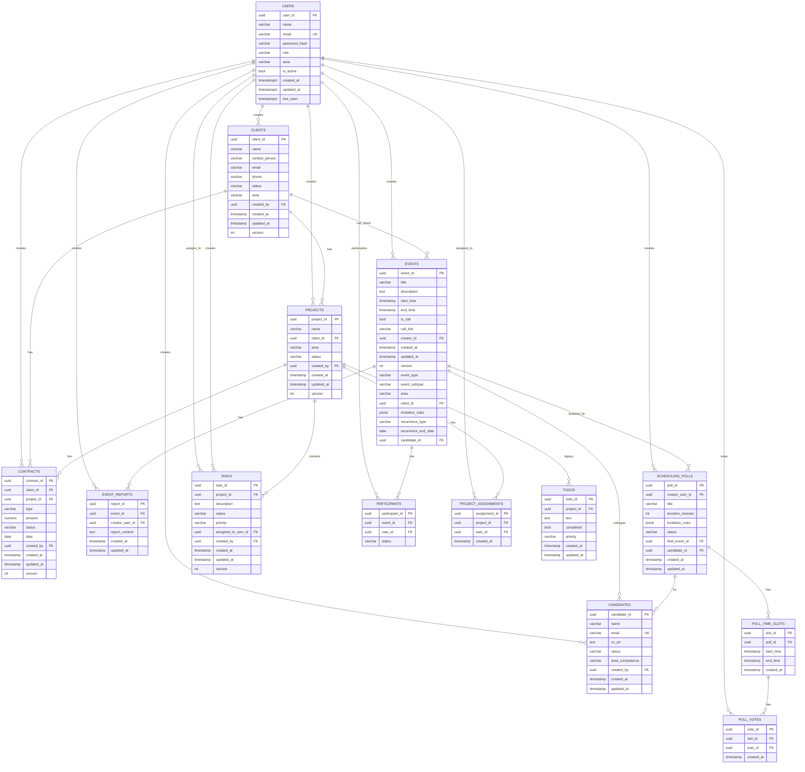

# 🗄️ Database Schema - Documentazione Completa

## Pubblico di Destinazione

Questa documentazione è destinata a:
- **Analisti Dati** che creano report e query complesse
- **Sviluppatori Backend** che scrivono query SQL
- **Ingegneri del Software** che progettano estensioni

## Diagramma Entità-Relazione (ERD)

### Diagramma Completo

## Dizionario dei Dati

### Tabella: `users`

**Descrizione**: Utenti del sistema (associati, manager, admin).

| Colonna | Tipo | Nullable | Default | Descrizione |
|---------|------|----------|---------|-------------|
| `user_id` | UUID | NO | `gen_random_uuid()` | Primary key |
| `name` | VARCHAR(255) | NO | - | Nome completo utente |
| `email` | VARCHAR(255) | NO | - | Email (UNIQUE) |
| `password_hash` | VARCHAR(255) | NO | - | Hash bcrypt della password |
| `role` | VARCHAR(50) | NO | `'Socio'` | Ruolo: `'Admin'`, `'Manager'`, `'Responsabile'`, `'Presidente'`, `'CDA'`, `'Tesoreria'`, `'Audit'`, `'Socio'`, `'Associato (Prova)'` |
| `area` | VARCHAR(50) | YES | NULL | Area: `'IT'`, `'Marketing'`, `'Commerciale'`, `'CDA'` |
| `is_active` | BOOLEAN | NO | `TRUE` | Utente attivo/disattivato |
| `created_at` | TIMESTAMPTZ | NO | `CURRENT_TIMESTAMP` | Data creazione |
| `updated_at` | TIMESTAMPTZ | NO | `CURRENT_TIMESTAMP` | Ultima modifica |
| `last_seen` | TIMESTAMPTZ | YES | NULL | Ultimo accesso (aggiornato da middleware auth) |

**Indici**:
- PRIMARY KEY: `user_id`
- UNIQUE: `email`
- INDEX: `idx_users_role`, `idx_users_area`, `idx_users_is_active`

---

### Tabella: `clients`

**Descrizione**: Clienti dell'associazione.

| Colonna | Tipo | Nullable | Default | Descrizione |
|---------|------|----------|---------|-------------|
| `client_id` | UUID | NO | `gen_random_uuid()` | Primary key |
| `name` | VARCHAR(255) | NO | - | Nome azienda/cliente |
| `contact_person` | VARCHAR(255) | YES | NULL | Persona di contatto |
| `email` | VARCHAR(255) | YES | NULL | Email contatto |
| `phone` | VARCHAR(50) | YES | NULL | Telefono |
| `status` | VARCHAR(50) | NO | `'Prospect'` | Stato: `'Prospect'`, `'In Contatto'`, `'In Negoziazione'`, `'Attivo'`, `'Chiuso'`, `'Perso'` |
| `area` | VARCHAR(50) | YES | NULL | Area: `'CDA'`, `'Marketing'`, `'IT'`, `'Commerciale'` |
| `created_by` | UUID | YES | NULL | FK a `users.user_id` |
| `created_at` | TIMESTAMP | NO | `CURRENT_TIMESTAMP` | Data creazione |
| `updated_at` | TIMESTAMP | NO | `CURRENT_TIMESTAMP` | Ultima modifica |
| `version` | INTEGER | NO | `1` | Versione per optimistic locking |

**Indici**:
- PRIMARY KEY: `client_id`
- INDEX: `idx_clients_status`, `idx_clients_area`, `idx_clients_created_by`

---

### Tabella: `projects`

**Descrizione**: Progetti dell'associazione.

| Colonna | Tipo | Nullable | Default | Descrizione |
|---------|------|----------|---------|-------------|
| `project_id` | UUID | NO | `gen_random_uuid()` | Primary key |
| `name` | VARCHAR(255) | NO | - | Nome progetto |
| `client_id` | UUID | YES | NULL | FK a `clients.client_id` (NULL per progetti interni) |
| `area` | VARCHAR(50) | YES | NULL | Area: `'CDA'`, `'Marketing'`, `'IT'`, `'Commerciale'` |
| `status` | VARCHAR(50) | NO | `'Pianificato'` | Stato: `'Pianificato'`, `'In Corso'`, `'In Revisione'`, `'Completato'`, `'Sospeso'` |
| `created_by` | UUID | YES | NULL | FK a `users.user_id` |
| `created_at` | TIMESTAMP | NO | `CURRENT_TIMESTAMP` | Data creazione |
| `updated_at` | TIMESTAMP | NO | `CURRENT_TIMESTAMP` | Ultima modifica |
| `version` | INTEGER | NO | `1` | Versione per optimistic locking |

**Indici**:
- PRIMARY KEY: `project_id`
- INDEX: `idx_projects_client_id`, `idx_projects_area`, `idx_projects_status`

---

### Tabella: `contracts`

**Descrizione**: Contratti, fatture e preventivi.

| Colonna | Tipo | Nullable | Default | Descrizione |
|---------|------|----------|---------|-------------|
| `contract_id` | UUID | NO | `gen_random_uuid()` | Primary key |
| `client_id` | UUID | YES | NULL | FK a `clients.client_id` |
| `project_id` | UUID | YES | NULL | FK a `projects.project_id` |
| `type` | VARCHAR(50) | NO | - | Tipo: `'Contratto'`, `'Fattura'`, `'Preventivo'` |
| `amount` | NUMERIC | NO | - | Importo (es. 1500.00) |
| `status` | VARCHAR(50) | NO | `'Bozza'` | Stato: `'Bozza'`, `'Inviato'`, `'Firmato'`, `'Pagato'`, `'Annullato'` |
| `date` | DATE | NO | - | Data documento |
| `created_by` | UUID | YES | NULL | FK a `users.user_id` |
| `created_at` | TIMESTAMP | NO | `CURRENT_TIMESTAMP` | Data creazione |
| `updated_at` | TIMESTAMP | NO | `CURRENT_TIMESTAMP` | Ultima modifica |
| `version` | INTEGER | NO | `1` | Versione per optimistic locking |

**Indici**:
- PRIMARY KEY: `contract_id`
- INDEX: `idx_contracts_client_id`, `idx_contracts_project_id`, `idx_contracts_status`, `idx_contracts_type`

---

### Tabella: `tasks`

**Descrizione**: Task assegnabili ai membri del team (sostituisce `todos` legacy).

| Colonna | Tipo | Nullable | Default | Descrizione |
|---------|------|----------|---------|-------------|
| `task_id` | UUID | NO | `gen_random_uuid()` | Primary key |
| `project_id` | UUID | NO | - | FK a `projects.project_id` |
| `description` | TEXT | NO | - | Descrizione task |
| `status` | VARCHAR(50) | NO | `'Da Fare'` | Stato: `'Da Fare'`, `'In Corso'`, `'Completato'`, `'In Revisione'` |
| `priority` | VARCHAR(20) | NO | `'Media'` | Priorità: `'Bassa'`, `'Media'`, `'Alta'` |
| `assigned_to_user_id` | UUID | YES | NULL | FK a `users.user_id` (NULL = backlog, non assegnato) |
| `created_by` | UUID | YES | NULL | FK a `users.user_id` |
| `created_at` | TIMESTAMP | NO | `CURRENT_TIMESTAMP` | Data creazione |
| `updated_at` | TIMESTAMP | NO | `CURRENT_TIMESTAMP` | Ultima modifica |
| `version` | INTEGER | NO | `1` | Versione per optimistic locking |

**Indici**:
- PRIMARY KEY: `task_id`
- INDEX: `idx_tasks_project_id`, `idx_tasks_assigned_to_user_id`, `idx_tasks_status`

**Logica Business**: 
- Se `assigned_to_user_id = NULL` → Task nel **backlog** del progetto
- Se `assigned_to_user_id != NULL` → Task assegnato a un utente

---

### Tabella: `project_assignments`

**Descrizione**: Membri del team di un progetto (many-to-many tra Projects e Users).

| Colonna | Tipo | Nullable | Default | Descrizione |
|---------|------|----------|---------|-------------|
| `assignment_id` | UUID | NO | `gen_random_uuid()` | Primary key |
| `project_id` | UUID | NO | - | FK a `projects.project_id` |
| `user_id` | UUID | NO | - | FK a `users.user_id` |
| `created_at` | TIMESTAMP | NO | `CURRENT_TIMESTAMP` | Data assegnazione |

**Indici**:
- PRIMARY KEY: `assignment_id`
- UNIQUE: `(project_id, user_id)` (un utente può essere assegnato una sola volta a un progetto)

---

### Tabella: `todos` (Legacy)

**Descrizione**: Task legacy (sostituiti da `tasks`). Mantenuta per retrocompatibilità.

| Colonna | Tipo | Nullable | Default | Descrizione |
|---------|------|----------|---------|-------------|
| `todo_id` | UUID | NO | `gen_random_uuid()` | Primary key |
| `project_id` | UUID | NO | - | FK a `projects.project_id` |
| `text` | TEXT | NO | - | Testo todo |
| `completed` | BOOLEAN | NO | `FALSE` | Completato o meno |
| `priority` | VARCHAR(20) | YES | NULL | Priorità |
| `created_at` | TIMESTAMP | NO | `CURRENT_TIMESTAMP` | Data creazione |
| `updated_at` | TIMESTAMP | NO | `CURRENT_TIMESTAMP` | Ultima modifica |

**Nota**: Non utilizzare per nuovi sviluppi. Usare `tasks` invece.

---

### Tabella: `events`

**Descrizione**: Eventi del calendario (call, formazione, networking, colloqui).

| Colonna | Tipo | Nullable | Default | Descrizione |
|---------|------|----------|---------|-------------|
| `event_id` | UUID | NO | `gen_random_uuid()` | Primary key |
| `title` | VARCHAR(255) | NO | - | Titolo evento |
| `description` | TEXT | YES | NULL | Descrizione |
| `start_time` | TIMESTAMP | NO | - | Data/ora inizio |
| `end_time` | TIMESTAMP | NO | - | Data/ora fine |
| `is_call` | BOOLEAN | NO | `FALSE` | Backward compatibility (deriva da `event_type`) |
| `call_link` | VARCHAR(255) | YES | NULL | Link meeting (es. Google Meet) |
| `creator_id` | UUID | YES | NULL | FK a `users.user_id` |
| `created_at` | TIMESTAMP | NO | `CURRENT_TIMESTAMP` | Data creazione |
| `updated_at` | TIMESTAMP | NO | `CURRENT_TIMESTAMP` | Ultima modifica |
| `version` | INTEGER | NO | `1` | Versione per optimistic locking |
| `event_type` | VARCHAR(50) | NO | `'generic'` | Tipo: `'call'`, `'networking'`, `'formazione'`, `'generic'`, `'colloquio'` |
| `event_subtype` | VARCHAR(50) | YES | NULL | Sottotipo: `'call_interna'`, `'call_reparto'`, `'call_clienti'` |
| `area` | VARCHAR(50) | YES | NULL | Area (per `call_reparto`) |
| `client_id` | UUID | YES | NULL | FK a `clients.client_id` (per `call_clienti`) |
| `invitation_rules` | JSONB | YES | NULL | Regole invito **prima** di espansione in `participants` |
| `recurrence_type` | VARCHAR(20) | NO | `'none'` | Ricorrenza: `'none'`, `'weekly'`, `'monthly'` |
| `recurrence_end_date` | DATE | YES | NULL | Data fine ricorrenza |
| `candidate_id` | UUID | YES | NULL | FK a `candidates.candidate_id` (per eventi colloquio) |

**Indici**:
- PRIMARY KEY: `event_id`
- INDEX: `idx_events_creator_id`, `idx_events_event_type`, `idx_events_client_id`, `idx_events_candidate_id`, `idx_events_start_time`

**Logica Business**:
- `invitation_rules` (JSONB): Memorizza regole di invito **prima** che vengano espanse in righe `participants`. Formato: `{groups: ["manager"], individuals: ["uuid"], area: "IT"}`
- `is_call`: Backward compatibility. Deriva da `event_type = 'call'`

---

### Tabella: `participants`

**Descrizione**: Partecipanti agli eventi (risultato dell'espansione di `invitation_rules`).

| Colonna | Tipo | Nullable | Default | Descrizione |
|---------|------|----------|---------|-------------|
| `participant_id` | UUID | NO | `gen_random_uuid()` | Primary key |
| `event_id` | UUID | NO | - | FK a `events.event_id` |
| `user_id` | UUID | NO | - | FK a `users.user_id` |
| `status` | VARCHAR(20) | NO | `'pending'` | Stato: `'pending'`, `'accepted'`, `'declined'` |

**Indici**:
- PRIMARY KEY: `participant_id`
- INDEX: `idx_participants_event_id`, `idx_participants_user_id`

**Logica Business**: 
- Creata automaticamente dal backend quando si crea un evento con `invitation_rules`
- Un utente può essere partecipante a più eventi (many-to-many)

---

### Tabella: `event_reports`

**Descrizione**: Verbali e report post-evento.

| Colonna | Tipo | Nullable | Default | Descrizione |
|---------|------|----------|---------|-------------|
| `report_id` | UUID | NO | `gen_random_uuid()` | Primary key |
| `event_id` | UUID | NO | - | FK a `events.event_id` |
| `creator_user_id` | UUID | NO | - | FK a `users.user_id` |
| `report_content` | TEXT | NO | - | Contenuto verbale (supporta Markdown) |
| `created_at` | TIMESTAMP | NO | `CURRENT_TIMESTAMP` | Data creazione |
| `updated_at` | TIMESTAMP | NO | `CURRENT_TIMESTAMP` | Ultima modifica |

**Indici**:
- PRIMARY KEY: `report_id`
- INDEX: `idx_event_reports_event_id`, `idx_event_reports_creator_user_id`

**Logica Business**: 
- Un evento può avere più report (uno per creatore)
- Solo eventi passati (`end_time < NOW()`) possono avere report

---

### Tabella: `scheduling_polls`

**Descrizione**: Sondaggi di disponibilità per organizzare eventi.

| Colonna | Tipo | Nullable | Default | Descrizione |
|---------|------|----------|---------|-------------|
| `poll_id` | UUID | NO | `gen_random_uuid()` | Primary key |
| `creator_user_id` | UUID | NO | - | FK a `users.user_id` |
| `title` | VARCHAR(255) | NO | - | Titolo sondaggio |
| `duration_minutes` | INTEGER | NO | - | Durata prevista evento in minuti |
| `invitation_rules` | JSONB | NO | - | Regole di invito (stesso formato di `events.invitation_rules`) |
| `status` | VARCHAR(20) | NO | `'open'` | Stato: `'open'` (attivo), `'closed'` (evento creato) |
| `final_event_id` | UUID | YES | NULL | FK a `events.event_id` (link all'evento finale creato) |
| `candidate_id` | UUID | YES | NULL | FK a `candidates.candidate_id` (per sondaggi colloquio) |
| `created_at` | TIMESTAMP | NO | `CURRENT_TIMESTAMP` | Data creazione |
| `updated_at` | TIMESTAMP | NO | `CURRENT_TIMESTAMP` | Ultima modifica |

**Indici**:
- PRIMARY KEY: `poll_id`
- INDEX: `idx_scheduling_polls_creator_user_id`, `idx_scheduling_polls_status`, `idx_scheduling_polls_candidate_id`

**Logica Business**:
- `status = 'open'`: Sondaggio attivo, gli associati possono votare
- `status = 'closed'`: Evento creato, sondaggio finalizzato
- `candidate_id`: Se presente, il sondaggio è per un colloquio (vedi Sezione 13)

---

### Tabella: `poll_time_slots`

**Descrizione**: Opzioni temporali proposte nel sondaggio.

| Colonna | Tipo | Nullable | Default | Descrizione |
|---------|------|----------|---------|-------------|
| `slot_id` | UUID | NO | `gen_random_uuid()` | Primary key |
| `poll_id` | UUID | NO | - | FK a `scheduling_polls.poll_id` |
| `start_time` | TIMESTAMP | NO | - | Data/ora inizio slot |
| `end_time` | TIMESTAMP | NO | - | Data/ora fine slot |
| `created_at` | TIMESTAMP | NO | `CURRENT_TIMESTAMP` | Data creazione |

**Indici**:
- PRIMARY KEY: `slot_id`
- INDEX: `idx_poll_time_slots_poll_id`, `idx_poll_time_slots_start_time`
- CHECK: `end_time > start_time`

**Logica Business**: 
- Ogni sondaggio ha N slot temporali
- Gli associati votano per gli slot disponibili

---

### Tabella: `poll_votes`

**Descrizione**: Voti degli utenti per gli slot temporali.

| Colonna | Tipo | Nullable | Default | Descrizione |
|---------|------|----------|---------|-------------|
| `vote_id` | UUID | NO | `gen_random_uuid()` | Primary key |
| `slot_id` | UUID | NO | - | FK a `poll_time_slots.slot_id` |
| `user_id` | UUID | NO | - | FK a `users.user_id` |
| `created_at` | TIMESTAMP | NO | `CURRENT_TIMESTAMP` | Data voto |

**Indici**:
- PRIMARY KEY: `vote_id`
- UNIQUE: `(slot_id, user_id)` (un utente può votare solo una volta per slot)
- INDEX: `idx_poll_votes_slot_id`, `idx_poll_votes_user_id`

**Logica Business**:
- Un utente può votare per **più slot** (selezione multipla)
- Quando un utente vota, tutti i suoi voti precedenti per quel sondaggio vengono eliminati e sostituiti

---

### Tabella: `candidates`

**Descrizione**: Candidati per assunzione (modulo HR).

| Colonna | Tipo | Nullable | Default | Descrizione |
|---------|------|----------|---------|-------------|
| `candidate_id` | UUID | NO | `gen_random_uuid()` | Primary key |
| `name` | VARCHAR(255) | NO | - | Nome candidato |
| `email` | VARCHAR(255) | NO | - | Email (UNIQUE) |
| `cv_url` | TEXT | YES | NULL | Link esterno al CV (GDrive, S3, ecc.) |
| `status` | VARCHAR(50) | NO | `'In attesa'` | Stato: `'In attesa'`, `'In colloquio'`, `'Accettato'`, `'Rifiutato'` |
| `area_competenza` | VARCHAR(50) | YES | NULL | Area: `'IT'`, `'Marketing'`, `'Commerciale'`, `'CDA'` |
| `created_by` | UUID | YES | NULL | FK a `users.user_id` |
| `created_at` | TIMESTAMP | NO | `CURRENT_TIMESTAMP` | Data creazione |
| `updated_at` | TIMESTAMP | NO | `CURRENT_TIMESTAMP` | Ultima modifica |

**Indici**:
- PRIMARY KEY: `candidate_id`
- UNIQUE: `email`
- INDEX: `idx_candidates_status`, `idx_candidates_area_competenza`

**Logica Business**:
- Flusso: `In attesa` → `In colloquio` (sondaggio avviato) → `Accettato` → Periodo di prova
- `area_competenza`: Usato per filtrare candidati per area del manager

---

## Relazioni Chiave

### One-to-Many

- **Users → Projects**: Un utente può creare molti progetti
- **Users → Events**: Un utente può creare molti eventi
- **Clients → Projects**: Un cliente può avere molti progetti
- **Projects → Tasks**: Un progetto può avere molti task
- **Events → Participants**: Un evento può avere molti partecipanti
- **Scheduling_Polls → Poll_Time_Slots**: Un sondaggio ha molti slot

### Many-to-Many

- **Projects ↔ Users**: Tramite `project_assignments`
- **Events ↔ Users**: Tramite `participants`

### Self-Referencing

Nessuna relazione self-referencing nel database attuale.

## Trigger e Funzioni

### Trigger: `update_updated_at_column`

**Funzione**: Aggiorna automaticamente `updated_at` quando una riga viene modificata.

**Applicato a**:
- `users`, `clients`, `projects`, `contracts`, `tasks`
- `event_reports`, `scheduling_polls`, `candidates`

### Trigger: `increment_version`

**Funzione**: Incrementa automaticamente `version` quando una riga viene modificata (per optimistic locking).

**Applicato a**:
- `projects`, `clients`, `contracts`, `tasks`, `events`

---

**Versione**: 1.0  
**Ultimo Aggiornamento**: 2024

