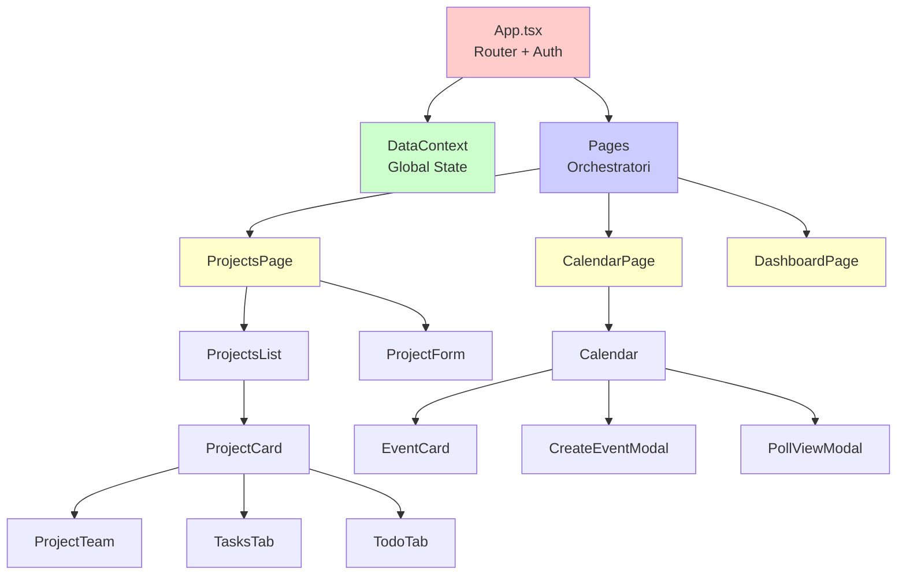
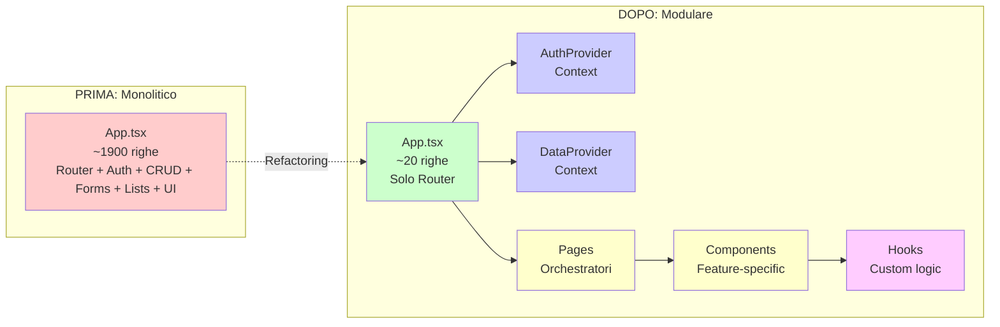
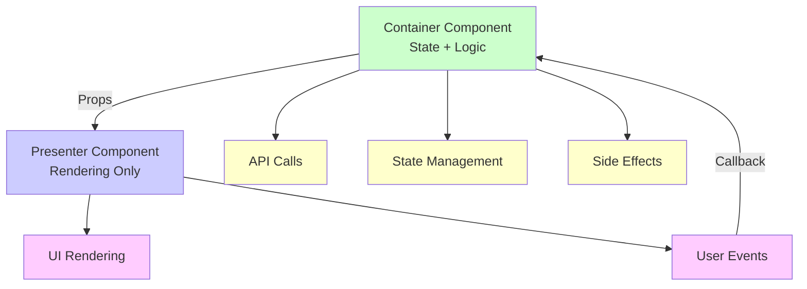

# 🏗️ Component Architecture - Frontend

## Pubblico di Destinazione

Questa documentazione è destinata a:
- **Sviluppatori Frontend** che creano o modificano componenti
- **Code Reviewers** che verificano la qualità del codice
- **Software Architects** che definiscono standard di architettura

## Principi Fondamentali

### 1. Single Responsibility Principle

Ogni componente dovrebbe avere **una sola responsabilità**:

```typescript
// ✅ BENE: Componente focalizzato
function TaskList({ tasks }: { tasks: Task[] }) {
    return (
        <div>
            {tasks.map(task => <TaskItem key={task.id} task={task} />)}
        </div>
    );
}

// ❌ MALE: Troppe responsabilità
function ProjectCard({ project, onUpdate, onDelete, onAddTask, ... }) {
    // Gestisce display, update, delete, task management, team management
}
```

### 2. Component Size

**Linee guida**:
- **< 200 righe**: Componente ideale
- **200-500 righe**: Accettabile, ma considerare split
- **> 500 righe**: **Refactoring necessario**

**Problemi attuali**:
- `App.tsx`: ~1900 righe ❌ **Da refactorizzare**
- `Calendar.tsx`: ~2000 righe ❌ **Da refactorizzare**

### 3. Separation of Concerns

**Separa**:
- **Presentazione** (UI rendering)
- **Logica** (business logic)
- **Stato** (data management)
- **Side effects** (API calls, subscriptions)

## Struttura Componenti Consigliata

### Architettura Componenti



### Struttura Directory

```
gestionale-app/src/
├── components/
│   ├── common/           # Componenti riutilizzabili
│   │   ├── Button.tsx
│   │   ├── Modal.tsx
│   │   ├── StatusBadge.tsx
│   │   └── FormInput.tsx
│   │
│   ├── layout/           # Componenti layout
│   │   ├── Sidebar.tsx
│   │   ├── Header.tsx
│   │   └── MainLayout.tsx
│   │
│   ├── features/         # Componenti feature-specific
│   │   ├── projects/
│   │   │   ├── ProjectCard.tsx
│   │   │   ├── ProjectList.tsx
│   │   │   ├── ProjectForm.tsx
│   │   │   └── ProjectTeam.tsx
│   │   │
│   │   ├── events/
│   │   │   ├── Calendar.tsx
│   │   │   ├── EventCard.tsx
│   │   │   ├── CreateEventModal.tsx
│   │   │   └── PollViewModal.tsx
│   │   │
│   │   └── tasks/
│   │       ├── TaskList.tsx
│   │       ├── TaskItem.tsx
│   │       └── TaskForm.tsx
│   │
│   └── pages/            # Componenti pagina (orchestratori)
│       ├── Dashboard.tsx
│       ├── ProjectsPage.tsx
│       └── CalendarPage.tsx
```

## Refactoring App.tsx

### Architettura Prima e Dopo Refactoring



### Problema Attuale

`App.tsx` contiene:
- Router principale
- Gestione autenticazione
- CRUD operations (clients, projects, contracts)
- Form components (AddClientForm, AddProjectForm, AddContractForm)
- List components (ClientiList, ProgettiList, ContabilitaList)
- UI components (Sidebar, Header, Modal, StatusSelector)
- Conflict resolution logic

**Totale**: ~1900 righe ❌

### Soluzione Consigliata

#### 1. Estrarre Router

**File**: `src/App.tsx` (semplificato)

```typescript
import { AuthProvider } from './contexts/AuthContext';
import { AppRouter } from './router/AppRouter';

export default function App() {
    return (
        <AuthProvider>
            <AppRouter />
        </AuthProvider>
    );
}
```

#### 2. Estrarre Context per Stato Globale

**File**: `src/contexts/DataContext.tsx`

```typescript
import { createContext, useContext } from 'react';

interface DataContextType {
    clients: Client[];
    projects: Project[];
    contracts: Contract[];
    loadData: () => Promise<void>;
    // ... altre funzioni CRUD
}

const DataContext = createContext<DataContextType | null>(null);

export function DataProvider({ children }: { children: React.ReactNode }) {
    const [clients, setClients] = useState<Client[]>([]);
    // ... stato e logica
    
    return (
        <DataContext.Provider value={{ clients, projects, contracts, loadData, ... }}>
            {children}
        </DataContext.Provider>
    );
}

export function useData() {
    const context = useContext(DataContext);
    if (!context) throw new Error('useData must be used within DataProvider');
    return context;
}
```

#### 3. Estrarre Componenti Form

**File**: `src/components/forms/AddClientForm.tsx`

```typescript
export function AddClientForm({ onSubmit, onCancel }: Props) {
    const [formData, setFormData] = useState({...});
    
    // Solo logica form, nessuna logica CRUD
    return <form>...</form>;
}
```

#### 4. Estrarre Componenti List

**File**: `src/components/lists/ProjectsList.tsx`

```typescript
export function ProjectsList({ projects, onUpdate, onDelete }: Props) {
    return (
        <div>
            {projects.map(project => (
                <ProjectCard key={project.id} project={project} {...} />
            ))}
        </div>
    );
}
```

#### 5. Estrarre Hooks Custom

**File**: `src/hooks/useProjects.ts`

```typescript
export function useProjects() {
    const [projects, setProjects] = useState<Project[]>([]);
    const [loading, setLoading] = useState(false);
    
    const loadProjects = async () => { ... };
    const createProject = async (data: Project) => { ... };
    const updateProject = async (id: string, data: Partial<Project>) => { ... };
    const deleteProject = async (id: string) => { ... };
    
    return {
        projects,
        loading,
        loadProjects,
        createProject,
        updateProject,
        deleteProject
    };
}
```

## Refactoring Calendar.tsx

### Problema Attuale

`Calendar.tsx` contiene:
- Logica calendario (griglia, navigazione)
- Modali eventi (CreateEventModal, EventDetailModal, PollViewModal)
- Gestione stato (events, polls, users)
- API calls multiple
- Form complessi inline

**Totale**: ~2000 righe ❌

### Soluzione Consigliata

#### 1. Estrarre Modali

**File**: `src/components/events/CreateEventModal.tsx`

```typescript
export function CreateEventModal({ 
    isOpen, 
    onClose, 
    onSuccess 
}: Props) {
    // Solo logica form creazione evento
    return <Modal>...</Modal>;
}
```

**File**: `src/components/events/PollViewModal.tsx`

```typescript
export function PollViewModal({ poll, onClose, onOrganize }: Props) {
    // Solo logica visualizzazione/votazione sondaggio
    return <Modal>...</Modal>;
}
```

#### 2. Estrarre Hooks

**File**: `src/hooks/useEvents.ts`

```typescript
export function useEvents() {
    const [events, setEvents] = useState<Event[]>([]);
    const loadEvents = async () => { ... };
    const createEvent = async (data: EventData) => { ... };
    // ...
    return { events, loadEvents, createEvent, ... };
}
```

**File**: `src/hooks/usePolls.ts`

```typescript
export function usePolls() {
    // Logica sondaggi
    return { polls, loadPolls, createPoll, vote, organize };
}
```

#### 3. Componente Calendar Semplificato

**File**: `src/components/events/Calendar.tsx`

```typescript
export function Calendar({ currentUser }: Props) {
    const { events, loadEvents } = useEvents();
    const { polls, loadPolls } = usePolls();
    const [selectedDate, setSelectedDate] = useState(new Date());
    
    // Solo logica rendering calendario
    return (
        <div>
            <CalendarGrid events={events} selectedDate={selectedDate} />
            <EventList events={getMonthEvents()} />
        </div>
    );
}
```

## Pattern Consigliati

### 1. Container/Presenter Pattern

**Container**: Gestisce stato e logica  
**Presenter**: Gestisce solo rendering



```typescript
// Container
function ProjectsContainer() {
    const { projects, loadProjects, createProject } = useProjects();
    
    useEffect(() => {
        loadProjects();
    }, []);
    
    return <ProjectsPresenter 
        projects={projects} 
        onCreate={createProject} 
    />;
}

// Presenter
function ProjectsPresenter({ projects, onCreate }: Props) {
    return (
        <div>
            {projects.map(p => <ProjectCard key={p.id} project={p} />)}
        </div>
    );
}
```

### 2. Custom Hooks per Logica Condivisa

```typescript
// Hook riutilizzabile
export function useAsyncOperation<T>(
    operation: () => Promise<T>
) {
    const [loading, setLoading] = useState(false);
    const [error, setError] = useState<string | null>(null);
    
    const execute = async () => {
        try {
            setLoading(true);
            setError(null);
            const result = await operation();
            return result;
        } catch (err: any) {
            setError(err.message);
            throw err;
        } finally {
            setLoading(false);
        }
    };
    
    return { execute, loading, error };
}

// Uso
function MyComponent() {
    const { execute, loading, error } = useAsyncOperation(() => 
        projectsAPI.create({ name: "Progetto" })
    );
    
    const handleCreate = async () => {
        await execute();
    };
}
```

### 3. Composition over Inheritance

**Usa composizione** invece di componenti monolitici:

```typescript
// ✅ BENE: Composizione
function ProjectCard({ project }: Props) {
    return (
        <Card>
            <ProjectHeader project={project} />
            <ProjectTabs>
                <TodoTab project={project} />
                <TeamTab project={project} />
                <TasksTab project={project} />
            </ProjectTabs>
        </Card>
    );
}

// ❌ MALE: Monolitico
function ProjectCard({ project }: Props) {
    // Tutto inline, 500+ righe
}
```

## State Management

### Pattern Attuale

- **Local State**: `useState` nei componenti
- **Global State**: Props drilling (passato da App.tsx)
- **Persistence**: `localStorage` per token/user

### Pattern Consigliato

#### Per Stato Globale: Context API

```typescript
// contexts/DataContext.tsx
export function DataProvider({ children }: Props) {
    const [clients, setClients] = useState<Client[]>([]);
    const [projects, setProjects] = useState<Project[]>([]);
    
    const loadData = async () => {
        const [clientsData, projectsData] = await Promise.all([
            clientsAPI.getAll(),
            projectsAPI.getAll()
        ]);
        setClients(clientsData);
        setProjects(projectsData);
    };
    
    return (
        <DataContext.Provider value={{ clients, projects, loadData }}>
            {children}
        </DataContext.Provider>
    );
}
```

#### Per Stato Locale: useState

```typescript
// Componente locale
function TaskForm() {
    const [description, setDescription] = useState('');
    // Solo stato locale al componente
}
```

## Best Practices

### 1. Naming Conventions

- **Componenti**: PascalCase (`ProjectCard.tsx`)
- **Hooks**: `use` prefix (`useProjects.ts`)
- **Utils**: camelCase (`formatDate.ts`)
- **Contexts**: `*Context.tsx` (`DataContext.tsx`)

### 2. File Organization

```
component-name/
├── ComponentName.tsx      # Componente principale
├── ComponentName.test.tsx # Test (futuro)
├── ComponentName.types.ts # Tipi TypeScript
└── index.ts              # Export
```

### 3. Props Interface

**Sempre definire interfacce** per props:

```typescript
interface ProjectCardProps {
    project: Project;
    onUpdate: (id: string, data: Partial<Project>) => Promise<void>;
    onDelete: (id: string) => Promise<void>;
    user: User;
}

export function ProjectCard({ project, onUpdate, onDelete, user }: ProjectCardProps) {
    // ...
}
```

### 4. Conditional Rendering

**Usa early return** per condizioni complesse:

```typescript
// ✅ BENE
function MyComponent({ user }: Props) {
    if (!user) return <div>Caricamento...</div>;
    if (!user.isActive) return <div>Account disattivato</div>;
    
    return <div>Contenuto principale</div>;
}

// ❌ MALE
function MyComponent({ user }: Props) {
    return (
        <div>
            {user ? (
                user.isActive ? (
                    <div>Contenuto principale</div>
                ) : (
                    <div>Account disattivato</div>
                )
            ) : (
                <div>Caricamento...</div>
            )}
        </div>
    );
}
```

### 5. Memoization

**Usa `useMemo` e `useCallback`** per performance:

```typescript
function ProjectCard({ project, users }: Props) {
    // Memoizza calcolo costoso
    const isManager = useMemo(() => {
        return calculateIsManager(project, users);
    }, [project, users]);
    
    // Memoizza callback
    const handleUpdate = useCallback(async (data: any) => {
        await updateProject(project.id, data);
    }, [project.id]);
}
```

## Conflict Resolution

### Componente ConflictDialog

**File**: `src/components/common/ConflictDialog.tsx`

**Responsabilità**:
- Visualizza conflitto optimistic locking
- Offre opzioni di risoluzione (yours/server/merged)
- Gestisce merge manuale

**Pattern**: Componente riutilizzabile, non specifico per entità.

## Esempio Refactoring Completo

### Prima (App.tsx - 1900 righe)

```typescript
// Tutto in un file
export default function App() {
    // 1900 righe di codice
    // Router, CRUD, Forms, Lists, UI components
}
```

### Dopo (Struttura Modulare)

```typescript
// App.tsx (20 righe)
export default function App() {
    return (
        <AuthProvider>
            <DataProvider>
                <AppRouter />
            </DataProvider>
        </AuthProvider>
    );
}

// router/AppRouter.tsx
export function AppRouter() {
    // Solo routing
}

// contexts/DataContext.tsx
export function DataProvider() {
    // Solo stato globale
}

// components/forms/AddClientForm.tsx
export function AddClientForm() {
    // Solo form clienti
}

// components/lists/ProjectsList.tsx
export function ProjectsList() {
    // Solo lista progetti
}
```

## Riferimenti

- **[Flussi Dinamici](./Flussi-Dinamici.md)** - Pattern per form dinamici
- **[Mock Data System](./Mock-Data-System.md)** - Testing componenti con mock

---

**Versione**: 1.0  
**Ultimo Aggiornamento**: 2024

