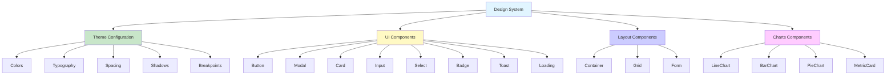
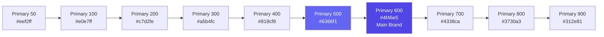
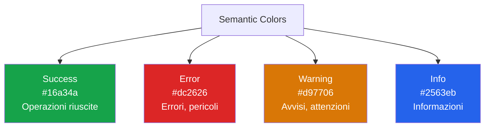
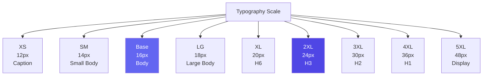
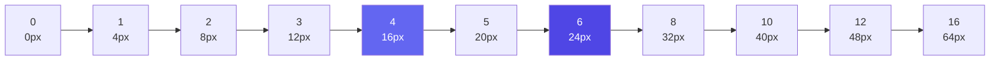
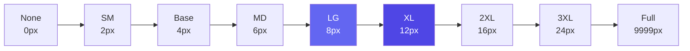
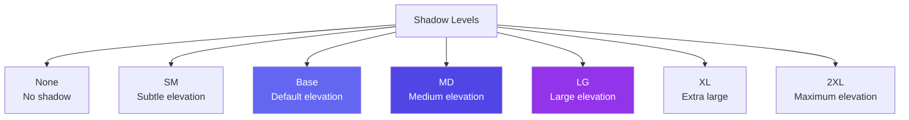
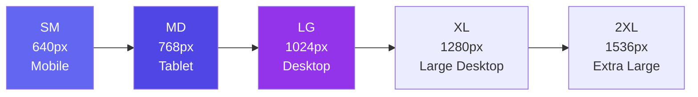

# 🎨 Design System - Documentazione Completa

## Pubblico di Destinazione

Questa documentazione è destinata a:
- **Designers** che utilizzano il design system
- **Sviluppatori Frontend** che implementano UI
- **Design System Maintainers** che aggiornano e mantengono il sistema

## Panoramica

Il Design System del Gestionale è un sistema completo e centralizzato che garantisce **consistenza visiva**, **accessibilità**, e **manutenibilità** dell'interfaccia utente. È basato su **Tailwind CSS** e **React** con supporto completo per **Dark Mode**.

## Architettura del Design System



## Struttura File

```
gestionale-app/src/
├── design-system/
│   ├── theme.ts              # Configurazione tema completo
│   └── tailwind-theme.ts     # Estensione Tailwind
│
├── components/
│   ├── ui/                   # Componenti UI base
│   │   ├── Button.tsx
│   │   ├── Modal.tsx
│   │   ├── Card.tsx
│   │   ├── Input.tsx
│   │   ├── Select.tsx
│   │   ├── Badge.tsx
│   │   ├── Toast.tsx
│   │   ├── Loading.tsx
│   │   ├── Form.tsx
│   │   ├── EmptyState.tsx
│   │   └── index.ts
│   │
│   ├── layout/               # Componenti layout
│   │   ├── Container.tsx
│   │   └── Grid.tsx
│   │
│   └── charts/                # Componenti charts
│       ├── SimpleChart.tsx
│       └── MetricCard.tsx
│
├── contexts/
│   └── ThemeContext.tsx      # Dark mode context
│
└── hooks/
    └── useToast.ts            # Hook per toast notifications
```

## 1. Color System

### Palette Colori

Il sistema di colori è organizzato in categorie:

#### Primary Colors (Indigo)



**Uso**: Colore principale del brand, azioni primarie, link importanti.

#### Semantic Colors



**Uso**:
- **Success**: Messaggi di successo, stati completati
- **Error**: Errori, validazioni fallite, azioni distruttive
- **Warning**: Avvisi, stati intermedi
- **Info**: Informazioni generali, tooltips

#### Neutral Colors (Gray)

```mermaid
graph LR
    A[Neutral 50<br/>#f9fafb] --> B[Neutral 100<br/>#f3f4f6]
    B --> C[Neutral 200<br/>#e5e7eb]
    C --> D[Neutral 300<br/>#d1d5db]
    D --> E[Neutral 400<br/>#9ca3af]
    E --> F[Neutral 500<br/>#6b7280]
    F --> G[Neutral 600<br/>#4b5563]
    G --> H[Neutral 700<br/>#374151]
    H --> I[Neutral 800<br/>#1f2937]
    I --> J[Neutral 900<br/>#111827]
    
    style A fill:#f9fafb
    style B fill:#f3f4f6
    style C fill:#e5e7eb
    style D fill:#d1d5db
    style E fill:#9ca3af
    style F fill:#6b7280,color:#fff
    style G fill:#4b5563,color:#fff
    style H fill:#374151,color:#fff
    style I fill:#1f2937,color:#fff
    style J fill:#111827,color:#fff
```



**Uso**: Testi, background, bordi, stati disabled.

### Utilizzo Colori

```typescript
import { colors } from '../design-system/theme';

// Uso diretto
const primaryColor = colors.primary[600];

// In Tailwind
<div className="bg-primary-600 text-white">
  Primary Button
</div>

// Semantic colors
<div className="bg-success-100 text-success-700 border-success-200">
  Success message
</div>
```

## 2. Typography System

### Font Family

```typescript
fontFamily: {
  sans: ['Inter', 'system-ui', '-apple-system', ...],
  mono: ['Fira Code', 'Menlo', 'Monaco', ...],
}
```

### Font Size Scale



### Heading Styles

| Element | Font Size | Line Height | Font Weight |
|---------|-----------|-------------|-------------|
| H1 | 2.5rem (40px) | 3rem | 700 |
| H2 | 2rem (32px) | 2.5rem | 600 |
| H3 | 1.5rem (24px) | 2rem | 600 |
| H4 | 1.25rem (20px) | 1.75rem | 600 |
| H5 | 1.125rem (18px) | 1.75rem | 600 |
| H6 | 1rem (16px) | 1.5rem | 600 |

### Body Text

- **Large**: 1.125rem (18px), line-height: 1.75rem
- **Base**: 1rem (16px), line-height: 1.5rem
- **Small**: 0.875rem (14px), line-height: 1.25rem

### Caption

- **Font Size**: 0.75rem (12px)
- **Line Height**: 1rem
- **Font Weight**: 400

## 3. Spacing System

### Spacing Scale

Il sistema di spacing segue una scala 4px-based:



### Utilizzo

```typescript
// In componenti
<div className="p-4">      // padding: 1rem (16px)
<div className="m-6">      // margin: 1.5rem (24px)
<div className="gap-2">    // gap: 0.5rem (8px)
```

## 4. Border Radius



**Uso tipico**:
- **SM/Base**: Input, select
- **MD/LG**: Cards, modals
- **XL/2XL**: Buttons, badges
- **Full**: Pills, avatars

## 5. Shadow System (Elevation)



**Uso**:
- **None**: Nessuna elevazione
- **SM**: Hover states
- **Base**: Default cards
- **MD**: Elevated cards
- **LG**: Modals, dropdowns
- **XL/2XL**: Overlays, popovers

## 6. Componenti UI

### Button

Componente button con varianti e stati.

```typescript
import { Button } from '../components/ui';

<Button variant="primary" size="md" isLoading={false}>
  Click me
</Button>
```

**Varianti**:
- `primary`: Azione principale (blu)
- `secondary`: Azione secondaria (viola)
- `ghost`: Trasparente, hover state
- `danger`: Azioni distruttive (rosso)
- `outline`: Outline style

**Sizes**:
- `sm`: 12px text, padding 3px 12px
- `md`: 16px text, padding 8px 16px (default)
- `lg`: 18px text, padding 12px 24px

**Props**:
- `variant`: Variante del button
- `size`: Dimensione
- `isLoading`: Mostra spinner
- `leftIcon`: Icona a sinistra
- `rightIcon`: Icona a destra
- `fullWidth`: Larghezza completa

### Modal

Modal con gestione focus trap e accessibilità.

```typescript
import { Modal } from '../components/ui';

<Modal
  isOpen={isOpen}
  onClose={handleClose}
  title="Titolo Modal"
  size="md"
  footer={<Button onClick={handleClose}>Chiudi</Button>}
>
  Contenuto modal
</Modal>
```

**Caratteristiche**:
- ✅ Focus trap (Tab non esce dal modal)
- ✅ ESC key per chiudere
- ✅ Click overlay per chiudere (opzionale)
- ✅ Backdrop blur
- ✅ Animazioni smooth
- ✅ ARIA attributes

**Sizes**: `sm`, `md`, `lg`, `xl`, `full`

### Card

Container per contenuti raggruppati.

```typescript
import { Card, CardHeader, CardTitle, CardContent, CardFooter } from '../components/ui';

<Card variant="outlined" padding="md">
  <CardHeader>
    <CardTitle>Titolo Card</CardTitle>
  </CardHeader>
  <CardContent>
    Contenuto
  </CardContent>
  <CardFooter>
    Azioni
  </CardFooter>
</Card>
```

**Varianti**:
- `outlined`: Bordo, background bianco
- `filled`: Background grigio chiaro
- `elevated`: Shadow, background bianco

### Input

Input con validazione e error handling.

```typescript
import { Input } from '../components/ui';

<Input
  label="Email"
  type="email"
  error={errors.email}
  helperText="Inserisci la tua email"
  leftIcon={<Mail />}
  required
/>
```

**Caratteristiche**:
- ✅ Label sempre visibile
- ✅ Error messages inline
- ✅ Helper text
- ✅ Icon support (left/right)
- ✅ ARIA attributes
- ✅ Required indicator

### Select

Select con styling migliorato.

```typescript
import { Select } from '../components/ui';

<Select
  label="Ruolo"
  options={[
    { value: 'admin', label: 'Admin' },
    { value: 'user', label: 'User' },
  ]}
  error={errors.role}
  placeholder="Seleziona ruolo"
/>
```

### Badge

Badge per stati e etichette.

```typescript
import { Badge } from '../components/ui';

<Badge variant="success" size="md" dot>
  Attivo
</Badge>
```

**Varianti**: `default`, `success`, `error`, `warning`, `info`

### Toast

Sistema di notifiche toast (sostituisce `alert()`).

```typescript
import { useToast, ToastContainer } from '../components/ui';

const { success, error, warning, info } = useToast();

// In component
success('Operazione completata!');
error('Errore durante il salvataggio');
warning('Attenzione: dati non salvati');
info('Nuovo messaggio ricevuto');

// In App.tsx
<ToastContainer toasts={toasts} onClose={removeToast} />
```

**Tipi**: `success`, `error`, `warning`, `info`

**Caratteristiche**:
- ✅ Auto-dismiss (default 5s)
- ✅ Animazioni smooth
- ✅ Stack verticale
- ✅ ARIA live regions

### Loading States

```typescript
import { Spinner, Skeleton, LoadingOverlay } from '../components/ui';

// Spinner
<Spinner size="md" color="primary" />

// Skeleton
<Skeleton variant="text" width="100%" height="20px" />

// Loading Overlay
<LoadingOverlay isLoading={loading} message="Caricamento...">
  <YourContent />
</LoadingOverlay>
```

## 7. Layout Components

### Container

Container responsive con max-width.

```typescript
import { Container } from '../components/layout';

<Container size="lg" padding>
  Contenuto
</Container>
```

**Sizes**: `sm`, `md`, `lg`, `xl`, `full`

### Grid

Sistema grid responsive.

```typescript
import { Grid } from '../components/layout';

<Grid
  cols={3}
  gap="md"
  responsive={{
    sm: 1,
    md: 2,
    lg: 3,
  }}
>
  <div>Item 1</div>
  <div>Item 2</div>
  <div>Item 3</div>
</Grid>
```

## 8. Dark Mode

### Implementazione

```typescript
import { ThemeProvider, useTheme } from '../contexts/ThemeContext';

// In main.tsx
<ThemeProvider>
  <App />
</ThemeProvider>

// In component
const { theme, toggleTheme } = useTheme();
```

### Theme Toggle

```typescript
import { ThemeToggle } from '../components/ui';

<ThemeToggle />
```

### Dark Mode Colors

Il sistema supporta automaticamente dark mode per:
- Background colors
- Text colors
- Border colors
- Component states

## 9. Accessibilità

### ARIA Attributes

Tutti i componenti includono:
- `aria-label` per elementi interattivi
- `aria-describedby` per descrizioni
- `aria-invalid` per errori
- `aria-required` per campi obbligatori
- `aria-live` per toast notifications

### Keyboard Navigation

- ✅ Tab navigation completa
- ✅ Focus trap in modals
- ✅ ESC key per chiudere modals
- ✅ Enter/Space per azioni
- ✅ Arrow keys per select/dropdown

### Focus Management

- ✅ Focus visible su tutti gli elementi interattivi
- ✅ Focus ring con colore primary
- ✅ Focus trap in modals
- ✅ Skip links per navigazione veloce

### Screen Reader Support

- ✅ Semantic HTML
- ✅ ARIA landmarks
- ✅ Alt text per immagini
- ✅ Hidden labels quando necessario

## 10. Responsive Design

### Breakpoints



### Mobile-First Approach

Tutti gli stili sono mobile-first:

```css
/* Mobile (default) */
.element {
  padding: 1rem;
}

/* Tablet e oltre */
@media (min-width: 768px) {
  .element {
    padding: 2rem;
  }
}
```

### Touch-Friendly

- Target size minimo: **44x44px**
- Spacing aumentato su mobile
- Gesture support per swipe

## 11. Animations & Transitions

### Transition Durations

- **Fast**: 150ms (hover states)
- **Base**: 200ms (default)
- **Slow**: 300ms (modals, page transitions)
- **Slower**: 500ms (complex animations)

### Easing Functions

- **easeIn**: `cubic-bezier(0.4, 0, 1, 1)`
- **easeOut**: `cubic-bezier(0, 0, 0.2, 1)`
- **easeInOut**: `cubic-bezier(0.4, 0, 0.2, 1)` (default)

### Keyframe Animations

- `fadeIn`: Fade in con slide up
- `shake`: Shake animation per errori
- `pulse`: Pulse animation per loading
- `wave`: Wave animation per skeleton

## 12. Best Practices

### ✅ DO

1. **Usa sempre componenti UI** invece di creare elementi custom
2. **Segui la palette colori** del design system
3. **Usa spacing system** per consistenza
4. **Implementa loading states** per operazioni async
5. **Aggiungi ARIA attributes** per accessibilità
6. **Testa responsive design** su tutti i breakpoints
7. **Usa toast** invece di `alert()`

### ❌ DON'T

1. **Non hardcode colori** - usa sempre il design system
2. **Non usare `alert()`** - usa toast notifications
3. **Non ignorare accessibilità** - sempre ARIA attributes
4. **Non creare componenti custom** se esiste già nel design system
5. **Non usare spacing arbitrario** - usa sempre lo spacing system

## 13. Esempi Pratici

### Esempio 1: Form Completo

```typescript
import { Form, FormField, FormGroup, Input, Select, Button } from '../components/ui';

<Form onSubmit={handleSubmit}>
  <FormGroup columns={2}>
    <FormField label="Nome" required error={errors.name}>
      <Input
        value={formData.name}
        onChange={(e) => setFormData({ ...formData, name: e.target.value })}
      />
    </FormField>
    
    <FormField label="Email" required error={errors.email}>
      <Input
        type="email"
        value={formData.email}
        onChange={(e) => setFormData({ ...formData, email: e.target.value })}
      />
    </FormField>
  </FormGroup>
  
  <FormField label="Ruolo" required error={errors.role}>
    <Select
      options={roleOptions}
      value={formData.role}
      onChange={(e) => setFormData({ ...formData, role: e.target.value })}
    />
  </FormField>
  
  <div className="flex gap-3 justify-end">
    <Button variant="ghost" onClick={onCancel}>
      Annulla
    </Button>
    <Button type="submit" isLoading={isSubmitting}>
      Salva
    </Button>
  </div>
</Form>
```

### Esempio 2: Dashboard con Metric Cards

```typescript
import { Grid, MetricCard } from '../components';
import { Users, Briefcase, FileText } from 'lucide-react';

<Grid cols={3} gap="lg">
  <MetricCard
    title="Utenti Totali"
    value="1,234"
    change={{ value: 12, label: 'mese scorso' }}
    icon={<Users />}
    trend="up"
  />
  
  <MetricCard
    title="Progetti Attivi"
    value="45"
    change={{ value: -5, label: 'mese scorso' }}
    icon={<Briefcase />}
    trend="down"
  />
  
  <MetricCard
    title="Contratti"
    value="123"
    change={{ value: 0, label: 'mese scorso' }}
    icon={<FileText />}
    trend="neutral"
  />
</Grid>
```

### Esempio 3: Modal con Form

```typescript
import { Modal, Form, Input, Button } from '../components/ui';

<Modal
  isOpen={isOpen}
  onClose={onClose}
  title="Crea Nuovo Progetto"
  size="lg"
  footer={
    <>
      <Button variant="ghost" onClick={onClose}>
        Annulla
      </Button>
      <Button onClick={handleSubmit} isLoading={isSubmitting}>
        Crea Progetto
      </Button>
    </>
  }
>
  <Form onSubmit={handleSubmit}>
    <Input
      label="Nome Progetto"
      value={projectName}
      onChange={(e) => setProjectName(e.target.value)}
      required
    />
    {/* Altri campi */}
  </Form>
</Modal>
```

## 14. Migrazione da Codice Legacy

### Sostituire `alert()`

**Prima**:
```typescript
alert('Operazione completata!');
```

**Dopo**:
```typescript
const { success } = useToast();
success('Operazione completata!');
```

### Sostituire Button Custom

**Prima**:
```typescript
<button className="px-4 py-2 bg-blue-600 text-white rounded">
  Click me
</button>
```

**Dopo**:
```typescript
<Button variant="primary" size="md">
  Click me
</Button>
```

### Sostituire Card Custom

**Prima**:
```typescript
<div className="bg-white rounded-lg shadow p-6">
  Contenuto
</div>
```

**Dopo**:
```typescript
<Card variant="outlined" padding="md">
  Contenuto
</Card>
```

## 15. Testing del Design System

### Checklist Pre-Deploy

- [ ] Tutti i componenti funzionano in light mode
- [ ] Tutti i componenti funzionano in dark mode
- [ ] Responsive design testato su tutti i breakpoints
- [ ] Accessibilità verificata (ARIA, keyboard navigation)
- [ ] Contrasto colori verificato (WCAG AA)
- [ ] Animazioni smooth su tutti i dispositivi
- [ ] Loading states implementati
- [ ] Error states implementati
- [ ] Empty states implementati

## Riferimenti

- **[Component Architecture](./Component-Architecture.md)** - Architettura componenti
- **[Flussi Dinamici](./Flussi-Dinamici.md)** - Utilizzo componenti in contesti reali
- **[Development Guide](../DEVELOPMENT.md)** - Workflow sviluppo

---

**Versione**: 1.0  
**Ultimo Aggiornamento**: 2024  
**Maintainer**: Design System Team

