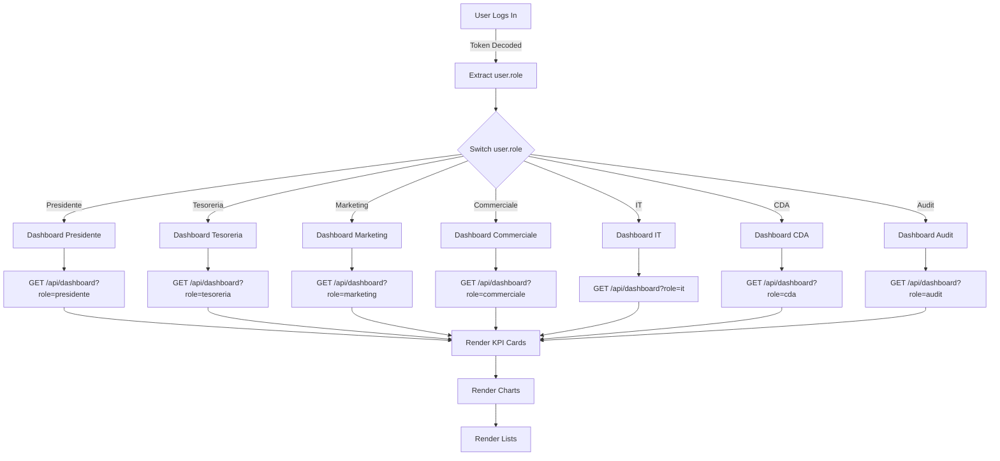
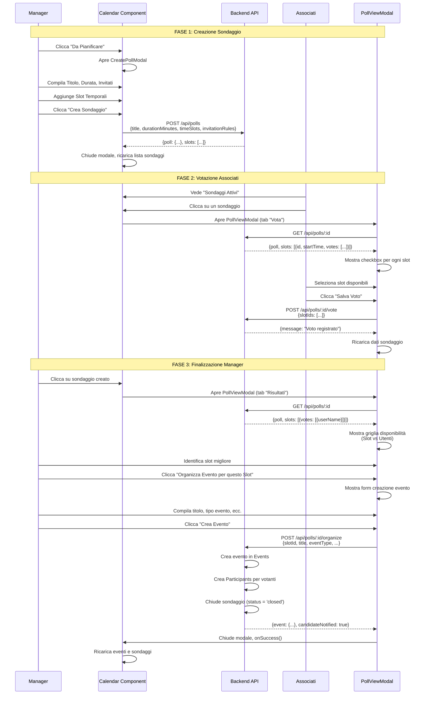

# 🔄 Flussi Dinamici - Logica Condizionale Frontend

## Pubblico di Destinazione

Questa documentazione è destinata a:
- **Sviluppatori Frontend** che implementano logica condizionale
- **UI/UX Designers** che progettano interfacce dinamiche

## Dashboard Dinamiche per Ruolo (Sezioni 1-7)

### Architettura

Le dashboard sono **completamente dinamiche** in base al ruolo dell'utente loggato. Il componente `DashboardRole` gestisce la logica di rendering condizionale.

### Flusso di Rendering



### Implementazione Componente

**File**: `components/DashboardRole.tsx`

```typescript
function DashboardRole({ user, clients, projects, contracts, events }: Props) {
    const [kpis, setKPIs] = useState<any[]>([]);
    const [charts, setCharts] = useState<any[]>([]);
    const [lists, setLists] = useState<any[]>([]);

    useEffect(() => {
        loadDashboardData();
    }, [user?.role]);

    const loadDashboardData = async () => {
        // Chiamata API con ruolo utente
        const data = await apiCall('GET', `/api/dashboard?role=${user.role}`);
        setKPIs(data.kpis);
        setCharts(data.charts);
        setLists(data.lists);
    };

    // Render condizionale in base al ruolo
    switch (user?.role) {
        case 'Presidente':
            return <DashboardPresidente kpis={kpis} charts={charts} lists={lists} />;
        case 'Tesoreria':
            return <DashboardTesoreria kpis={kpis} charts={charts} lists={lists} />;
        // ... altri ruoli
        default:
            return <DashboardDefault />;
    }
}
```

### Esempio: Dashboard Tesoreria

**KPI Cards**:
- **Incassato (Anno)**: Somma contratti/fatture `status = 'Pagato'`
- **Da Incassare**: Somma fatture `status = 'Inviata'`
- **Fatture Scadute**: Fatture inviate con data > 30gg fa
- **Preventivi da Approvare**: Somma preventivi `status = 'Inviato'`

**Charts**:
- Grafico a Linee: Flusso di Cassa (Ultimi 6 Mesi)

**Lists**:
- Fatture Scadute (Azione Richiesta)
- Progetti da Fatturare

## Form Dinamici per Tipo Evento (Sezione 10.3)

### Architettura

Il modale "Crea Evento" (`Calendar.tsx`) cambia **dinamicamente** i campi visibili in base al `eventType` selezionato.

### Diagramma di Flusso

```mermaid
stateDiagram-v2
    [*] --> BaseForm: Apre Modale
    BaseForm --> SelectType: Utente seleziona eventType
    
    SelectType --> CallForm: eventType = 'call'
    SelectType --> FormazioneForm: eventType = 'formazione'
    SelectType --> NetworkingForm: eventType = 'networking'
    SelectType --> GenericForm: eventType = 'generic'
    
    CallForm --> CallSubtype: Seleziona sottotipo
    CallSubtype --> CallReparto: eventSubtype = 'call_reparto'
    CallSubtype --> CallClienti: eventSubtype = 'call_clienti'
    CallSubtype --> CallInterna: eventSubtype = 'call_interna'
    
    CallReparto --> AreaSelect: Mostra Select Area
    CallClienti --> ClienteSelect: Mostra Select Cliente
    
    FormazioneForm --> SessioniForm: Se ricorrenza
    FormazioneForm --> MaterialiForm: Bottone Aggiungi Materiale
    
    NetworkingForm --> LocationInput: Mostra Location
    NetworkingForm --> ExternalLinkInput: Mostra Link Esterno
    
    CallForm --> Submit
    FormazioneForm --> Submit
    NetworkingForm --> Submit
    GenericForm --> Submit
    [*] <-- Submit
```

### Implementazione

**File**: `components/Calendar.tsx` (CreateEventModal)

```typescript
function CreateEventModal({ onClose, onSuccess }: Props) {
    const [eventType, setEventType] = useState<'call' | 'formazione' | 'networking' | 'generic'>('generic');
    const [eventSubtype, setEventSubtype] = useState<string>('');
    const [formData, setFormData] = useState({
        title: '',
        description: '',
        startTime: '',
        endTime: '',
        // Campi comuni
        invitationRules: { groups: [], individuals: [] },
        recurrenceType: 'none',
        // Campi Call
        callLink: '',
        clientId: '',
        area: '',
        // Campi Formazione
        trainerName: '',
        level: '',
        prerequisites: '',
        // Campi Networking
        location: '',
        externalLink: '',
    });

    // Render condizionale campi
    return (
        <form>
            {/* Campi Comuni (sempre visibili) */}
            <input type="text" placeholder="Titolo" />
            <input type="datetime-local" placeholder="Data Inizio" />
            
            {/* Select Tipo Evento */}
            <select value={eventType} onChange={(e) => setEventType(e.target.value)}>
                <option value="generic">📅 Evento Generico</option>
                <option value="call">📞 Call</option>
                <option value="formazione">🎓 Formazione</option>
                <option value="networking">🤝 Networking</option>
            </select>

            {/* Campi Dinamici Call */}
            {eventType === 'call' && (
                <>
                    <select value={eventSubtype} onChange={(e) => setEventSubtype(e.target.value)}>
                        <option value="call_interna">Call Interna</option>
                        <option value="call_reparto">Call di Reparto</option>
                        <option value="call_clienti">Call con Clienti</option>
                    </select>

                    {eventSubtype === 'call_reparto' && (
                        <select value={formData.area} onChange={(e) => setFormData({...formData, area: e.target.value})}>
                            <option value="">Seleziona Area</option>
                            <option value="IT">IT</option>
                            <option value="Marketing">Marketing</option>
                            <option value="Commerciale">Commerciale</option>
                        </select>
                    )}

                    {eventSubtype === 'call_clienti' && (
                        <select value={formData.clientId} onChange={(e) => setFormData({...formData, clientId: e.target.value})}>
                            <option value="">Seleziona Cliente</option>
                            {clients.map(client => (
                                <option key={client.id} value={client.id}>{client.name}</option>
                            ))}
                        </select>
                    )}

                    <input type="url" placeholder="Link per la Call" value={formData.callLink} />
                </>
            )}

            {/* Campi Dinamici Formazione */}
            {eventType === 'formazione' && (
                <>
                    <input type="text" placeholder="Nome Relatore/Formatore" value={formData.trainerName} />
                    <select value={formData.level}>
                        <option value="Base">Base</option>
                        <option value="Intermedio">Intermedio</option>
                        <option value="Avanzato">Avanzato</option>
                    </select>
                    <textarea placeholder="Prerequisiti" value={formData.prerequisites} />
                    
                    {/* Gestione Sessioni (se ricorrenza) */}
                    {formData.recurrenceType !== 'none' && (
                        <SessioniManager sessions={sessions} />
                    )}
                    
                    {/* Gestione Materiale */}
                    <button onClick={openMaterialiModal}>Aggiungi Materiale</button>
                </>
            )}

            {/* Campi Dinamici Networking */}
            {eventType === 'networking' && (
                <>
                    <input type="text" placeholder="Location (Indirizzo)" value={formData.location} />
                    <input type="url" placeholder="Link Esterno" value={formData.externalLink} />
                    <input type="number" placeholder="Limite Partecipanti" />
                </>
            )}

            {/* Widget Invitati (sempre visibile) */}
            <InvitationRulesWidget 
                rules={formData.invitationRules}
                onChange={(rules) => setFormData({...formData, invitationRules: rules})}
            />

            {/* Widget Ricorrenza (sempre visibile) */}
            <RecurrenceWidget 
                type={formData.recurrenceType}
                endDate={formData.recurrenceEndDate}
                onChange={(type, endDate) => setFormData({...formData, recurrenceType: type, recurrenceEndDate: endDate})}
            />
        </form>
    );
}
```

### Widget Invitati

**Componente**: `InvitationRulesWidget`

```typescript
function InvitationRulesWidget({ rules, onChange }: Props) {
    const [groups, setGroups] = useState<string[]>(rules.groups || []);
    const [individuals, setIndividuals] = useState<string[]>(rules.individuals || []);

    const toggleGroup = (group: string) => {
        const newGroups = groups.includes(group)
            ? groups.filter(g => g !== group)
            : [...groups, group];
        setGroups(newGroups);
        onChange({ groups: newGroups, individuals });
    };

    return (
        <div>
            <h3>Gruppi</h3>
            {['Manager', 'CDA', 'Associati'].map(group => (
                <label key={group}>
                    <input 
                        type="checkbox" 
                        checked={groups.includes(group)}
                        onChange={() => toggleGroup(group)}
                    />
                    {group}
                </label>
            ))}
            
            <h3>Utenti Singoli</h3>
            {allUsers.map(user => (
                <label key={user.id}>
                    <input 
                        type="checkbox"
                        checked={individuals.includes(user.id)}
                        onChange={() => toggleIndividual(user.id)}
                    />
                    {user.name}
                </label>
            ))}
        </div>
    );
}
```

### Widget Ricorrenza

**Componente**: `RecurrenceWidget`

```typescript
function RecurrenceWidget({ type, endDate, onChange }: Props) {
    return (
        <div>
            <select value={type} onChange={(e) => onChange(e.target.value, endDate)}>
                <option value="none">Nessuna Ricorrenza</option>
                <option value="weekly">Settimanale</option>
                <option value="monthly">Mensile</option>
            </select>

            {type !== 'none' && (
                <input 
                    type="date" 
                    value={endDate} 
                    onChange={(e) => onChange(type, e.target.value)}
                    placeholder="Data Fine Ricorrenza"
                />
            )}
        </div>
    );
}
```

## Flusso Sondaggi (Sezione 12)

### Diagramma di Flusso Completo



### Componente: CreatePollModal

**File**: `components/Calendar.tsx` (CreatePollModal)

```typescript
function CreatePollModal({ allUsers, currentUser, onClose, onSuccess }: Props) {
    const [formData, setFormData] = useState({
        title: '',
        durationMinutes: 60,
        invitationRules: { groups: [], individuals: [] },
        timeSlots: [] as { startTime: string; endTime: string }[],
        candidateId: null as string | null, // Per sondaggi colloquio
    });

    const [newSlotDate, setNewSlotDate] = useState('');
    const [newSlotTime, setNewSlotTime] = useState('');

    const addTimeSlot = () => {
        const startTime = new Date(`${newSlotDate}T${newSlotTime}`);
        const endTime = new Date(startTime.getTime() + formData.durationMinutes * 60000);
        
        setFormData(prev => ({
            ...prev,
            timeSlots: [...prev.timeSlots, {
                startTime: startTime.toISOString(),
                endTime: endTime.toISOString(),
            }],
        }));
    };

    const handleSubmit = async (e: React.FormEvent) => {
        e.preventDefault();
        await pollsAPI.create(formData);
        onSuccess();
    };

    return (
        <form onSubmit={handleSubmit}>
            {/* Form fields */}
        </form>
    );
}
```

### Componente: PollViewModal

**File**: `components/Calendar.tsx` (PollViewModal)

**Due Tab**:
1. **"Vota Disponibilità"**: Per associati che votano
2. **"Risultati"**: Solo per creatore, mostra griglia disponibilità

```typescript
function PollViewModal({ poll, currentUser, onClose, onSuccess }: Props) {
    const [activeView, setActiveView] = useState<'vote' | 'results'>('vote');
    const [selectedSlots, setSelectedSlots] = useState<string[]>([]);
    const [pollData, setPollData] = useState<any>(null);

    const isCreator = poll.creatorUserId === currentUser?.id;

    useEffect(() => {
        loadPollDetails();
    }, [poll.id]);

    const loadPollDetails = async () => {
        const data = await pollsAPI.getById(poll.id);
        setPollData(data);
        
        // Precarica voti esistenti utente
        const userVotes = data.slots
            .filter((slot: any) => slot.votes?.some((v: any) => v.userId === currentUser?.id))
            .map((slot: any) => slot.id);
        setSelectedSlots(userVotes);
    };

    return (
        <div>
            {/* Tabs */}
            <button onClick={() => setActiveView('vote')}>Vota Disponibilità</button>
            {isCreator && (
                <button onClick={() => setActiveView('results')}>Risultati</button>
            )}

            {/* Tab Vota */}
            {activeView === 'vote' && (
                <div>
                    {pollData.slots.map((slot: any) => (
                        <label key={slot.id}>
                            <input
                                type="checkbox"
                                checked={selectedSlots.includes(slot.id)}
                                onChange={() => handleToggleSlot(slot.id)}
                            />
                            {new Date(slot.startTime).toLocaleString('it-IT')}
                            {slot.votes.length > 0 && (
                                <span>{slot.votes.length} disponibili</span>
                            )}
                        </label>
                    ))}
                    <button onClick={handleVote}>Salva Voto</button>
                </div>
            )}

            {/* Tab Risultati */}
            {activeView === 'results' && isCreator && (
                <div>
                    {pollData.slots.map((slot: any) => {
                        const voters = slot.votes || [];
                        return (
                            <div key={slot.id}>
                                <div>
                                    <strong>{new Date(slot.startTime).toLocaleString('it-IT')}</strong>
                                    <span>{voters.length} disponibili</span>
                                </div>
                                <div>
                                    {voters.map((vote: any) => (
                                        <span key={vote.id}>{vote.userName}</span>
                                    ))}
                                </div>
                                <button onClick={() => handleOrganize(slot.id)}>
                                    Organizza Evento per questo Slot
                                </button>
                                
                                {/* Form creazione evento (se cliccato) */}
                                {organizingSlot === slot.id && (
                                    <CreateEventFormFromPoll 
                                        slot={slot}
                                        poll={pollData}
                                        onSuccess={onSuccess}
                                    />
                                )}
                            </div>
                        );
                    })}
                </div>
            )}
        </div>
    );
}
```

## Integrazione Recruiting (Sezione 13)

### Flusso Sondaggio Colloquio

**File**: `components/Recruiting.tsx` (CreatePollModalForCandidate)

Quando un manager clicca "Avvia Sondaggio Colloquio" su un candidato:

```typescript
function CreatePollModalForCandidate({ candidate, onSuccess }: Props) {
    // Pre-compila il form con dati candidato
    const [formData, setFormData] = useState({
        title: `Colloquio con ${candidate.name}`,
        durationMinutes: 60,
        invitationRules: { groups: [], individuals: [] },
        timeSlots: [],
        candidateId: candidate.id, // ⚠️ IMPORTANTE: Passa candidateId
    });

    const handleSubmit = async () => {
        await pollsAPI.create(formData); // Include candidateId
        onSuccess();
    };
}
```

**Backend**: Quando viene organizzato il sondaggio, crea evento con `event_type = 'colloquio'` e `candidate_id = candidate.id`.

---

**Versione**: 1.0  
**Ultimo Aggiornamento**: 2024

