# 🎭 Mock Data System - Guida Completa

## Pubblico di Destinazione

Questa documentazione è destinata a:
- **Sviluppatori Frontend** che devono lavorare senza backend
- **QA Engineers** che testano funzionalità
- **UI/UX Designers** che progettano interfacce

## Panoramica

Il sistema di **Mock Data** permette di sviluppare e testare il frontend senza dipendere dal backend. I dati mock sono attivabili/disattivabili per sezione o globalmente.

## Architettura

### Flusso di Decisione

```mermaid
graph TD
    A[API Call] --> B{Endpoint Auth?}
    B -->|Sì /api/auth/*| C[Chiamata Reale<br/>Sempre]
    B -->|No| D{Mock Globale Attivo?}
    D -->|Sì| E{Mock Sezione Attivo?}
    D -->|No| F{Mock Sezione Attivo?}
    E -->|Sì| G[Restituisci Mock Data]
    E -->|No| H[Chiamata Reale]
    F -->|Sì| G
    F -->|No| H
    
    style C fill:#c8e6c9
    style G fill:#fff9c4
    style H fill:#c8e6c9
```



### Storage

Il sistema usa `localStorage` per persistere le configurazioni:

- `useMockData`: `'true'` o `'false'` (mock globale)
- `mockDataSections`: `{clients: true, projects: false, ...}` (mock per sezione)

## Attivazione Mock Data

### Metodo 1: Admin Panel (UI)

1. Accedi come **Admin** o **IT Manager**
2. Vai su **"Amministrazione"**
3. Tab **"Mock Data"**
4. Attiva **"Dati di Simulazione Globali"** o sezioni specifiche

### Metodo 2: Console Browser (Sviluppo)

```javascript
// Attiva mock globale
localStorage.setItem('useMockData', 'true');

// Attiva mock per sezione specifica
const sections = JSON.parse(localStorage.getItem('mockDataSections') || '{}');
sections.clients = true;
sections.projects = true;
localStorage.setItem('mockDataSections', JSON.stringify(sections));

// Disattiva mock
localStorage.setItem('useMockData', 'false');
```

## Sezioni Disponibili

### Sezioni Mock Supportate

- `clients` - Clienti
- `projects` - Progetti
- `contracts` - Contratti/Fatture
- `events` - Eventi
- `dashboard` - Dashboard (utenti, health)

### Endpoint NON Mockati

**⚠️ IMPORTANTE**: Gli endpoint di autenticazione **NON sono mai mockati**:

- `/api/auth/login`
- `/api/auth/register`
- `/api/auth/verify`

Questo garantisce che l'autenticazione funzioni sempre correttamente.

## Configurazione Mock Data

### Mock Globale

Quando attivo, tutti gli endpoint supportati ritornano mock data:

```javascript
localStorage.setItem('useMockData', 'true');
```

**Eccezioni**: Sezione specifica disattivata esplicitamente:

```javascript
const sections = { clients: false }; // clients usa API reale anche se mock globale attivo
localStorage.setItem('mockDataSections', JSON.stringify(sections));
```

### Mock per Sezione

Puoi attivare mock solo per sezioni specifiche:

```javascript
const sections = {
    clients: true,    // Mock attivo
    projects: false,  // API reale
    contracts: true,  // Mock attivo
    events: false     // API reale
};
localStorage.setItem('mockDataSections', JSON.stringify(sections));
localStorage.setItem('useMockData', 'false'); // Mock globale disattivo
```

## Dati Mock Disponibili

### Clients Mock Data

**File**: `gestionale-app/src/services/api.ts` (funzione `getMockData`)

**Dati inclusi**:
- 12 clienti con stati vari (Prospect, In Contatto, In Negoziazione, Attivo)
- Date realistiche (ultimi 90 giorni, 180 giorni, ecc.)
- Aree diverse (IT, Marketing, Commerciale)

**Utilizzo**: Dashboard Marketing (prospect), Dashboard Commerciale (negoziazioni)

### Projects Mock Data

**Dati inclusi**:
- Progetti IT (6 progetti con stati vari)
- Progetti Marketing (3 progetti)
- Progetti Commerciale (2 progetti)
- Todos associati per ogni progetto

**Utilizzo**: Dashboard IT, Dashboard Marketing, visualizzazione progetti

### Contracts Mock Data

**Dati inclusi**:
- Contratti firmati (per Presidente/Commerciale)
- Fatture pagate (per Tesoreria)
- Fatture in sospeso (per Tesoreria)
- Fatture scadute (per Tesoreria/Audit)
- Preventivi inviati (per Tesoreria/Commerciale)

**Utilizzo**: Dashboard Tesoreria, Dashboard Commerciale, Dashboard Audit

### Events Mock Data

**Dati inclusi**:
- Eventi CDA (per Presidente)
- Call commerciali del mese corrente (per Commerciale)
- Eventi vari con date future

**Utilizzo**: Calendario, Dashboard Commerciale

### Users Mock Data

**Dati inclusi**:
- 10 utenti con ruoli vari
- Date di creazione realistiche
- Aree diverse

**Utilizzo**: Dashboard, Admin Panel, selezioni utenti

## Limitazioni del Sistema Mock

### 1. Dati Statici

I mock data sono **statici** e non cambiano tra chiamate:

```javascript
// Prima chiamata
GET /api/clients → [{id: '1', name: 'Cliente A'}, ...]

// Seconda chiamata (stesso risultato)
GET /api/clients → [{id: '1', name: 'Cliente A'}, ...] // Identico
```

**Conseguenza**: Le modifiche (create/update/delete) non persistono tra refresh.

### 2. Simulazione Delay

I mock data simulano un delay di rete (300ms):

```javascript
return new Promise((resolve) => {
    setTimeout(() => {
        resolve(mockData);
    }, 300);
});
```

**Nota**: Non simula errori di rete o timeout.

### 3. Operazioni Non Supportate

Alcune operazioni complesse non sono completamente mockate:

- **Transazioni multi-step**: Non simulate
- **Validazioni complesse**: Limitata
- **Relazioni complesse**: Mockate superficialmente

### 4. Inconsistenze Possibili

Tra mock data di sezioni diverse possono esserci inconsistenze:

```javascript
// Mock clients: Cliente con id '8'
// Mock projects: Progetto con client_id '8' (corrisponde)
// Mock contracts: Contratto con client_id '9' (potrebbe non corrispondere)
```

## Aggiungere Nuovi Mock Data

### Template

```javascript
// In getMockData() function in api.ts

// Nuova sezione: invoices
if (endpoint.includes('/api/invoices')) {
    if (options.method === 'GET' && !endpoint.includes('/api/invoices/')) {
        resolve([
            { id: '1', amount: 1000, status: 'Pagato', date: '2024-01-15' },
            { id: '2', amount: 2000, status: 'In Sospeso', date: '2024-01-20' },
        ]);
    } else if (options.method === 'POST') {
        const body = JSON.parse(options.body as string);
        resolve({ id: Date.now().toString(), ...body, created_at: new Date().toISOString() });
    }
    // ... altri metodi
}
```

### Best Practices

1. **Dati Realistici**: Usa dati che simulano scenari reali
2. **Varietà**: Includi vari stati/valori per testare tutti i casi
3. **Relazioni**: Mantieni coerenza tra sezioni (es. client_id che corrispondono)
4. **Date Dinamiche**: Usa date relative (es. `new Date(Date.now() - 30 * 24 * 60 * 60 * 1000)`)

## Testing con Mock Data

### Scenario 1: Sviluppo Frontend

```javascript
// Attiva mock per sviluppare UI senza backend
localStorage.setItem('useMockData', 'true');

// Testa dashboard Marketing
// Mock data include prospect, progetti marketing, ecc.
```

### Scenario 2: Test UI Components

```javascript
// Attiva solo mock clients per testare componente ClientiList
const sections = { clients: true };
localStorage.setItem('mockDataSections', JSON.stringify(sections));
localStorage.setItem('useMockData', 'false');
```

### Scenario 3: Demo/Presentazione

```javascript
// Attiva mock globale per demo senza backend
localStorage.setItem('useMockData', 'true');

// Presenta funzionalità con dati realistici
```

## Disattivazione Mock Data

### Metodo 1: Admin Panel

1. Vai su **"Amministrazione"**
2. Tab **"Mock Data"**
3. Disattiva toggle globali o sezioni specifiche

### Metodo 2: Console Browser

```javascript
// Disattiva tutto
localStorage.removeItem('useMockData');
localStorage.removeItem('mockDataSections');

// Oppure esplicitamente
localStorage.setItem('useMockData', 'false');
localStorage.setItem('mockDataSections', JSON.stringify({}));
```

## Troubleshooting Mock Data

### Problema: Mock Data Non Funziona

**Possibili cause**:
1. Endpoint di autenticazione (non mockati)
2. Sezione non riconosciuta
3. Configurazione localStorage errata

**Soluzione**:
```javascript
// Verifica configurazione
console.log('Mock globale:', localStorage.getItem('useMockData'));
console.log('Mock sezioni:', localStorage.getItem('mockDataSections'));

// Verifica sezione riconosciuta
// In api.ts, getSectionFromEndpoint() deve riconoscere l'endpoint
```

### Problema: Mock e API Reale Mescolati

**Causa**: Configurazione inconsistente.

**Soluzione**: Verifica che tutte le sezioni siano configurate correttamente:

```javascript
// Reset completo
localStorage.removeItem('useMockData');
localStorage.removeItem('mockDataSections');
```

### Problema: Dati Mock Non Aggiornati

**Causa**: Mock data sono statici.

**Soluzione**: Non c'è persistenza. Ogni refresh ricarica dati mock originali. Per testare modifiche, usa API reale.

## Best Practices

### 1. Usa Mock Solo in Sviluppo

**Non attivare mock in produzione**:

```javascript
// In produzione, verifica sempre
if (import.meta.env.PROD) {
    // Disabilita mock
    localStorage.removeItem('useMockData');
}
```

### 2. Mock Realistici

Crea mock data che simulano scenari reali:

```javascript
// ✅ BENE: Dati realistici
{ id: '1', name: 'TechStartup SRL', status: 'Prospect', createdAt: new Date(Date.now() - 5 * 24 * 60 * 60 * 1000).toISOString() }

// ❌ MALE: Dati generici
{ id: '1', name: 'Test', status: 'Active' }
```

### 3. Coerenza tra Sezioni

Mantieni coerenza tra sezioni:

```javascript
// Mock clients: Cliente con id '8'
// Mock projects: Progetto con client_id '8' (corrisponde)
```

### 4. Documentazione Mock

Documenta quali dati mock sono disponibili e perché:

```javascript
// Mock data per testing dashboard Marketing
// Include: prospect (ultimi 90gg), progetti marketing attivi, task aperti
```

## Riferimenti

- **[Component Architecture](./Component-Architecture.md)** - Architettura componenti che usano mock
- **[API Service](../services/api.ts)** - Implementazione mock data

---

**Versione**: 1.0  
**Ultimo Aggiornamento**: 2024

