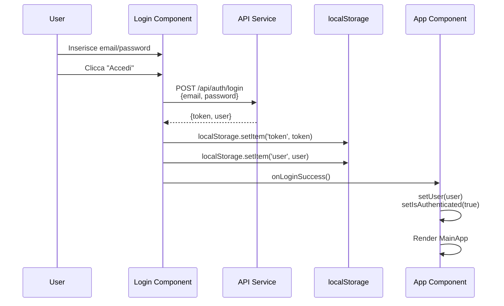
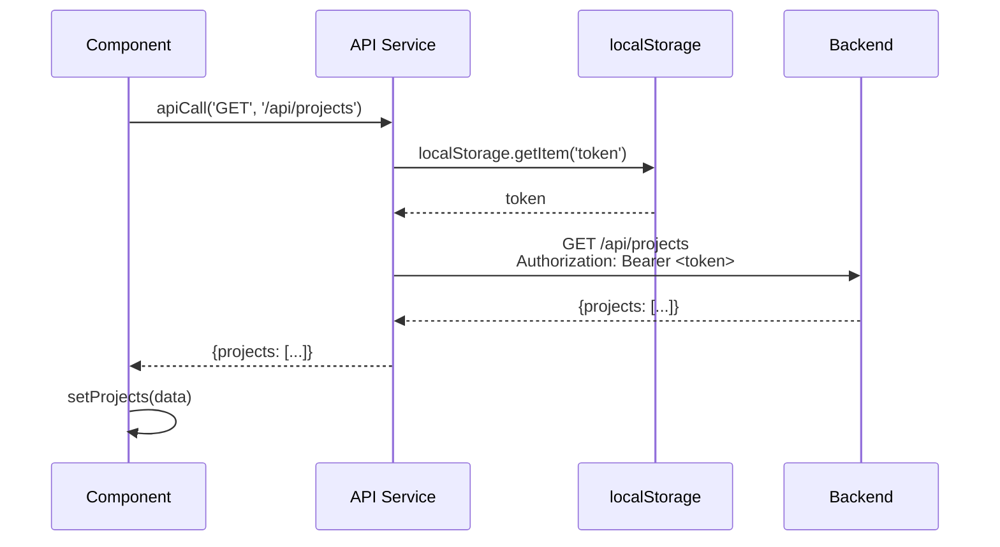

# 🎨 Documentazione Frontend

## Pubblico di Destinazione

Questa documentazione è destinata a:
- **Sviluppatori Frontend** che implementano o modificano componenti React
- **Ingegneri del Software** che devono comprendere l'architettura UI
- **UI/UX Designers** che progettano nuove interfacce

## Tech Stack

### Tecnologie Core

- **React 18+**: Libreria UI con componenti funzionali e hooks
- **TypeScript**: Type safety per prevenire errori a runtime
- **Vite 5+**: Build tool veloce per sviluppo e produzione
- **Tailwind CSS 3+**: Framework CSS utility-first
- **Lucide React**: Libreria di icone moderne e coerenti

### Dipendenze Principali

```json
{
  "react": "^18.2.0",
  "react-dom": "^18.2.0",
  "typescript": "^5.0.0",
  "vite": "^5.0.0",
  "tailwindcss": "^3.3.0",
  "lucide-react": "^0.294.0"
}
```

## Installazione e Avvio

### Prerequisiti

- Node.js 18+ installato
- npm o yarn come package manager

### Setup Locale

```bash
# Naviga nella cartella frontend
cd gestionale-app

# Installa le dipendenze
npm install

# Crea file .env
echo "VITE_API_URL=http://localhost:3000" > .env

# Avvia il server di sviluppo
npm run dev

# Build per produzione
npm run build

# Preview build produzione
npm run preview
```

### Script Disponibili

- `npm run dev`: Avvia server di sviluppo con Hot Module Replacement (HMR)
- `npm run build`: Crea build ottimizzata per produzione
- `npm run preview`: Preview della build di produzione
- `npm run lint`: Esegue linter (se configurato)

## Variabili d'Ambiente

### Configurazione

**`.env`** file nella root di `gestionale-app/`:

```env
VITE_API_URL=http://localhost:3000
```

### Descrizione Variabili

- **`VITE_API_URL`**: URL base del backend API. In produzione, utilizzare l'URL del servizio Render (es. `https://gestionale-backand-api.onrender.com`)

**Nota**: Le variabili che iniziano con `VITE_` sono esposte al client. Non includere mai informazioni sensibili.

## Architettura dei Componenti

### Struttura Directory

```
gestionale-app/src/
├── components/          # Componenti React riutilizzabili
│   ├── Login.tsx        # Pagina di login
│   ├── Calendar.tsx     # Calendario eventi
│   ├── AdminPanel.tsx   # Pannello amministrazione
│   ├── MyTasks.tsx      # Dashboard task associato
│   ├── Recruiting.tsx   # Pagina recruiting HR
│   └── ...
│
├── services/            # Servizi API
│   └── api.ts          # Client API centralizzato
│
├── utils/              # Utility functions
│   ├── conflictResolver.ts
│   └── updateWithConflictHandling.ts
│
├── App.tsx             # Componente principale (Router)
└── main.tsx            # Entry point
```

### Componente Principale: App.tsx

**Logica di Routing**:

`App.tsx` gestisce il routing principale dell'applicazione:

1. **Verifica Autenticazione**: Controlla `localStorage` per token e user
2. **Router Condizionale**:
   - Se **non autenticato** → Renderizza `<Login />`
   - Se **autenticato** → Renderizza `<MainApp />` (Sidebar + Content)

```typescript
// Pseudo-codice App.tsx
function App() {
    const [isAuthenticated, setIsAuthenticated] = useState(false);
    const [user, setUser] = useState(null);

    useEffect(() => {
        // Verifica token salvato
        const token = localStorage.getItem('token');
        const savedUser = localStorage.getItem('user');
        if (token && savedUser) {
            setUser(JSON.parse(savedUser));
            setIsAuthenticated(true);
        }
    }, []);

    if (!isAuthenticated) {
        return <Login onLoginSuccess={handleLoginSuccess} />;
    }

    return (
        <div className="flex h-screen">
            <Sidebar activeView={activeView} setActiveView={setActiveView} user={user} />
            <RenderContent activeView={activeView} user={user} {...props} />
        </div>
    );
}
```

### Gestione dello Stato

**Pattern Utilizzato**: Local State + localStorage

- **Token JWT**: Salvato in `localStorage.setItem('token', token)`
- **User Data**: Salvato in `localStorage.setItem('user', JSON.stringify(user))`
- **State React**: `useState` per stato reattivo (es. lista clienti, progetti)

**Nessun State Management Library**: Il progetto non utilizza Redux o Context API complessi. Lo stato è gestito localmente nei componenti e sincronizzato con localStorage.

## Flusso di Autenticazione (Lato Client)

### Diagramma di Sequenza: Login



### Diagramma di Sequenza: Richiesta API Protetta



### Gestione Scadenza Sessione

**Logout Forzato**:

Quando il backend ritorna `401 Unauthorized`:

```typescript
// In api.ts
try {
    const response = await fetch(url, options);
    if (response.status === 401) {
        // Token scaduto o invalido
        localStorage.removeItem('token');
        localStorage.removeItem('user');
        window.location.href = '/login'; // Redirect a login
    }
} catch (error) {
    // Gestione errori
}
```

## Servizio API Centralizzato

### File: `services/api.ts`

**Funzione `apiCall`**:

Wrapper centralizzato per tutte le chiamate API che:
- Aggiunge automaticamente l'header `Authorization: Bearer <token>`
- Gestisce errori comuni (401, 500)
- Normalizza URL (rimuove trailing slashes)
- Supporta timeout (30 secondi)

**Esempio Utilizzo**:

```typescript
import { projectsAPI } from './services/api.ts';

// In un componente
const loadProjects = async () => {
    try {
        const projects = await projectsAPI.getAll();
        setProjects(projects);
    } catch (error) {
        console.error('Errore caricamento progetti:', error);
    }
};
```

**API Services Disponibili**:

- `authAPI`: Login, register, verify
- `usersAPI`: Gestione utenti
- `clientsAPI`: CRUD clienti
- `projectsAPI`: CRUD progetti, team, tasks
- `contractsAPI`: CRUD contratti
- `eventsAPI`: CRUD eventi, reports
- `tasksAPI`: Gestione task
- `pollsAPI`: Sondaggi disponibilità
- `candidatesAPI`: CRUD candidati
- `onboardingAPI`: Avvio periodo di prova

## Componenti Principali

### Login Component

**File**: `components/Login.tsx`

**Funzionalità**:
- Form email/password
- Chiamata `POST /api/auth/login`
- Salvataggio token e user in localStorage
- Callback `onLoginSuccess` per aggiornare App

### Calendar Component

**File**: `components/Calendar.tsx`

**Funzionalità**:
- Visualizzazione calendario mensile
- Lista eventi del mese
- Modale creazione evento (form dinamico)
- Modale dettaglio evento (con tab Report)
- Sondaggi attivi
- Integrazione progetti assegnati

**Vedi**: [Flussi Dinamici](./Flussi-Dinamici.md) per dettagli sui form dinamici.

### Recruiting Component

**File**: `components/Recruiting.tsx`

**Funzionalità**:
- Tabella candidati (filtrata per area se Manager)
- Form creazione candidato
- Avvio sondaggio colloquio
- Avvio periodo di prova

### MyTasks Component

**File**: `components/MyTasks.tsx`

**Funzionalità**:
- Lista task assegnati all'utente loggato
- Aggiornamento stato task
- Filtri per progetto, stato, priorità

### AdminPanel Component

**File**: `components/AdminPanel.tsx`

**Funzionalità**:
- Gestione utenti (CRUD)
- Health check sistema
- Toggle mock data (solo sviluppo)
- Lista utenti connessi

## Styling

### Tailwind CSS

Il progetto utilizza **Tailwind CSS** per lo styling. Tutti i componenti usano classi utility.

**Esempi**:
```tsx
<div className="bg-white rounded-lg shadow-md p-6">
    <h1 className="text-2xl font-bold text-gray-900 mb-4">
        Titolo
    </h1>
</div>
```

### Design System

**Colori Principali**:
- **Primary**: Indigo (`bg-indigo-600`, `text-indigo-600`)
- **Success**: Green (`bg-green-100`, `text-green-800`)
- **Error**: Red (`bg-red-100`, `text-red-800`)
- **Warning**: Yellow (`bg-yellow-100`, `text-yellow-800`)
- **Info**: Blue (`bg-blue-100`, `text-blue-800`)

**Spacing**: Sistema 4px (es. `p-4` = 16px, `p-6` = 24px)

## Best Practices

### Gestione Errori

**Pattern Standardizzato**:

```typescript
try {
    const data = await apiCall(...);
    setState(data);
} catch (error: any) {
    console.error('Errore descrittivo:', error);
    alert(error.message || 'Errore sconosciuto');
    // O mostra un toast/notification
}
```

### Loading States

**Pattern Standardizzato**:

```typescript
const [loading, setLoading] = useState(true);

useEffect(() => {
    loadData();
}, []);

const loadData = async () => {
    try {
        setLoading(true);
        const data = await apiCall(...);
        setData(data);
    } finally {
        setLoading(false);
    }
};

if (loading) return <div>Caricamento...</div>;
```

### Conditional Rendering

**Pattern Standardizzato**:

```typescript
// Solo Manager può vedere
const canView = user?.role === 'Manager' || user?.role === 'Admin';

{canView && (
    <button onClick={handleAction}>
        Azione Manager
    </button>
)}
```

## Deployment

### Build Produzione

```bash
npm run build
```

Genera una cartella `dist/` con file statici ottimizzati.

### Render Static Site

Il frontend è configurato per deploy su Render come Static Site:

```yaml
# render.yaml
services:
  - type: web
    name: gestionale-frontend
    env: static
    buildCommand: npm install && npm run build
    staticPublishPath: ./dist
    envVars:
      - key: VITE_API_URL
        value: https://gestionale-backand-api.onrender.com
```

### Environment Variables in Produzione

Le variabili `VITE_*` sono sostituite al **build time**, non al runtime. Assicurarsi che `VITE_API_URL` sia configurato correttamente in Render prima del build.

## Riferimenti

- **[Flussi Dinamici](./Flussi-Dinamici.md)** - Form dinamici e logica condizionale
- **[API Endpoints](../backend/API-Endpoints.md)** - Documentazione completa API backend

---

**Versione**: 1.0  
**Mantainer**: Team Frontend

